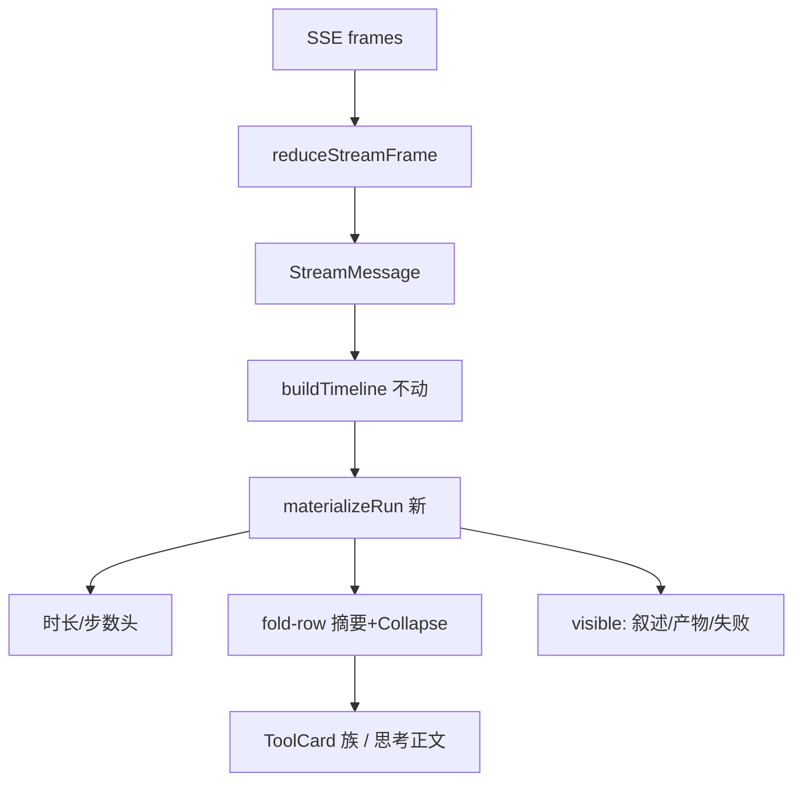
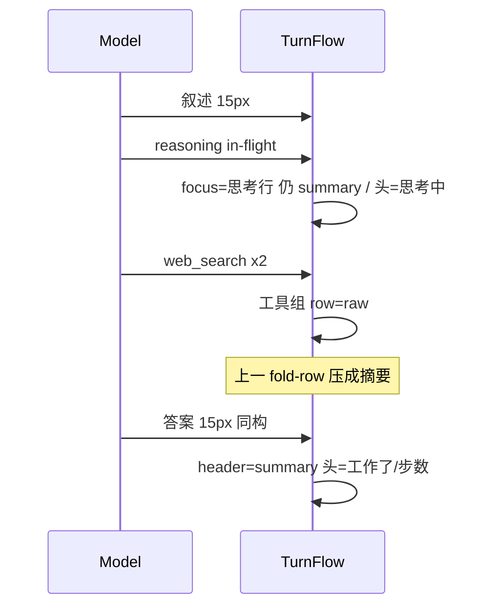

# 会话过程展示重构：Codex 式三海拔

- Author: Grok (independent)
- Date: 2026-08-15
- Status: Draft
- Scope: `app/src/components/chat/*`、`app/src/lib/{turnTimeline,executionTrack,messageTiming,stream}.ts`
- 只读代码产出；不改仓库业务代码

## Overview

骨架已接近 Codex（append-only、叙述恒可见、渐进收口）。差在静息态只有「已完成 N 步 / 原始卡全量」。方案：聚合层 + `fold-row`。头优先报时长，无则回落计数。成功同族压成摘要行；思考与工具组同级；失败/产物/叙述恒可见。不改 SSE，不改叙述字号。

## Background & Motivation

`done` 现渲染 `chat.toolGroup`。连续过程条目合成 `run`，被叙述接替后经 `Collapse struct` 整段卸掉；只展开**活跃的最后一段 run**。`messageTiming` 只给流式出生的消息计时。过程消息 min/max 在所引 fixture 上得 0（`formatDuration(0)`→`0.1s`）。`ResponseFrame` 墙钟协议有、历史无 per-turn Response。

## Goals & Non-Goals

**Goals**

- 静息态能读出做了什么；有墙钟再报多久。
- 成功同族合成一行；思考同级默认收起正文。
- 失败工具 / 失败或进行中压缩 / 产物 / 叙述 / `FileChangesCard` 恒可见。

**Non-Goals**

- 不改 SSE、不发明 plan / phase 字段。
- 不重做 `FileChangesCard` / 产物卡。
- 不默认展开思维链。
- 不改叙述字号或容器（守住 `turnTimeline` 同构）。

## Proposed Design

### 信息架构（三海拔）

| 海拔 | 谁看见 | 数据 |
|---|---|---|
| 头 | 始终 | 时长或步数，见下 |
| 摘要行 | `header=summary` | 聚合文案 /「思考过程」 |
| 原始 | `row=raw` | Tool 卡 / 思考正文（无第二层头） |

恒可见（`visible`，头关不掉）：叙述、产物 `prominentArtifact`、失败工具卡、失败或进行中压缩 `ProgressCard`、`FileChangesCard`。失败 pair 仍计入 `summarizeTrack` / 时长 / `showHeader`（记账与渲染分开）。



### 折叠状态机

新增 **`fold-row`**：摘要在 `Collapse` 外。思考必须是它——走 `visible()` 头关不掉，留在工具 `run` 会切断合并。

```
header ∈ { collapsed, summary }     // 默认 summary
row    ∈ { summary, raw }           // 只描述原始层；≠ 窗口焦点
focus  ∈ fold-row key | null        // 钉在 live 窗口末行
manualHeader: boolean | null
rowByKey / everRaw: 提在 TurnFlow    // 按 group.key；关头不丢
settling: live 结束后 600ms

headerOpen = manualHeader ?? true
focus (live | settling):
  最后 active tool pair 所在组
  否则最后一条 in-flight 思考行
  否则 null
row=raw 自动只赋给 active tool pair 组
  思考行永不自动 raw（用户点 ReasoningBlock 头才开）
  无 active pair: 全部自动 summary
settling 结束且用户没点过该行: 该组 → summary
```

用户点头：`collapsed` ↔ `summary`。点摘要行：只改 `rowByKey[key]`。

组级 DOM（工具 / progress）：

```
header=collapsed: 不挂子树（状态在 TurnFlow 的 rowByKey/everRaw）
header=summary:
  [摘要按钮]
  Collapse(struct, keepMounted iff everRaw[key])
    原始卡
```

思考行不套 StepGroupRow：摘要即 `ReasoningBlock` 头。`keepMounted` 只加在组内 Collapse 上。

### 头文案

进行中不变。压缩完成头（`chat.contextCompaction.*`）保留。

`done`：有墙钟 → `工作了 {duration}`（失败附个数）；否则 `chat.toolGroup*`；无 fold-row 且无失败工具 → 不画头。duration 一律 `formatDuration`；`ms<=0` 禁止入格式化。

时钟按优先级，**不按 live 互斥**：

```
1. trackDurationLabel(全部过程条目) 非空 → 用之
   （收口后本页 messageTiming 仍在，直到 openChat/newChat reset）
2. 否则 historyTurnDuration(
     prevUser.metadata.timestamp,
     lastAssistantTurnMessage.metadata.timestamp)
   Date.parse 失败或 end<=start → 空
3. 否则无墙钟，回落 chat.toolGroup
不读 ResponseFrame 墙钟
```

`summarizeTrack` / 时长 / `showHeader` 吃**全部过程条目**，含升为 `visible` 的失败 pair。`showHeader` = 有 fold-row **或** 有失败工具。产物卡仍不计步。

去掉头上「摘要 / 详细」。`useToolDetail` 仍只认 `?debug=tools` / `localStorage qwenpaw.toolDebug` / 残留 `qwenpaw.toolDetail`。

### 聚合与摘要对象

`materializeRun(ProcessEntry[])` 产出 fold-row 与要升为 `visible` 的失败 pair。不能先滤成 `ToolPair[]`。

```
family(name):
  web_search → search
  web_fetch → fetch
  grep_search → grep
  glob_search → glob
  read_file → read
  write_file|edit_file|append_file → edit
  execute_shell_command → shell
  skill → skill
  其余 → other(name)

连续可合并 iff 同 family，且:
  两边都已知名（无名不合并，与 isWorkSlot 一致）
  两边都是成功 pair（失败 pair 单列，走 visible 原卡）
  skill 还要 skillName 相同

key = first.callId ?? first.messageId   // 无名→有名不换 key
```

对象：先 `JSON.parse(arguments)`，非法 JSON → 空对象。按家族取键，**取组内首次非空**；组内其余对象与首次不同则文案加「等」。

| family | 键 | 展示 |
|---|---|---|
| search | `search_term` 否则 `query` | 截断 32 |
| fetch | `url` | 截断 32 |
| grep / glob | **只要 `pattern`，不用 `path`** | 截断 32 |
| read / edit | `file_path` | basename；edit 对成功 pair 的 `pairChangeStats` **求和** 附 ± |
| shell | `command` | **只取 argv0**（首个空白前 token） |
| skill | `name` 否则 `skill` / `skill_name` | `skillDisplayName` |
| other | 无 | 只动词 |

单条成功组不套两层，直出 `ToolCard`（仍算 1 行）。失败 pair 单列 `visible` 原卡，仍记账。已完成 progress 直出 `ProgressCard`（算 1 行，不套 StepGroupRow）。失败/进行中压缩保持今日 `failed || (compaction && status!==completed)` → `visible`。`other`：`n===1` 直出原卡；`n>1` = `humanToolName` + `{count}`。

### 8 行封顶

只计 fold-row（含直出单卡、思考、完成 progress；不含 visible）。

```
settled 且用户未点溢出:
  总数>8 → 前 7 行 + 「另有 N 步」
  N = 未展示 fold-row 数（禁止 N=0）
  点溢出: 原地接上剩余行，直到头 collapsed
live 或 settling:
  窗口钉 focus（思考也可钉，但不因此 raw）
  有 focus: focus 末行 + 其前最多 7 条
  无 focus: 最近 8 条 fold-row（不要用 settled 的「前 7」裁掉尾部）
  前面被裁 → 「另有 N 步」N=被裁 fold-row 数
```

### 思考

连续 `reasoning` 合成一条 fold-row：正文 `\n\n` 拼接，`key` = 第一条 `messageId`。摘要即 `ReasoningBlock` 头，禁止再套一层。in-flight 思考可以当 **focus**（钉窗口、头写「思考中」），**不自动 raw**。`header=collapsed` 不挂子树，开合存在 `rowByKey`。已结算且空由 `buildTimeline` 跳过；in-flight 空思考必须占位。

### 计划句

前端不检测、不改字号、不藏叙述。有短叙述就当普通正文。计划靠提示词（PR3），没有就空着。

### 动效与风险

组 raw→summary 用该组自己的 `Collapse struct` 280ms；行内展开 200ms。`prefers-reduced-motion` 已在 `global.css`。

- 中：长轨道变高 → settled 才封顶；live 钉 focus，思考不自动展开。
- 中：工具名晚到 → 无名不合并。
- 低：单条双 chevron → 单条直出。
- 低：shell 令牌进时间线 → 摘要只露 argv0。



### 组件去留

| 符号 | 处置 |
|---|---|
| `turnTimeline.ts` | 不动。 |
| `executionTrack.ts` | 状态机不动；`done` 只给回落 2 和失败计数。 |
| `MessageList.TurnFlow` | 持有 `rowByKey` / `everRaw` / `manualHeader`；记账 ≠ 渲染。 |
| **新建 `lib/stepGroups.ts`** | `materializeRun` + 对象提取 + 测。 |
| **新建 `StepGroupRow.tsx`** | 工具/other 多条组用。思考不用它。 |
| `ReasoningBlock` | 保留头；思考 fold-row 直接用它，禁止双层。连续段拼进一个正文。 |
| `ProgressCard` | 完成态直出；失败/进行中压缩仍 `visible`。 |
| `ToolCard` 族 / `ToolDisclosure` / `Collapse` | 原始层，保留。 |
| `messageTiming.ts` | `trackDurationLabel` 优先；另增 `historyTurnDuration`。 |

## API / Interface Changes

无 HTTP / SSE 变更。

头（duration 一律 `formatDuration`）：

- `chat.workedFor`：`工作了 {duration}` / `Worked for {duration}`
- `chat.workedForWithFailures`：`工作了 {duration}（{failed} 个失败）` / `Worked for {duration} ({failed} failed)`
- **保留** `chat.toolGroup` / `chat.toolGroupWithFailures`

摘要（`n=1` 且无对象：只用现成 `tool.tense.*.done`；`n>1` 用次数键；有对象再拼 ` · {object}`）：

| family | zh | en |
|---|---|---|
| search | 搜索了网页{n, plural, one {} other { # 次}} | Searched the web{n, plural, one {} other { # times}} |
| fetch | 读取了网页… | Read {n} pages |
| grep | 搜索了文件… | Searched files… |
| glob | 匹配了文件… | Matched files… |
| read | 读取了 {n} 个文件 | Read {n} files |
| edit | 修改了 {n} 个文件 | Edited {n} files |
| shell | 运行了 {n} 条命令 | Ran {n} commands |
| skill | 调用了技能 | Ran skill |
| other | `{humanToolName} {count} 次` | `{humanToolName} ×{count}` |
| thinking | 思考过程（复用 `reasoning.process`） | Reasoning |
| overflow | 另有 {n} 步 | {n} more steps |

实现不必上 ICU：`n===1` 走 `tool.tense.*.done`，`n>1` 走 `chat.step.{family}` = `… {count} 次/个/条`。en 同样分单复数两个键。

## Data Model Changes

不改消息 schema。不把 `ResponseFrame` 时间戳写进 `ConversationStreamState` 当历史时长（刷新没用）。无迁移。

## Alternatives Considered

1. **只改文案。** 无中间层。否决。
2. **猜 phase。** 无协议字段。否决。
3. **默认只留头。** 静息态再次空白。否决。
4. **收口后改短叙述为 13px。** 缩字破坏同构。否决。

## Security & Privacy Considerations

摘要只回放已在 `arguments` 里的字段。shell 只露 argv0；完整命令仍在用户展开后的 `ShellToolCard`。思维链仍需点开。无新外发。

## Observability

无新后端指标。聚合 O(n)，单轮通常 <50。无 `MessageList` 测试；回归压在 `stepGroups` / `turnTimeline` / `executionTrack` / `historyTurnDuration`（fixture 的 `echo` → argv0）。

## Rollout Plan

无 feature flag。PR1 只改头回落（可回滚 i18n）。PR2 一次落地 `fold-row` 物化；出问题回退 `TurnFlow`，`buildTimeline` 不动。

## 后端需要补的数据（非阻塞）

| 需要 | 来源 | 缺了 |
|---|---|---|
| 历史墙钟 | 本轮用户 → 最后助手 `metadata.timestamp` | 头回落 `已完成 N 个步骤` |
| 跨刷新的 response 墙钟 | 须随 `ChatHistory` 持久化 per-turn `created_at/completed_at` | 不做前端假收口 |
| 逐步 `started_at/ended_at` | 现无 | 只直播有逐步钟 |
| 计划句 | 提示词一句，无新事件 | 叙述保持原样 |

不发明：`phase`、`step_kind`、`aggregate_count`。

## References

- `app/src/lib/stream.ts`、`protocol/types.ts`、`turnTimeline.ts`、`executionTrack.ts`、`messageTiming.ts`
- `MessageList.tsx`（`TurnFlow` / `ProcessEntry` / `trackDurationLabel` / compaction 头）
- `ToolCard.tsx`（`argumentSummary` / `TOOL_TENSE_KEYS`）、`skillPresentation.ts`（`skillDisplayName`）
- `src/qwenpaw/agents/tools/{web_search,file_search}.py`（`search_term` / `pattern`）
- `app/fixtures/http/chat-history-tool-call.json`
- `app/docs/process-display-claude.md`（前稿；本文在 fold-row、失败直出、历史时钟、取消意图样式上不同）

## Key Decisions

1. **三海拔。** 头报时长或步数，摘要行走故事，原卡进 `row=raw`。
2. **思考是 `fold-row`，摘要即 `ReasoningBlock` 头。** 不走 `visible`，不进工具 run，不套第二层 chevron。
3. **`turnTimeline` 不动。** 重构只在 `TurnFlow` 物化。
4. **连续成功同族才合并；无名 / 失败是分界。**
5. **单条成功组直出 `ToolCard`。**
6. **头默认 `summary`，`manualHeader` 只绑头。** 今日收口后全关会把三海拔塌回一行，必须反转默认。
7. **前端不改叙述样式。** 守住 15px 同构；计划只靠提示词。
8. **密度开关只留 debug 后门。** compaction 完成头保留。
9. **时钟优先级：`trackDurationLabel` → `historyTurnDuration` → `chat.toolGroup`。** 不按 `live` 互斥。本地用户气泡无 timestamp 时第 1 档仍能在本页收口后报时长。
10. **失败工具走 `visible` 原卡，但仍进记账。** `showHeader` 在「有 fold-row 或有失败工具」时为真。
11. **focus ≠ row。** live 钉 focus（可是思考行）；`row=raw` 只自动给 active tool pair。无 focus 时窗口取最近 8 条。
12. **思考永不自动 raw。** 摘要即 `ReasoningBlock` 头；连续段拼接，key 用第一条 id。
13. **`rowByKey` / `everRaw` 提在 `TurnFlow`。** 关头卸子树，再打开按表恢复；`keepMounted` 仅 `header=summary && everRaw`。
14. **已完成 progress / n=1 other 直出原卡；n>1 other 用 `humanToolName`+次数。**
15. **PR2 一次落地 fold-row + 思考。** 收口保留 600ms settling。

## PR Plan

### PR1 — 头回落 + 历史墙钟 + 去掉密度 chrome

- **Files:** `app/src/lib/i18n.ts`；`MessageList.tsx`（`TurnFlow` 头文案、拆密度按钮）；新建 `app/src/lib/historyTurnDuration.ts` + 测试（fixture：用户 21:17:48 → 最后助手 21:17:53 ⇒ 约 5s；`end<=start` ⇒ 空串）
- **Deps:** 无
- **Changes:** 时钟 `trackDurationLabel`（含收口后本页内存）→ `historyTurnDuration(userTs, lastAssistantTs)` → `chat.toolGroup`；无过程条目且无失败工具则不画头。失败计数仍吃全部过程条目。compaction 完成头不动。不改 `executionTrack.ts`。不写入 Response 墙钟。

### PR2 — TurnFlow 物化：fold-row + 聚合 + 思考

- **Files:** 新建 `app/src/lib/stepGroups.ts` + 测试；新建 `StepGroupRow.tsx`；改 `MessageList.tsx` `TurnFlow` / `ProcessEntry` 物化
- **Deps:** PR1
- **Changes:** 引入 `fold-row`；`TurnFlow` 持 `rowByKey`/`everRaw`。focus ≠ row：思考可钉窗口但不自动 raw。失败 pair `visible` 仍记账。in-flight 空思考占位。settled 才 8 行；live 钉 focus，无 focus 取最近 8 条。`keepMounted` 仅 `header=summary && everRaw`。

### PR3 — 提示词引导计划句（可选，后端）

- **Files:** 系统提示词模板（不改 SSE）
- **Deps:** 无（不依赖前端样式）
- **Changes:** 「开工前用一句话说打算；阶段切换再补一句」。无新字段；叙述按现通道 15px 渲染。
