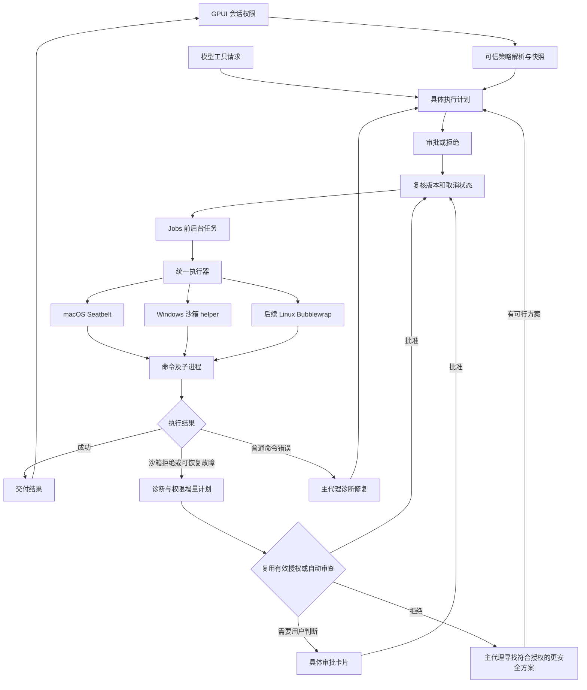

# Potato 原生沙箱：Codex 源码分析与接入方案

日期：2026-09-10。状态：macOS 第一阶段已接入，真实 OS 沙箱与自动恢复测试已通过。当前交付范围及限制见[实现记录](sandbox-implementation.md)；本文保留源码分析、实施前基线和后续设计，不代表所有拟议能力均已完成。

范围：仅 `native/potato-core` 与 `native/potato-gpui`，遵循[原生架构原则](native-only.md)。

源码基线：官方 `openai/codex` 仓库的 `2cbbf0c9b542a36a1c3284b5e804917635b6f666`（2026-09-08）。本次直接阅读本地无修改快照 `/private/tmp/potato-codex-prompt-reference-20260908`，下文源码链接固定到该提交；不把它声称为 9 月 10 日最新 HEAD。另核对了 [OpenAI 官方沙箱说明](https://learn.chatgpt.com/docs/sandboxing)。

## 推荐结论

在 potato-core 增加统一的沙箱执行层，先落地 macOS Seatbelt，随后实现 Windows 专用受限执行器。GPUI、模型通信、凭据管理与数据库留在可信主进程；模型发起的命令及其子进程进入 OS 沙箱。

保留现有审批器，分别表达三个维度：文件访问范围、命令网络权限、审批策略。第一版必须同时交付自动恢复：沙箱拒绝后自动分析、生成具体权限申请、复用有效授权或自动审查，获准后继续执行。只有需要用户判断时才打断用户，不能把第一次沙箱拒绝直接当作任务失败。

审批通过只授予被审查的具体能力，不隐式关闭所有沙箱限制。支持经过审批的单次无沙箱执行；该申请可以由恢复编排器或主代理发起，并由模型审批器批准，不要求用户手动重发命令。本文“提权”指扩大此次执行权限，不自动包含 sudo/管理员权限。

优先参考 Codex 的策略模型、平台实现和边界测试，建立 Potato 自己的小型接口。直接依赖整个 Codex workspace 会同时引入协议、网络代理、PTY、Windows 后端等内部依赖；当前 `codex-sandboxing` 并非单一、无耦合的执行包装器。见 [Cargo.toml](https://github.com/openai/codex/blob/2cbbf0c9b542a36a1c3284b5e804917635b6f666/codex-rs/sandboxing/Cargo.toml)。如复用源码，保留对应许可证、归属和修改记录，并固定上游版本。

## Codex 的实现

### 1. 审批与强制隔离分层

简化后的调用链是：工具请求 → 审批要求判断 → 选择沙箱 → 生成受限执行请求 → 平台启动器 → 收集结果。遇到可能的沙箱拒绝，再依据策略决定是否允许请求额外权限或重试。

- `core/src/tools/orchestrator.rs`：组织审批、首次尝试与重试。`Never`、`OnRequest` 等条件影响是否自动进入无沙箱重试流程；不能概括成“失败就自动放开”。严格自动审批对无沙箱重试还有重新审查逻辑。
- `sandboxing/src/manager.rs`：`SandboxManager::select_initial` 选择后端，`transform` 将程序、参数、环境和权限合成为实际执行请求。
- `sandboxing/src/spawn.rs`：统一管道/PTY 启动，并分流 Windows 特有的启动流程。
- `protocol/src/permissions.rs`：文件系统和网络权限分开，支持读、写、拒绝以及受保护子路径；`cwd` 的解析基准与命令实际工作目录也是分别传递的。

来源：[orchestrator.rs](https://github.com/openai/codex/blob/2cbbf0c9b542a36a1c3284b5e804917635b6f666/codex-rs/core/src/tools/orchestrator.rs)、[manager.rs](https://github.com/openai/codex/blob/2cbbf0c9b542a36a1c3284b5e804917635b6f666/codex-rs/sandboxing/src/manager.rs)、[spawn.rs](https://github.com/openai/codex/blob/2cbbf0c9b542a36a1c3284b5e804917635b6f666/codex-rs/sandboxing/src/spawn.rs)、[permissions.rs](https://github.com/openai/codex/blob/2cbbf0c9b542a36a1c3284b5e804917635b6f666/codex-rs/protocol/src/permissions.rs)。

Codex 的自动恢复有两个层次，需要一起借鉴：

1. **执行器内重试**：`orchestrator.rs` 捕获 `SandboxErr::Denied`，检查 `escalate_on_failure`、审批策略与能否无沙箱执行。符合条件时构造带 `retry_reason` 的审批申请，批准后执行第二次尝试。普通非零退出不直接进入该分支。已有审批在特定条件下可以复用；严格自动审查覆盖的沙箱内尝试不能直接批准无沙箱重试。
2. **主代理续跑**：`tools/sandboxing.rs::wants_no_sandbox_approval` 在 `OnRequest` 下通常不允许编排器自动申请无沙箱重试（托管网络另有条件）。工具受限结果会回到主代理，由主代理判断后发起 `require_escalated`。返回工具错误不等于向用户结束任务。

审批申请在 `tools/approvals.rs::request_approval` 中先经过 permission hooks，再路由到 Guardian 或用户。自动审批启用后，由独立 reviewer 判断具体申请；批准后执行继续。自动审批与自动发起提权是两个独立环节，都属于恢复链路。来源：[sandboxing.rs](https://github.com/openai/codex/blob/2cbbf0c9b542a36a1c3284b5e804917635b6f666/codex-rs/core/src/tools/sandboxing.rs)、[approvals.rs](https://github.com/openai/codex/blob/2cbbf0c9b542a36a1c3284b5e804917635b6f666/codex-rs/core/src/tools/approvals.rs)、[官方自动审批说明](https://learn.chatgpt.com/docs/sandboxing/auto-review)。本文不要求 Potato 复制 Codex 的所有配置分支，而要求实现同等连续执行体验。

### 2. macOS：Seatbelt 策略约束进程树

Codex 固定使用 `/usr/bin/sandbox-exec`，通过参数传入生成的 SBPL 策略，再执行目标命令。策略从 `(deny default)` 开始，逐项开放进程执行、必要系统调用、允许的文件路径和网络能力；子进程继承限制。

`seatbelt.rs` 将读写根目录、不可读路径、受保护子路径、网络代理端口转换成策略。路径通过 `-D` 参数传入，避免把任意路径直接拼进策略语法。受限读取与全盘读取是不同分支，因此照搬简单的 `(allow file-read*)` 会丢失 Potato 现有的目录读取授权语义。

值得复用的细节包括：可写根中的符号链接检查；保护 `.git` 等目录和解析后的 gitdir；阻止替换或重命名可写根及保护路径的祖先；保护尚未创建的元数据路径；限制 Unix socket 和代理端口。仅允许项目 `subpath` 写入并不构成完整实现。

来源：[seatbelt.rs](https://github.com/openai/codex/blob/2cbbf0c9b542a36a1c3284b5e804917635b6f666/codex-rs/sandboxing/src/seatbelt.rs)、[基础策略](https://github.com/openai/codex/blob/2cbbf0c9b542a36a1c3284b5e804917635b6f666/codex-rs/sandboxing/src/seatbelt_base_policy.sbpl)、[Seatbelt 测试](https://github.com/openai/codex/blob/2cbbf0c9b542a36a1c3284b5e804917635b6f666/codex-rs/sandboxing/src/seatbelt_tests.rs)。

### 3. Linux：默认 Bubblewrap，叠加 seccomp

该版本默认使用 Bubblewrap，建立 user/PID namespace，通过只读挂载和可写根的 bind mount 实现文件范围，再叠加受保护路径。限制联网时隔离 network namespace；托管代理模式通过专门的桥接通路连接允许的代理。执行器还设置 `PR_SET_NO_NEW_PRIVS` 和 seccomp 限制。

Landlock 保留为显式旧路径，不能表达某些细分权限时不能用它替代 Bubblewrap。源码仍有 `LinuxSeccomp` 枚举名称，但名称不代表只使用 seccomp。系统缺少 bwrap 时可使用随包 helper；用户 namespace 不可用、WSL1 等限制需要显式处理。

来源：[Linux README](https://github.com/openai/codex/blob/2cbbf0c9b542a36a1c3284b5e804917635b6f666/codex-rs/linux-sandbox/README.md)、[Linux 入口](https://github.com/openai/codex/blob/2cbbf0c9b542a36a1c3284b5e804917635b6f666/codex-rs/linux-sandbox/src/lib.rs)。Potato 当前没有 Linux 发布包，因此 Linux 可放在后续阶段。

### 4. Windows：受限令牌、ACL 与独立启动流程

源码有 legacy 与 elevated 两条执行路径。核心包括 restricted token、capability SID、文件 ACL、专用 helper、进程通信与桌面隔离选项；elevated 后端使用专用沙箱账户，并有防火墙/WFP 配置。这里的 elevated 指需要提权进行沙箱设施设置，不是让模型命令获得管理员权限。

托管网络在 `SandboxManager` 中要求 elevated 后端。网络隔离涉及系统规则，不能靠修改代理环境变量或换成 PowerShell 实现。Potato 已使用的 JobObject 负责进程生命周期，也不能替代文件和网络权限约束。

来源：[token.rs](https://github.com/openai/codex/blob/2cbbf0c9b542a36a1c3284b5e804917635b6f666/codex-rs/windows-sandbox-rs/src/token.rs)、[elevated 后端](https://github.com/openai/codex/blob/2cbbf0c9b542a36a1c3284b5e804917635b6f666/codex-rs/windows-sandbox-rs/src/unified_exec/backends/elevated.rs)、[WFP](https://github.com/openai/codex/blob/2cbbf0c9b542a36a1c3284b5e804917635b6f666/codex-rs/windows-sandbox-rs/src/wfp.rs)。

### 5. 文件工具与拒绝识别也有独立处理

Codex 的 exec-server 文件系统沙箱路径会启动专门的 fs helper，使用更窄的权限并关闭网络；当该路径要求隔离但平台无法提供时返回错误。这说明“只有 shell 加包装器”不能覆盖全部文件操作。

拒绝识别也不是完全可靠的：`denial.rs` 明确采用退出状态及输出关键词的启发式。命令输出可以伪造这些词，因此这类识别可以触发诊断和权限申请，但不能直接产生执行授权；申请仍须通过独立审批。

来源：[fs_sandbox.rs](https://github.com/openai/codex/blob/2cbbf0c9b542a36a1c3284b5e804917635b6f666/codex-rs/exec-server/src/fs_sandbox.rs)、[denial.rs](https://github.com/openai/codex/blob/2cbbf0c9b542a36a1c3284b5e804917635b6f666/codex-rs/sandboxing/src/denial.rs)。

## Potato 当前实际情况

| 入口 | 已有机制 | 接入时需要补足 |
| --- | --- | --- |
| `tools.rs` shell 分支 | 非完全访问模式要求显式 `require_escalated`；进入审批并复核权限版本、取消、工作目录 | 默认执行应生成受限计划；`cwd` 不能扩大项目授权根 |
| `jobs.rs` → `processes.rs` | 前后台共用执行函数；输出归档、超时、取消；Unix ProcessGroup / Windows JobObject | 传递不可变权限快照；在启动边界强制沙箱；明确环境和句柄继承 |
| `permissions.rs` / `approval.rs` | 文件模式、审批策略、模型审批、带操作范围的目录读取授权、路径身份复核 | 增加真正的 OS 策略；目录工具授权不能自动变成任意程序读取授权 |
| `file_ops.rs` | `cap_std::fs::Dir`、相对路径约束、准备/提交和并发修改检查 | 保留这些机制；后续按需要把操作放进受限文件 helper |
| `projects.rs` | 单独启动 Git；清理 `GIT_*`，禁用 hooks/fsmonitor 等 | 纳入执行入口清单，为内部 Git 操作定义独立最小策略 |
| `mcp.rs` | stdio 服务独立启动；服务环境可含配置凭据 | 每服务独立信任/权限；shell 沙箱不会自动覆盖它 |
| `computer.rs` | 独立启动电脑操作驱动 | 保留独立授权；不能声称电脑操作受文件沙箱约束 |
| GPUI 设置与提示词 | 已有三档文件模式和三档审批模式 | 展示实际后端可用性、联网状态和具体权限增量 |

关键证据：`tools.rs` 当前直接返回 “Native shell has no OS sandbox”；`processes.rs::execute_spooled` 直接启动 `/bin/sh -c` 或 PowerShell，没有 OS 隔离，也没有清空父进程环境。设置名 `sandbox_mode` 当前主要代表文件工具策略，不能据此宣称 shell 已隔离。

## 建议的权限语义

以下为 Potato 的设计建议，并非对 Codex 默认值的逐项复制。

| 模式 | 文件访问 | 命令网络 | 默认执行 |
| --- | --- | --- | --- |
| `read-only` | 允许项目和必要运行库读取；用户文件不可写；仅独立 scratch 可写 | 关闭 | 可执行受限命令；审批策略仍生效 |
| `workspace-write` | 项目普通文件可读写；敏感和策略路径另行保护；独立 scratch 可写 | 关闭 | 普通项目命令在沙箱内执行 |
| `danger-full-access` | 明确选择宿主账号权限 | 明确显示实际网络状态 | 不承诺 OS 文件隔离；审批策略仍独立生效 |

“只读”需向用户解释为不改用户文件，执行器仍可能需要专用临时目录。临时目录应按任务或会话隔离，不把整个 `/tmp`、用户 HOME 或 Potato 数据目录列为可写根。

默认可读范围建议为项目、必要系统运行库、经过审查的工具链目录与显式授权资源。Potato 私有数据库、凭据、其他会话目录不可读写；`.ssh`、`.aws`、`.gnupg`、项目 `.env*` 等秘密默认不可读。项目内部的 `.git`、`.agents`、`.codex` 和持久化代理指令默认不可写。具体分类复用并细化现有 `sensitive` 规则，不能把“秘密不可读”与“指令允许读取但禁止修改”合成一个布尔值。

若当前项目位于 Potato 数据根下，必须精确开放项目子树并排除私有兄弟路径，不能先对整个数据根设置不可覆盖的拒绝再期待允许规则生效。策略编译器应验证重叠规则，拒绝无法精确表达的配置。

已有目录规则只授权 `read_file/list_directory/search` 等指定操作，尤其非递归或仅 list 的授权无法等价映射为 OS 的目录可读。第一版保留其原有用途；新增命令读取授权时明确展示“此命令及其子进程可读取该范围”，不静默迁移旧授权。

## 接入结构与行为

建议新增 `potato-core/src/sandbox/`，先包含 `policy.rs`、`plan.rs`、`macos.rs`、`environment.rs`、`status.rs`，并增加 `execution_recovery.rs` 组织诊断、审批与重试，Windows 独立 helper 随第二阶段加入。命名是拟议结构，不表示文件已存在。

核心数据包括：

- `ResolvedSandboxPolicy`：项目授权根、精确读写范围、拒绝项、scratch、网络策略、策略版本。由可信运行时生成。
- `ExecutionPlan`：程序、参数数组、实际 cwd、经过过滤的环境、策略快照、执行模式和计划摘要。后台任务继续使用该快照。
- `ExecutionGrant`：批准的计划摘要、权限增量、会话、有效期和次数。请求中的 `require_escalated` 只是申请，不能直接产生授权。
- `SandboxStatus`：平台后端、可用性、实际强制的文件和网络限制、错误原因，供 UI 和模型上下文使用。

审批摘要覆盖命令、cwd、权限范围、网络状态与策略版本。审批后修改任何一项都必须重新判定；撤销授权需明确终止受影响的活动任务，因为 OS 策略通常不会随数据库规则修改而自动收紧。

沙箱内执行仍可造成项目内破坏，所以不能把所有命令标成无风险。沿用 `AUTO/STRICT/NEVER` 的产品语义，为命令审批补充实际隔离范围；沙箱解决能力边界，审批器判断动作是否符合用户授权。

`processes.rs` 是 shell 第一接入点，保留现有输出/取消逻辑；`jobs.rs` 增加实际沙箱后端、策略摘要和是否无沙箱执行的状态。启动前再次核验策略版本，避免后台排队跨过授权撤销。Unix 进程组并不保证清除主动脱离组的所有后代，生命周期验收要包含这类行为，不能仅凭已有 kill 测试宣称进程树管理完整。

环境采用 `env_clear()` 后显式构建，包含必要 PATH、语言、运行库配置和隔离临时目录；不继承模型密钥、SSH agent socket、任意代理和动态库注入变量。配置虚拟 HOME/缓存路径时要同时检查工具实际访问，修改环境变量本身不构成隔离。只继承明确需要的管道/句柄，避免已打开文件或 socket 绕过路径和联网限制。

网络第一版只实现“关闭”和明确授权的更宽网络能力，不先构建完整代理。仅授予联网时仍保留文件沙箱。后续若支持域名授权，必须由 OS 禁止直连、只允许受控代理，代理再实施域名策略，并测试 IPv6、DNS、UDP、loopback、Unix socket 与重定向；仅设置 `HTTP_PROXY` 不足以强制执行。

主进程中的模型请求、联网搜索等是独立的可信网络调用，不被 shell 网络开关自动控制，也必须准确展示范围。MCP、电脑操作和内部 Git 在实施清单中分别登记，不能因 shell 上线而标为“全工具已沙箱化”。

## 自动提权、审批与恢复：第一版必需

产品要求是“沙箱拒绝先恢复，任务继续推进”。低层必须如实记录失败，但恢复完成前，GPUI 不应把逻辑动作显示为最终失败，主代理也不能只凭一次沙箱拒绝结束回复。批准后的权限扩展可以全自动完成；“失败关闭”仅指未获授权时不执行更宽权限的命令。

恢复编排应位于 `execute_tool` 与实际 jobs/进程尝试之间，并能在后台持续运行，不能只在前台 `wait` 返回后处理。前台调用在整个逻辑动作进入终态时写最终工具结果；后台调用仍立即返回 job_id，由 job 状态和已有通知链路报告恢复进展。需要主代理诊断时返回带恢复上下文的工具结果，或通过后台通知恢复代理处理，继续同一任务。

### 恢复流程

1. **记录并归因**：保存本次策略、退出状态、受限事件、输出和可能的部分副作用，区分 OS 沙箱拒绝、硬性规则拒绝、审批拒绝、启动故障、普通命令错误、超时和取消。退出码或错误关键词可触发调查，不能单独授权提权。
2. **形成具体恢复计划**：能确定所需能力时，由运行时形成计划；原因不明或需要改命令时交给主代理诊断。优先申请特定路径或联网能力；平台无法表达所需增量或工具确实需要宿主权限时，可申请本次无沙箱执行。原命令、cwd、权限差异和重试理由一起提交。
3. **自动审批**：复用覆盖新计划的有效授权；否则按照当前审批模式路由。`AUTO + model` 由现有独立 reviewer 审查，返回 `allow` 即自动继续，`ask_user` 才显示具体审批，`deny` 进入替代方案分支。恢复请求不因“沙箱失败”本身被判为高风险。
4. **批准后重试**：复核取消、用户新指令、权限版本、相关文件状态和授权有效期，以批准的新计划执行。仅联网的批准保留文件约束；批准单次无沙箱执行时明确记录实际后端，不修改会话默认模式。
5. **继续任务**：重试成功后向模型返回最终结果，保留尝试历史；模型继续后续工作。审批拒绝时返回理由，让代理寻找符合授权且实质更安全的方案；无可行路径才向用户说明具体阻碍。不能通过改写命令绕过同一拒绝。

### 各审批模式的行为

| 配置 | 遇到可恢复的沙箱拒绝 |
| --- | --- |
| `AUTO + model` | 自动形成申请 → 独立审查 → 批准后重试；无需用户逐次点击 |
| `AUTO + user` | 精确授权已覆盖则复用，否则显示一次具体权限申请；批准后自动续跑 |
| `STRICT` | 需要执行审批的重试始终由用户确认；不被恢复编排器跳过 |
| `NEVER` | 不发起需确认的提权；代理继续寻找现有边界内可行方案，无方案才报告阻碍 |

沿用 Potato 当前 `NEVER` 禁止需确认动作的语义，不从 Codex 相似名称推断行为。

### 审批器、缓存和运行状态

Potato 已有 `approval.rs::authorize` → `review_action` 的 `allow/deny/ask_user` 路由，且模型审查故障可转入用户审批。应扩展该链路，向 reviewer 提供可信的原/新权限范围、执行后端、权限增量和首次尝试证据；将命令输出标记为不可信材料。现有“所有 shell 均无 OS 沙箱”的固定提示必须改成每次实际执行上下文。

审批缓存键需包含完整计划与策略摘要、上下文版本及文件状态。沙箱内批准不能命中无沙箱执行，目录读取授权不能命中 shell 授权；扩大权限必需已有授权明确覆盖，或重新审查。审查器超时/网络错误与明确拒绝分别记录：技术故障可做一次有界重试，再按配置交用户，不能当作批准或风险拒绝。

后台任务以一个逻辑动作关联多个 `attempt_id`，各次输出单独归档，状态依次为 `running → diagnosing → reviewing/awaiting_approval → retrying → completed/blocked/failed`，另保留 `cancelled/timed_out`。这些是拟议新增状态，需同步更新 jobs、UI 和恢复时的状态读取。普通进程非零退出继续保留现有 exit_code 语义，不混成审批拒绝。重启后不自动重放已执行命令。

GPUI 折叠展示“沙箱受限 → 自动审批通过 → 已重试成功”；用户展开可查看具体权限差异与各次结果。仍需审批时展示动作、理由和权限增量，获准后自动继续，无需用户再输入“继续”。

### 重试限制与具体例子

执行器对同一不可变计划默认只做一次获准后的直接重试。再次失败交给主代理诊断，整个逻辑动作建议最多产生三次自动恢复计划，只有出现新证据或方案变化才允许继续。重试预算覆盖内部重试和代理续跑，避免换一个 tool call id 就无限重复。用户取消、硬性禁止和明确拒绝优先于预算，不能继续重放。

重试前检查部分副作用：可安全重复的动作获准后自动重试；复合命令已完成前半段时由代理检查产物并仅重试失败步骤，新的命令也按新计划审批。这样既避免直接失败，也避免重复发送、追加或提交。

| 场景 | 期望恢复行为 |
| --- | --- |
| 用户要求安装依赖，下载被禁网阻止 | 诊断网络限制，申请该次联网；自动审批通过后保留文件限制并重试 |
| 构建需要写项目外缓存 | 选择专用缓存目录或申请具体缓存路径；允许后自动重试 |
| 兼容性问题确实要求无沙箱执行 | 自动提交完整命令及理由，审查批准后仅此次使用宿主权限 |
| 沙箱 helper 缺失、初始化失败 | 检查可用后端或修复条件；必要时申请单次无沙箱执行，不直接假装已隔离，也不止于向用户抛启动错误 |
| 测试断言失败、编译错误 | 主代理分析输出并修复代码，权限升级不是默认补救 |
| 自动审批明确拒绝 | 依据拒绝理由选择实质更安全的方案；无可行方案时才报告阻碍及所需信息 |

## 分阶段交付

| 阶段 | 交付内容 | 完成标准 |
| --- | --- | --- |
| A：macOS shell | 策略模型、Seatbelt 编译、环境隔离、jobs 接入、自动恢复与审批、提示词和 GPUI 状态 | 越界先被阻止；符合授权的恢复请求自动审查并成功重试；前后台一致；未获授权不放开权限 |
| B：Windows | 受限令牌/ACL/helper、系统网络约束、安装修复与卸载清理 | Windows 真机或 CI 上验证文件、网络、子进程及安装升级流程；不能仅交叉编译 |
| C：统一边界 | 文件 helper、内部 Git 策略、MCP 每服务权限、必要的网络代理 | 各入口能说明实际隔离范围；系统测试覆盖多入口与并发撤权 |
| D：Linux | Bubblewrap 打包、namespace/seccomp、能力探测 | 原生 Linux 与 WSL2 实测；不支持的平台失败关闭 |

阶段 A 同步修改 `approval.rs::GUIDANCE`、权限上下文、`reviewer.rs` 的无沙箱假设、`tool_registry.rs` shell 描述以及 GPUI `interactions.rs/settings.rs`。旧的 `sandbox_mode` 配置可兼容读取，但显示以探测到的实际能力为准。Windows 阶段未完成前应明确显示该平台沙箱不可用。

Windows 沙箱设置可能需要管理员授权，当前 Potato 安装器不要求管理员权限；建议在首次启用 Windows 沙箱时单独设置，并使失败、修复、卸载可追踪。不能为省事对用户目录递归改成宽松 ACL。

## 必须用真实 OS 行为验收

策略字符串和 Rust 单元测试不足以证明隔离。实现阶段需在原生 macOS/Windows 环境执行允许与拒绝的配对测试，网络使用本地受控服务，文件使用临时假凭据。

| 测试 | 预期 |
| --- | --- |
| 项目读写、只读模式、带空格/中文路径、常用构建命令 | 合法动作成功，权限语义可解释 |
| 绝对路径、`..`、符号链接、替换根目录、重命名保护目录祖先 | 越界动作失败且外部标记文件不变 |
| `.git` 指针、首次创建保护目录、秘密文件与其硬链接别名 | 不绕过保护；无法覆盖的别名语义必须记录并限制承诺 |
| shell 再启动 Python/Node/子 shell | 后代仍受相同文件和网络限制 |
| 项目外读取、旧目录工具授权、只授予联网 | 只开放批准的能力，不能出现附带文件授权 |
| TCP/UDP/IPv4/IPv6/DNS/loopback/Unix socket | 按实际声明的网络策略阻止；不能只检查 curl 失败 |
| 网络受限后自动审批允许 | 第一次被 OS 阻止，获准后自动重试成功，不要求用户重发；文件范围不附带扩大 |
| 沙箱内审批缓存用于无沙箱申请 | 不复用较窄权限的批准；覆盖新计划的有效批准可复用 |
| `ask_user`、明确拒绝、审查超时、STRICT/NEVER | 分别走用户审批、替代方案、技术故障恢复和对应模式分支 |
| 伪造 “permission denied”、命令先写后失败 | 关键词不能绕过独立审批；检查产物后续跑，不重复副作用 |
| 后台命令触发恢复、审批期间取消或撤权 | 后台也完整恢复；取消/撤权后不得启动重试 |
| 反复提权失败、重试期间重启 | 有界恢复，不换 call id 无限重试，重启不重放 |
| 环境变量、继承文件描述符/Windows 句柄 | 假密钥和未经授权的通道不可见 |
| 后台任务、取消、超时、脱离进程组、关闭应用、撤销授权 | 策略不丢失，任务与输出状态准确，残留行为有证据 |
| helper 缺失、策略非法、平台不可用 | 不启动假沙箱；进入诊断/修复或明确审批的替代执行，未获准不回退 |

已授权可写项目内的数据损坏仍然可能发生，沙箱也不提供事务回滚。该方案防范模型生成的命令、项目脚本及其后代越过批准边界；不把已被攻陷的宿主内核、管理员或其他宿主进程纳入可保证隔离的范围。

本次只完成源码阅读、当前调用链核对与方案整理，没有修改运行时代码，也没有将已有 Potato 测试视为沙箱验证。
