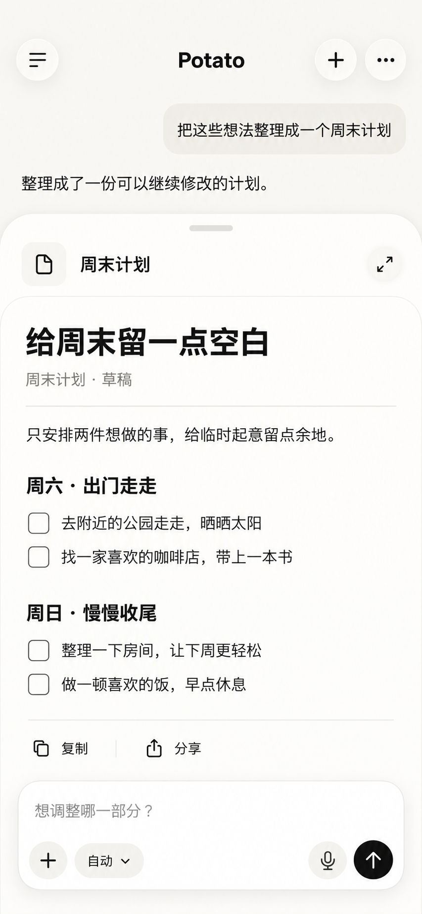
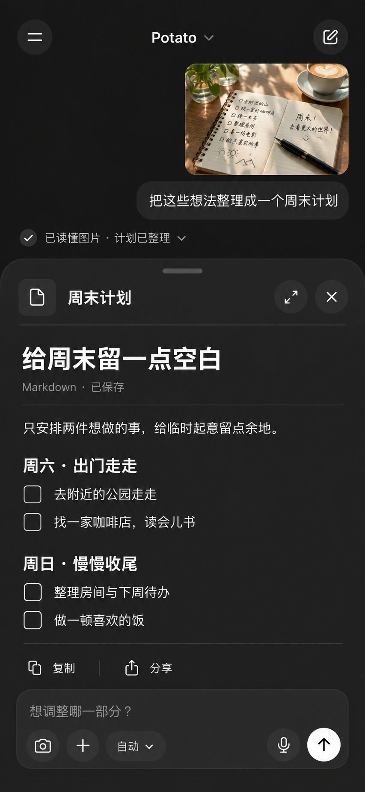

# Potato iPhone 视觉原型

日期：2026-09-12。

用户明确要求探索 iPhone 原生客户端，以 SwiftUI 为后续实现方向。本目录保存设计资料；不改变现有 GPUI + potato-core 的维护与构建入口。

## 当前选定方案：第 1 张「随身工作稿」

用户最新选择为「还是按 1 吧」，对应上一轮实际展示的第 1 张，原始文件 `exec-0b44c3b4-da2d-4d29-885c-7d41ad2c6757.png`。以此图的暖白底色、文稿浮层、复制/分享和底部继续修改输入框作为后续 iPhone 原生交互原型的视觉基准。深色融合图仅保留为探索记录。

已实现 [SwiftUI 原生客户端预览版](../../../native/potato-ios/README.md)，支持持久化多会话、文稿编辑、流式模型连接、实际附件与原生语音输入。已在 iPhone 17 与 SE 模拟器验证核心流程。[实际界面](../../../native/potato-ios/qa/polish/working-draft-refined.png)、[视觉验收](../../../native/potato-ios/design-qa.md)和[功能进度](../../../native/potato-ios/IMPLEMENTATION.md)独立于本生成图。默认仍为明确标识的本地体验模式；[Worker 接口](../../../native/potato-worker/README.md)已实现并本地测试，尚未部署、尚未真实模型联调。

## 历史融合草案（未采用）

此前曾探索合并第 1 张「随身工作稿」与第 3 张「暗色随手问」，用户随后回选第 1 张。本图仅为历史视觉草案，图中的复选框、已保存状态和输入控件均为示意。

- 保留第 1 张的文稿浮层、展开/关闭、复制/分享和继续修改入口。
- 保留第 3 张的深色中性色、图片输入、拍照与附件入口。
- 图片上下文位于顶部，主要阅读空间留给文稿；底部集中输入与语音入口。
- 后续实现应使用系统字体、动态字号、安全区域和至少 44pt 的操作区域；验证键盘避让、浮层滚动、展开与关闭后的焦点恢复。
- 深色画面是本张设计选择；系统浅色主题、首页与历史会话尚待细化。

## 生成记录

使用内置 Image Gen，输入为用户选中的两张生成图，目标逻辑视口 390 × 844。提示词的核心约束是：合并文稿编辑流程与深色图片对话；将上下文压缩到顶部；仅保留一个文稿浮层；拍照、附件、模型选择、麦克风和发送整合进底部输入区；使用中文系统字体与中性色；不绘制设备边框、系统状态栏或后端技术说明。

原始输入文件标识：

- 第 1 张：`exec-0b44c3b4-da2d-4d29-885c-7d41ad2c6757.png`
- 第 3 张：`exec-7f93d985-0f52-47d3-bcce-fcecda8da110.png`
- 融合输出：`exec-b85df606-2e0d-4bb1-afb7-680c1ca7b9ef.png`

## 产品与服务端约束

客户端是当前重点。用户接受先以 Cloudflare Workers 承载适合云端的业务接口，并暂不使用 VPS；这仍是架构方向，未部署服务。现有 potato-core 含桌面文件与进程能力，不能直接整体搬入 Worker。手机基础聊天与云端文件应能独立使用，电脑操作需另行设计桌面连接。

竞品参照来自三家官方 App Store 公开截图，未验证其完整实机手势：

- [Grok](https://apps.apple.com/us/app/grok-ai/id6670324846)
- [Claude](https://apps.apple.com/us/app/claude-by-anthropic/id6473753684)
- [ChatGPT](https://apps.apple.com/us/app/chatgpt/id6448311069)
