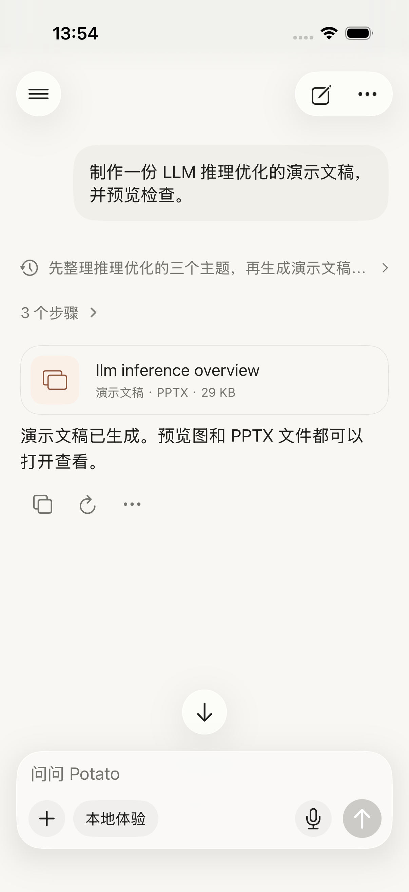
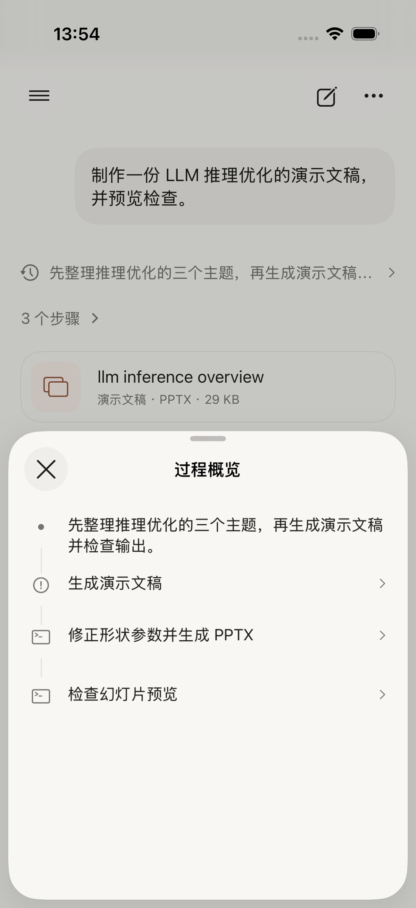
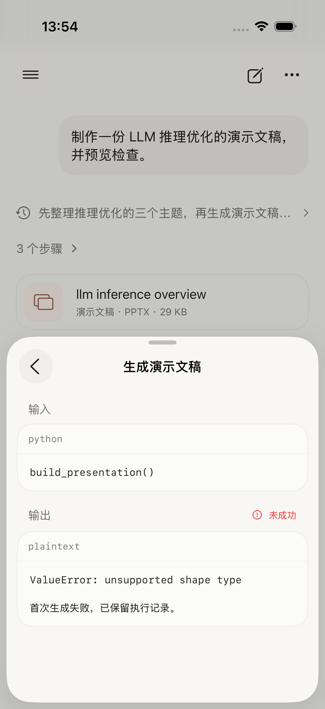
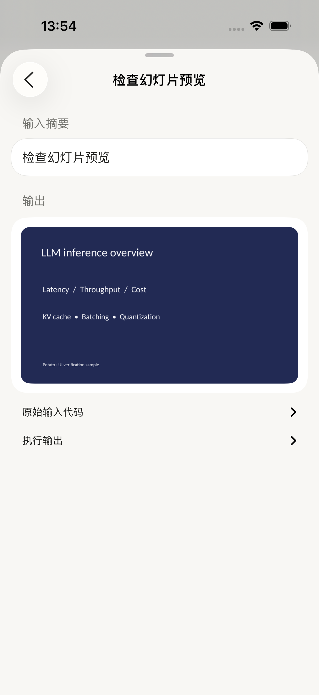
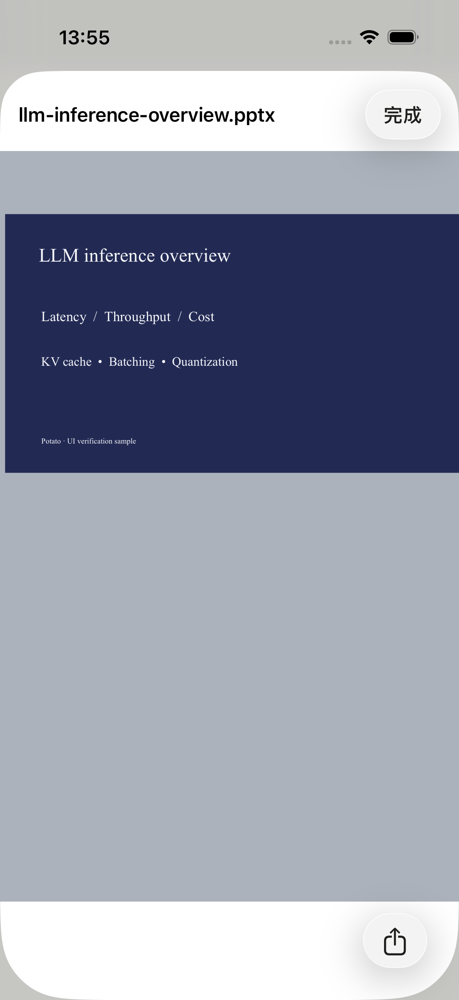

# Claude 参考对照与原生验收

结构验收：通过。细节对照与后续修正见 [detail-comparison.md](detail-comparison.md)。

范围：iPhone 工具步骤、详情、图片输出与交付卡片。用户要求采用 Claude 的展示设计；保留 Potato 既有导航和系统 SF Symbols，文案中文化。并非对整个 Claude 聊天应用逐像素复刻。

## 对照与迭代

原始参考为用户的 Photo 1–9。对照同一手机纵向宽高比例的原生截图，参考为 589×1280，原生为 1206×2622，两者纵横比约 0.46，按显示宽度归一化观察；原生截图保留完整像素，未裁去导航或错误状态。已在同一视觉输入中检查参考和实现的过程、输入/输出区域；进一步打开最终截图确认标题、间距、代码换行和图片四边。

- 第一轮：改动前基线仍是行内「Python 执行完成」折叠块，小文件入口位于正文下方。P1：工具过程与正文挤在同一层级，缺少独立概览与详情。已由共享步骤入口、半屏概览和单步详情替代。
- 第二轮：新版各完成项仍有重复状态标签，标题退回代码类型/文件名。P2：列表密度和动作可读性不符合参考。已去掉正常完成标签，增加模型提供的动作标题；错误保留图标与文字。
- 第二轮：PPT 渲染页仍重复占据聊天主线。P2：产物层次不清。已将有明确调用归属的 PPT 图片保留在步骤输出，将文件卡片移到最终说明前。
- 第三轮：文件预览测试截图停在「正在载入」。P2：证据不能证明实际文件可读。已等待 Quick Look 内容就绪并重新截图，最终文件页显示完整幻灯片。
- 远程回归：概览入口与已有任务状态各显示一个 spinner。已关闭远程概览入口的重复 spinner，保留既有状态栏和步骤详情内的状态反馈；结束的推理标题同步改为「思考记录」，不沿用上游过期的「正在思考」。

## 最终流程截图

1. 主聊天与文件交付 — 通过。只有步骤入口、PPTX 卡片和结论，没有中间代码块或重复的幻灯片图片。

2. 过程概览 — 通过。半屏圆角面板，关闭按钮、居中标题、图标与细线连接各步；动作标题可读，失败记录保留。

3. 输入与输出详情 — 通过。原地返回、可选择和复制的输入输出分区，失败原因可见。

4. 图片输出 — 通过。可上拉为大面板，图片完整保留宽高比，点击后可放大预览。

5. 文件预览 — 通过。Quick Look 实际加载 PPTX 内容，保留分享入口。

6. 辅助字号 — 通过本轮范围。步骤文字换行、面板可滚动，返回与关闭可用；完整 VoiceOver 真机验收尚未执行。

## 自动验证

- iOS 单元测试 136 项通过：包括新旧数据兼容、版本选择、过程顺序、同名文件归属、远程 call ID 配对、孤立输出、非零退出码、状态待确认、动作标题及 PPTX 保存。
- 本机 UI 8 条流程通过：PPT 失败/重试记录、图片和实际文件预览、大字号、运行中的详情更新、返回和关闭、停止、重启恢复、思考/搜索切换与断流。
- 最终交付样式改变后，重新执行 PPT 端到端与辅助字号 2 条 UI 用例，均通过。
- Worker 类型检查及 82 项测试通过；覆盖可选动作标题的 SSE 传递与 PPTX MIME 返回。
- iPhone Release（iphoneos，未签名）构建通过，检查发布可执行文件不包含 DEBUG 样例。
- 初轮远程 UI 因环境变量未传入而跳过，不计为通过。后续使用 TEST_RUNNER_POTATO_IOS_PROCESS_UI 执行，并修复重复进度动画；最终远程 UI 1 条实际执行通过，未跳过。

本次测试运行在 iOS 26.3 模拟器。没有发布 TestFlight，没有部署 Worker，没有调用真实模型生成 PPT，没有将本机富文件展示声称为远程图片传输能力。

进一步对照后，已移除详情「完成」按钮，并收紧行距、代码框和交付卡片。代码暂未做语法配色，系统 Quick Look 的字体替换由 iOS 控制。控件使用原生触控区域与语义标签；截图不能证明完整无障碍合规。
