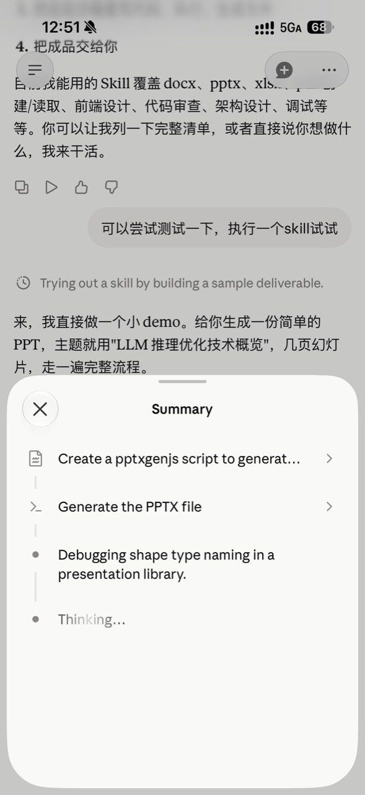
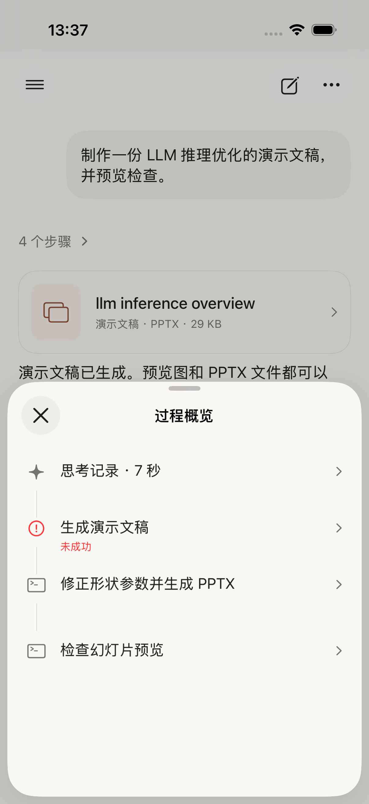
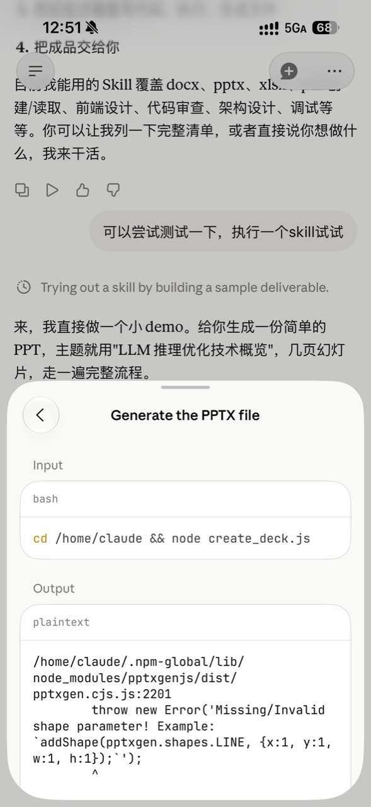
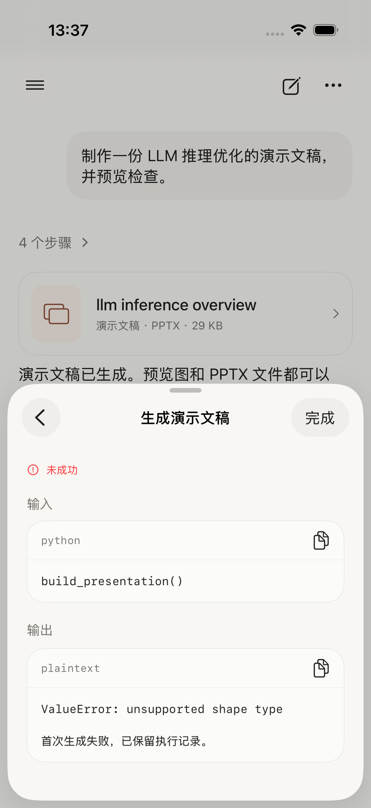

# Claude 与 Potato：第二次细节对照

按用户的 Photo 1、7、8、9 与同一 iPhone 模拟器的新截图对照。参考为 589×1280，实现为 1206×2622；观察时按屏幕宽度归一化，表中的 pt 是实现参数，不声称从参考图取得了设计源文件数值。

上一版只对齐了展示层级，视觉细节仍偏重。本轮直接调整现有 SwiftUI 实现。

| 项目 | Claude 参考 | 上一版差异 | 本轮修改 |
| --- | --- | --- | --- |
| 步骤列表 | 小图标、较紧凑行距、细竖线 | 最小 64pt 行高，18pt 图标 | 最小 52pt，16pt 图标；标题采用随系统字号变化的 callout |
| 思考项 | 灰点与具体内容 | 星形图标与泛化的“思考记录” | 6pt 灰点，直接摘录已有记录首段；最多 3 行，完整内容可打开 |
| 详情导航 | 左侧返回，标题居中 | 右侧额外“完成”，顶部还有状态行 | 移除“完成”；异常状态放在输出标题旁；返回概览后关闭 |
| 代码容器 | 细边框、轻量语言栏 | 大复制图标占据视线，框体偏窄 | 语言栏 44→38pt；复制移至长按菜单与无障碍动作；扩大内容宽度 |
| 图片结果 | 半屏就能看图片 | 代码与 stdout 把图片推到下方 | 输入摘要和图片优先；原始代码、日志仍分别可展开 |
| 文件卡片 | 低矮、浅色图标块，标题与类型 | 90pt 高、标题偏粗、有尾部箭头 | 默认 68pt 高、16pt 常规标题、去掉尾部箭头；大字号/长标题仍可自然增高 |

## 并排对照

按整屏宽度对齐；对话内容不同，重点观察下半屏弹层。

| Claude 参考 | Potato 调整前 | Potato 调整后 |
| --- | --- | --- |
|  |  |  |
|  |  |  |

## 本轮截图

- [过程概览](screenshots/ppt-02-timeline.png)
- [输入／输出](screenshots/ppt-03-failed-input-output.png)
- [半屏图片输出](screenshots/ppt-04-medium-image-output.png)
- [最终文件卡片](screenshots/ppt-01-chat.png)

## 发布前补充

用户指出思考入口过深，现已在聊天主线恢复独立摘要和状态，点击一次直接打开完整思考。工具步骤另行折叠，步骤计数只统计工具；共享概览仍可查看思考与工具顺序。

## 仍有差异

- Claude 展示的是过程中穿插的多条语义摘要。Potato 当前的本机协议累计提供一份思考记录，所以概览展示已有内容的摘录，不能据此重建多段精确的思考时间线。要完全对齐这点，需要进一步改事件协议。
- 系统 SF Symbols 的终端图标有外框；参考终端图标是无框形式。原生弹层与玻璃按钮的光泽也受 iOS 版本控制。
- 输入代码保留单色等宽字体，尚无参考图中的语法着色。
- 图片步骤的输入是代码，所以明确标为“输入摘要”，完整原始输入保留在下方；参考图的图片工具本身接受简短描述。

本轮不把“结构相似”写成“逐像素一致”。沿用原生导航、中文文案；未改整个聊天页的字体、输入框或顶部导航。

## 验证

本轮已完成：

- 8 条本机 UI 流程通过，覆盖停止、断流、重启恢复、搜索与思考切换、详情返回、文件交付及大字号。
- 最新思考摘录与图片布局再次通过 2 条 UI 用例；展开后能读取原始代码与完整执行日志，关闭详情后能打开 PPTX。
- 远程过程页 1 条实际运行通过，7 项过程数据单元测试通过。
- 最终截图与参考同时打开检查：图片在半屏内完整显示，输入/输出容器边距和标签层级接近参考；过程项文字换行正常，没有额外“完成”按钮。
- 结果包：`/tmp/potato-detail-after.xcresult`、`/tmp/potato-detail-verified.xcresult`。一次复验因本地远程测试服务未启动而失败并中止，不计为通过；启动 fixture 后限定用例重跑通过。
- 最后只修正了复制菜单的“输入代码／完整参数”文案，随后独立编译验证。

界面展示使用 DEBUG 固定样例；未调用真实模型制作 PPT，未发布 TestFlight 或部署 Worker。
