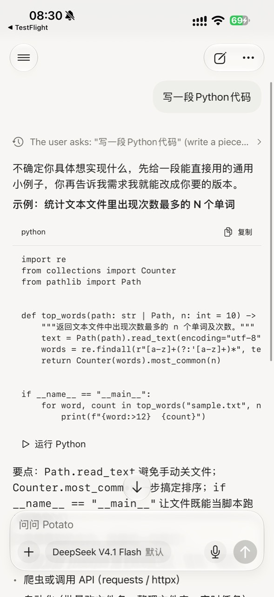
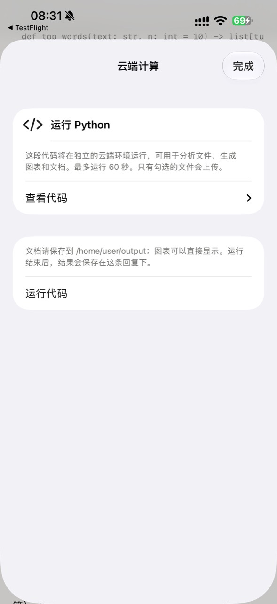
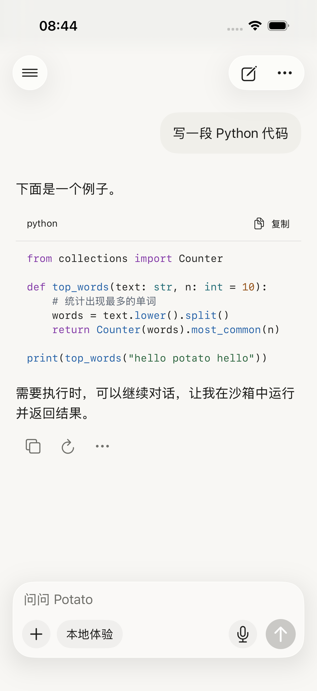
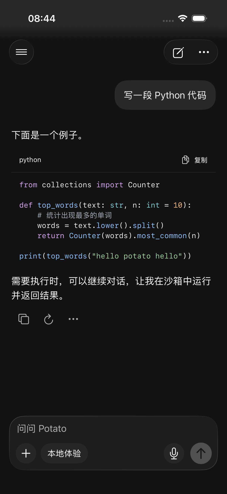
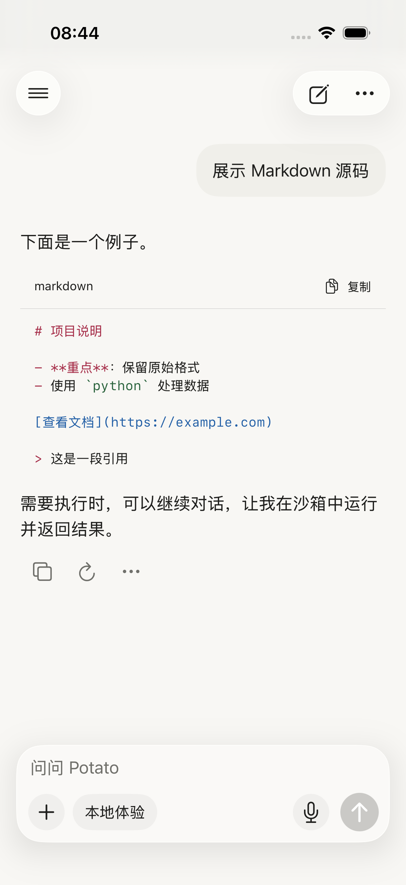

# iPhone 代码高亮与移除手动运行

2026-09-17。范围为用户本次截图中的 iPhone SwiftUI 客户端。

用户最终决定：移除代码块的手动运行入口。代码可能只是不能独立运行的片段；需要执行时，通过下一条消息让模型使用容器或沙箱并返回结果。因此不采用原位运行或半屏文件选择方案。

## 截图审查

1. 阅读代码：语言名和复制入口清晰，但单色等宽文字无法区分关键字、字符串和注释。长行支持横向滚动，仍需在原生界面确认手势。见图 1。
2. 点击运行：进入“云端计算”大面板，再次显示“运行 Python”“查看代码”和“运行代码”。无输入文件时主体大面积留空，重复操作也暗示每个片段都可执行。见图 2。
3. 等待结果：用户截图未覆盖。原代码由弹窗持有 HTTP 等待，关闭会取消客户端等待；用户决定移除该入口，不继续扩展这条手动交互。

## 最终实现

- 代码块仅保留语言与复制。删除手动运行弹窗、WorkspaceView 弹窗状态及 Markdown 的运行回调。
- 模型调用 run_python 的工具链保持不变，继续显示工具过程、输出和文件。历史手动执行结果的数据读取仍保留。
- 统一原生语法高亮用于聊天、文稿、远程 Markdown 和工具详情，跟随系统/应用深浅色。
- 词法着色支持 Python、Markdown、JSON、JavaScript/TypeScript、Shell、HTML/XML、CSS、SQL、Swift、Rust、Go、C/C++、Java、C#、YAML 及常用别名。
- 语法着色不执行代码，不改变复制内容。未知语言或超过 64 KB 的块退回纯文本，限制流式渲染中的同步处理量。每个代码视图缓存最近的着色结果。
- 支持四个及更多反引号围栏和波浪线围栏，Markdown 源码内较短的代码围栏不会提前结束外层块。
- 保留已有横向滚动、选择文字、动态字号与复制按钮的 44 pt 高度。

此实现为轻量词法高亮，并非编译器级语义分析：如 Rust 生命周期、正则字面量和混合语言嵌入不保证精确着色。

## 验证

Xcode 26.3 / iOS 26.3 模拟器 PotatoParityiOS 编译成功，共 29 项针对性单元测试和 5 项 UI 回归通过：

- CodeHighlightingTests 5 项：各语言保留原始源码，字符串/注释优先级，流式半截字符串，未知语言/超长块回退，嵌套围栏。
- CodeExecutionTests 4 项、SandboxTests 3 项：模型工具事件、附件持久化、历史回复版本及旧结果兼容。
- StreamingTests 5 项、CloudReplyTests 12 项：流式字符、断线恢复、游标和停止意图。
- CodeHighlightingUITests 3 项：Python 浅色/暗色、Markdown 源码；复制并粘贴到输入框，无手动运行入口。
- CodeExecutionUITests 2 项：工具详情实时更新、生成文件重启后可用、停止状态。

首轮 CodeExecutionUITests 暴露旧测试夹具配置成云端账号、但只实现旧 SSE 响应的问题。将仅限 DEBUG 的夹具明确改为 SSE 工具事件源后两项回归通过；云端异步链路另由上述 12 项 CloudReplyTests 验证，未修改生产执行逻辑。

结果包：`/tmp/potato-code-highlighting-tests.xcresult`（新高亮的 17 项单元测试和 3 项 UI 测试通过，包含修复前的旧夹具失败）；`/tmp/potato-code-tool-regression.xcresult`（修复后的 2 项工具 UI 与 12 项云端单元测试全部通过）。

检查了以下原生截图，关键字/字符串/注释颜色可区分，代码和复制入口保持原布局。截图中的“需要执行时……”是 DEBUG 示例回复，不是为每个代码块添加的固定提示。

未在本轮调用真实模型/E2B；真机和完整 VoiceOver 验收尚未进行。已发布至 TestFlight **0.2.2（2026091702）**，既有个人内测组 Testing，详见 [发布记录](release-2026091702/README.md)。
