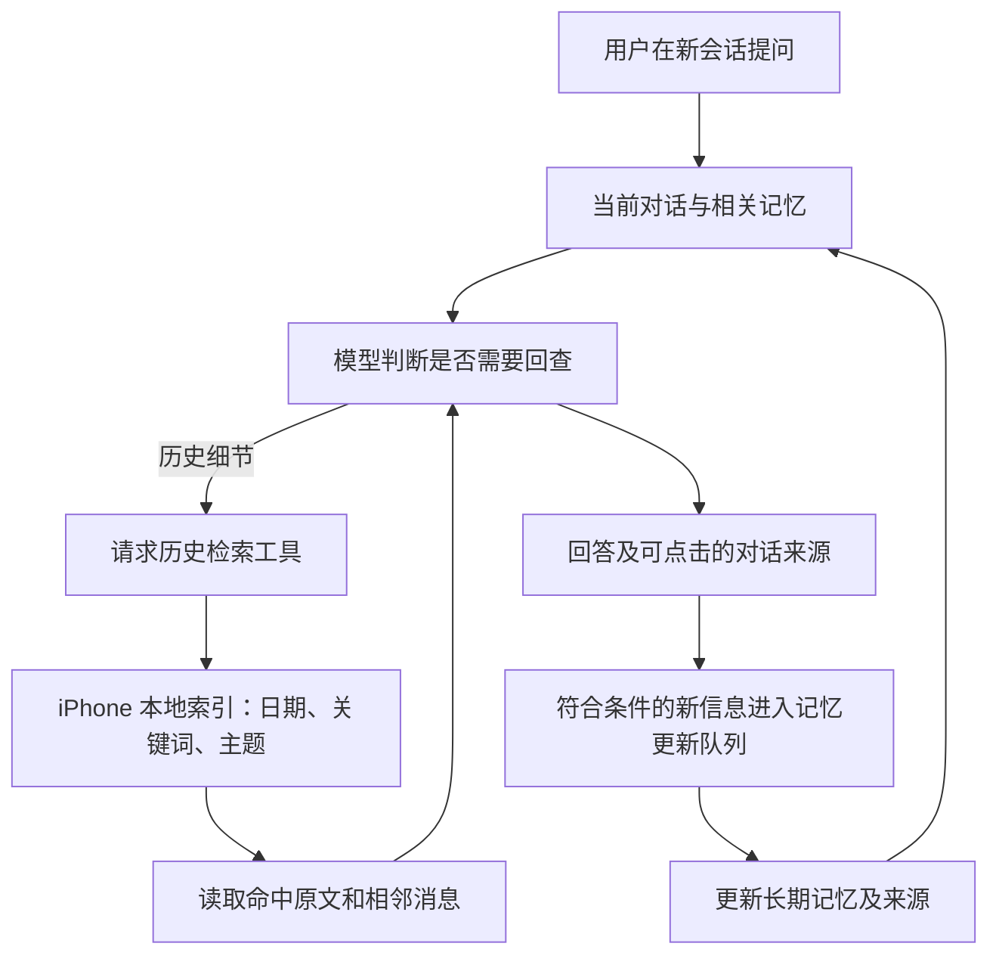

# iOS 跨对话检索与长期记忆：调研和落地方案

调研日期：2026-09-13。状态：方案，尚未实现、未发布。根据本轮要求，仅调研与设计。目标是让 iPhone 新建对话后，仍能回答「昨天我问了什么」「我最终选了哪款商品」，并延续用户的稳定偏好。

**当前实施设计：[E2B + R2 跨对话检索](e2b-r2-design.md)**。以该文件的同步、云端工具循环和生命周期为准；下文保留初始调研及备选方案。

当前选型决定：用户因使用量较少，希望继续使用 E2B，避免为 Cloudflare Sandbox 新增 Workers Paid 固定月费。后续方案以复用 E2B 为准；外部持久存储可选 R2，尚未开通、挂载或迁移数据。E2B 官方已提供通过自定义模板和 s3fs 挂载 R2 的指南，不依赖其私有测试的原生 Volumes。下文早先的本地优先及其他提供商建议保留为调研备选。

后续提供商调研见 [Cloudflare、Daytona、Modal、阿里云与 E2B 对比](sandbox-providers.md)；其中优先验证 Cloudflare Sandbox 的早先建议已由上述用户决定取代。

建议采用「原始对话 + 可更新的长期记忆 + 按需检索工具 + 可点击来源」。第一版优先覆盖这台 iPhone 上保存的普通聊天，用本地索引执行检索，继续使用现有云端模型理解问题和作答；跨设备同步与容器分析放在后续阶段。

**ChatGPT 的公开机制支持这个方向，但不能据此断言其底层实现。**

| 官方公开信息 | 对 Potato 的启发 |
| --- | --- |
| 2025-04-10 官方更新明确区分 saved memories 与 chat history。 | 稳定知识和历史细节需要不同的保留方式。 |
| 2026-01-15 更新加强从过去对话找具体细节，并提供原对话来源；2026-05-05 继续改善检索和来源控制。 | 回忆必须可核对，检索应由问题驱动。 |
| 2026-06-04 推出更自动更新的记忆；当前 Memory FAQ 描述自动维护的 memory summary，且摘要不代表全部记忆。 | 摘要是可管理的概览，不能替代原始记录。 |

依据：[OpenAI 记忆公告](https://openai.com/index/memory-and-new-controls-for-chatgpt/)、[ChatGPT 发布说明](https://help.openai.com/en/articles/6825453-chatgpt-release-notes)、[Memory FAQ](https://help.openai.com/en/articles/8590148-memory-faq)。产品能力和界面仍可能因账号及推出阶段不同而不同。

官方资料没有说明 ChatGPT 普通聊天具体使用哪种数据库、向量库、文件布局，也没有确认是否用容器内的 grep、SQL 或其他系统命令查历史。上述资料描述的是产品行为，下面是为 Potato 设计的实现方案。

另一个容易混淆的点：[本地 Codex 记忆文档](https://learn.chatgpt.com/docs/customization/memories)确实公开了文件式记忆，但也明确区分本地 Codex 存储与 ChatGPT 网页记忆；不能把前者直接当作后者的架构。使用相同模型或兼容接口，也不会自动把 ChatGPT 产品的历史与记忆能力接到 Potato。

**当前缺口在调用链，不是新会话把旧数据删除了。**

| 当前代码 | 已具备与缺口 |
| --- | --- |
| [LocalStorage.swift](../../../../native/potato-ios/Sources/LocalStorage.swift) | 所有普通会话保存在 Application Support/Potato/workspace.json，原子写入并启用文件保护。 |
| [Models.swift](../../../../native/potato-ios/Sources/Models.swift) | 消息有 ID、创建时间和回复版本；会话有软删除标记。日期检索应使用消息时间，不能用会随编辑变化的会话 updatedAt。 |
| [LibraryView.swift](../../../../native/potato-ios/Sources/LibraryView.swift) | 用户可以按标题或正文查历史，但这只是界面搜索。 |
| [WorkspaceStore.swift](../../../../native/potato-ios/Sources/WorkspaceStore.swift) / [ChatService.swift](../../../../native/potato-ios/Sources/ChatService.swift) | 生成请求只取 selected.messages，没有跨对话工具或长期记忆。 |
| [index.ts](../../../../native/potato-worker/src/index.ts) / [search-chat.ts](../../../../native/potato-worker/src/search-chat.ts) | Worker 已能让模型调用 web_search，但客户端请求校验只允许 system/user/assistant；iOS 流解析也不处理通用工具调用，必须补上完整工具往返。 |
| [sandbox.ts](../../../../native/potato-worker/src/sandbox.ts) | 当前每次新建 E2B 沙箱，最后 kill；仅传入显式选择的文件，不保存全量历史。 |
| [RemoteService.swift](../../../../native/potato-ios/Sources/RemoteService.swift) | 远程任务从电脑读取，是独立数据源；当前远程消息模型还没有供日期检索用的消息时间字段。 |
| [Rust memory.rs](../../../../native/potato-core/src/memory.rs) | 桌面已有 Markdown 记忆与读写/搜索工具，可复用数据规范和理念；Swift 客户端目前没有接入这套运行时。 |

**两类信息承担不同职责。**

| 信息 | 存储方式 | 回答时的规则 |
| --- | --- | --- |
| 喜欢简洁中文、鞋码、长期目标 | 可编辑的记忆条目，带来源和更新时间 | 有关时引用，新信息可以修正旧信息。 |
| 昨天问的问题、某次商品比较、原话和价格 | 完整原始对话 | 检索后读上下文，保留当时状态。 |
| 某件商品从考虑到选定、下单、取消 | 可选的事件摘要，保留原文引用与状态变更 | 「推荐」「想买」「选定」「已买」不能混为一谈；冲突时检查更新的用户陈述。 |

示例：用户问「昨天我最后选了哪款耳机？」时，系统先确定用户时区下的昨天，检索当天相关对话，再读命中片段前后的消息，检查是否后来改选或取消。回答应带日期、原对话和原消息入口。如果只有推荐，没有用户确认，就说明没有找到最终选择，不能编造购买记录。若购买只发生在线下、从未在聊天或已连接的数据源中出现，也无法从聊天凭空知道。

**推荐的第一版运行流程如下。**



本地检索不意味着本地模型：查询理解、工具选择和最终回答仍通过已配置的模型服务完成，相关原文片段也会发送给该服务。收益是无需为检索额外启动沙箱或上传全部聊天；确需回查时，仍可能增加模型调用轮次，不能承诺零延迟。

建议提供以下受限工具接口，名字为方案草案：

| 工具 | 输入/输出 |
| --- | --- |
| search_conversations | query、start/end、timezone、cursor；返回会话/消息 ID、时间、短片段、分页与覆盖范围。允许纯日期查询。 |
| read_conversation | 会话 ID、消息位置、前后窗口、版本；返回原文和可验证来源标识。 |
| search_memory / read_memory | 根据主题查记忆，返回事实、更新时间和出处。 |
| update_memory / forget_memory | 经已启用的记忆规则处理更新/忘记；写入包含 revision 与来源，重复调用不重复新增。 |

Worker 与 iOS 需要新增带版本的工具往返协议：模型发起本地工具调用，iOS 校验并执行，再把结果交回当前生成流程；Worker 的现有 web_search 继续在服务端执行。工具调用必须绑定本次生成 ID、工具名与 call ID，限制轮数和结果大小，停止生成会取消整个链路。只发最终正文不会构成跨会话能力；把全部历史拼到 system prompt 也不是这个方案。

第一版工具只覆盖已声明支持的云端连接，自定义连接要验证工具能力，不能假装所有 Chat Completions 接口都支持；不支持时保留普通聊天和手动搜索。

**存储上先兼容现有数据，再逐步演进。**

普通聊天第一阶段继续以 workspace.json 为事实源，增加可重建的本地检索索引。不要同时引入两个可编辑的对话主副本。需要文件式访问时，可导出按会话分隔的只读 JSONL，并记录源版本，供调试、备份或后续沙箱使用。

建议的新增数据区域：

```text
Recall/
  index.sqlite                    # 可重建：消息索引、关键词、时间、主题
  summaries/                      # 可重建：会话/日摘要，必须保留来源
  exports/<conversation-id>.jsonl  # 可选：原始记录的只读投影
Memory/
  MEMORY.md                       # 从条目生成的概览/目录
  notes/<topic>.md                 # 可编辑条目，含 ID、revision、日期、来源
```

索引至少记录 conversation_id、message_id、reply_version_id、role、created_at、source_revision、deleted/excluded 标记。记忆条目至少记录内容、来源消息、更新时间、有效状态和被哪条新记忆替代。用户纠正应覆盖当前有效结论，同时保留变更关系；历史原文不因此被改写。

检索首先结合日期与中文关键词/短语，用问题改写和主题摘要补充同义表达。建议评估 SQLite FTS5，但不能直接把默认英文式分词当成中文语义检索：默认 unicode61 按连续字母数字分词，trigram 对不足 3 个字符的全文查询也有限制。因此需明确中文分词/二字词与型号检索方案，并在目标 iOS 版本验证模块能力。[SQLite FTS5 文档](https://www.sqlite.org/fts5.html)

对没有明确日期、只记得意思的请求，增加语义候选检索会更有价值。建议将 embedding 作为可替换的召回层：新消息增量计算，全文关键词与语义结果合并后再读原文。第一版若暂不接 embedding，必须在验收中明确同义转述的召回限制；不能把关键词命中宣传成完整语义记忆。

「昨天」按当前用户时区的自然日解释，而非简单往前 24 小时。还要区分消息发送时间与事件发生时间：今天说「昨天我买了耳机」，事件属于昨天，消息属于今天；事件时间只有在原文明示或可可靠解析时提取，否则标为未知，不伪造时间。

**长期记忆需要有生命周期。**

明确的「记住」「忘掉」「改成」即时处理；自动记忆从用户自己的陈述中提取稳定偏好、长期目标及明确决定，采用来源核对、去重和版本更新。助手的猜测、第三方引用、假设性讨论、密码与令牌不得直接沉淀为用户事实。

提取与合并安排在应用可执行期间的空闲队列，按新增消息增量处理、可中断与续做，不让每条正常回答都等一次全量总结。不假定 iOS 后台进程始终运行。摘要有损，原文检索必须独立可用。

提供「引用历史」「使用和更新记忆」控制，以及单会话不参与、记忆查看/修改/删除、来源查看。软删除、排除会话后，立即从后续检索中排除并使相关自动记忆失效；希望保留的独立记忆由用户另行确认。对「忘掉某条」保留必要的抑制标记，避免下次摘要又从旧历史自动提取回来。已有回答中的副本不会因为停止引用自动消失，界面要区分停止使用和删除记录。

来源界面显示「本次检索到/提供给回答的历史」，不把检索候选一概标成模型确实引用的证据。回答中的来源标识必须来自真实返回结果；点开后显示日期、原文、上下文及对应回复版本。已删除来源不得因来源卡片缓存而重新泄露。

**E2B 已有可复用的持久化与挂载能力。**

E2B 官方提供 pause/resume，可以保留文件系统与运行状态；这不等于当前 Potato 已接入持久会话，当前代码使用的是 kill。[E2B 持久化说明](https://docs.e2b.dev/sandbox/persistence)

补充核验：2026-09-13，按用户要求继续检查官方存储文档。此前只介绍 pause/resume 不够完整，E2B 还提供以下两条路线：

- **原生 Volumes**：存储卷独立于沙箱生命周期，支持将同一卷在不同沙箱中复用；当前仍为 private beta，需要申请访问，尚未核验 Potato 账号是否开通。[Volumes](https://docs.e2b.dev/volumes)
- **Cloud buckets**：官方提供通过自定义模板和 FUSE 挂载 S3、GCS、Cloudflare R2 的指南，可作为已有对象存储接入路线。[Cloud buckets](https://docs.e2b.dev/storage/cloud-buckets)

若采用 Volumes，可由 Potato 将每个用户映射到独立卷，把原始会话保存为 JSONL、长期记忆保存为 Markdown，再在创建检索沙箱时挂载到 `/data/personal`。SDK 也支持向未挂载的卷直接读写文件，因此文件同步不必总先启动执行沙箱；卷挂载后则通过沙箱文件路径访问，不能假设两条写入通道可以随意并发。[挂载接口](https://docs.e2b.dev/volumes/mount)、[文件接口](https://docs.e2b.dev/volumes/read-write)

这能承载「跨对话的个人文件空间」，但会话导出、用户与卷的权限映射、增量同步、历史搜索工具、记忆更新规则和来源跳转仍由 Potato 实现。现有临时沙箱结束后 kill 可以保留；挂载卷中的文件不会因执行沙箱销毁而一起消失，不必为了保存文件强制维持同一个沙箱。

**Beta 对本项目的实际约束**：官方目前列出仅支持美国和欧洲区域，APAC 不可用；文件锁可能挂起，SQLite 应放沙箱本地盘；大量小文件操作有网络开销；尚不支持只读挂载，且卷权限位不隔离同一沙箱内的 Linux 用户。因此不能靠 chmod 或未提供的只读选项保护唯一历史档案。执行模型生成代码时，宜由服务准备限定范围的工作副本，记忆更新经版本化接口写回；需实测国内访问与检索耗时。[Volumes beta 限制](https://docs.e2b.dev/faq/volumes-beta-limitations)

调整后的建议是把「复用 E2B + 个人持久文件」列为可直接评估的首版云端路线，而非只留给复杂分析阶段；本地索引仍是降低云端依赖的备选。能否优先采用原生 Volumes，取决于账号开通情况、区域延迟与上述限制的验证；未开通时可评估官方 bucket 挂载或持久沙箱，不需要另建一套沙箱平台。

| 路线 | 适用情况 | 取舍 |
| --- | --- | --- |
| iPhone 本地索引 + 记忆文件，第一版推荐 | 先让新会话能查这台手机的历史 | 不增加检索容器依赖；换机和跨设备可用性需要后续同步。 |
| 账号级持久存储 + 服务端检索 | 手机、电脑共享个人知识 | 要做同步、隔离、删除传播、离线冲突与备份；服务区域影响等待时间。 |
| 持久存储 + 按需沙箱查询 | 跨月统计、批量分析和复杂代码处理 | 可用 grep/SQL/Python，但执行与启动成本更高，需限制文件范围和资源。 |

采用容器路线时，建议「账号级原始存储（可由 E2B Volume 承担） → 准备限定范围的历史工作副本 → 沙箱执行查询 → 返回片段与来源」。记忆更改走专门的版本化写入接口。容器销毁后仍能从主存储恢复，不将唯一聊天档案寄托于一个 sandbox ID。文件存储与全文/语义索引并不冲突，也不需要让每次回忆都运行任意 shell。

**建议分三步交付，先证明用户的问题真的答得对。**

1. 原始历史检索、日期范围、工具往返、原文来源跳转、删除排除与旧数据迁移。先覆盖 iPhone 普通聊天；远程电脑历史作为第二个有明确权限和数据完整性标记的数据源，补齐时间字段后接入。
2. 可编辑记忆、明确的记住/忘记、自动提取与冲突更新；补上同义问题的召回评测，再决定 embedding 方案。只有 1+2 都完成，才算首个完整的「检索 + 记忆」版本。
3. 同账号多端同步、远程任务融合、可选沙箱分析。此时再选存储服务和区域，不因已有 Cloudflare/E2B 就默认让全部历史经过其执行环境。

首版验收采用合成历史，不使用个人聊天做未经限定的全量上传测试：

| 场景 | 必须满足 |
| --- | --- |
| 新建对话问昨天讨论了什么 | 找到不同会话中的问题，日期按时区正确，附真实来源。 |
| 先推荐 A，用户选 B，后来取消 B | 不把 A 当成购买，不把已取消状态说成当前已买。 |
| 今天提到昨天发生的购买 | 区分事件日期与消息日期。 |
| 同义表达、两字中文、具体型号、跨午夜 | 分别测试召回；无结果/覆盖不完整时明确说明。 |
| 重试、分支、切换回复版本 | 来源不串版本，不把复制的消息当作多次独立确认。 |
| 删除、排除、忘记后再问 | 不再检索或自动重新生成被排除的信息。 |
| 切模型、新建会话、重启 | 历史与有效记忆仍可用；索引损坏可重建。 |
| 普通知识问答 | 不无条件附加整段私人历史，不强制启动沙箱。 |
| 网络中断或用户停止 | 不继续生成、不写入半成品记忆，已有内容保留。 |

性能测试分别记录本地检索、模型工具往返、首字和总耗时，并使用 1 千/1 万/10 万消息分档。当前尚无该能力的性能实测，不给出毫秒级提升承诺。
