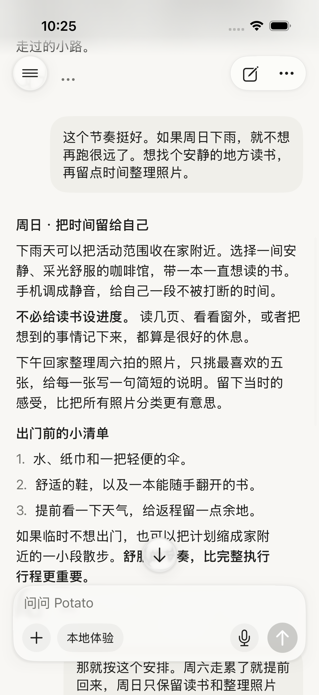
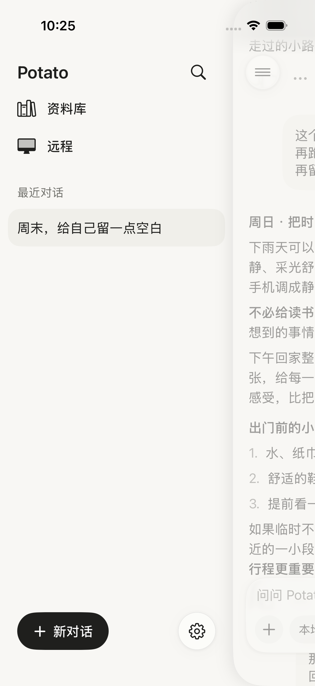
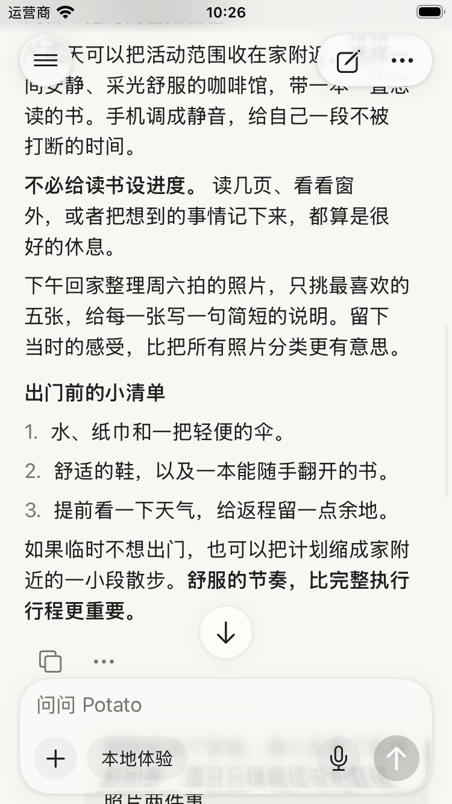
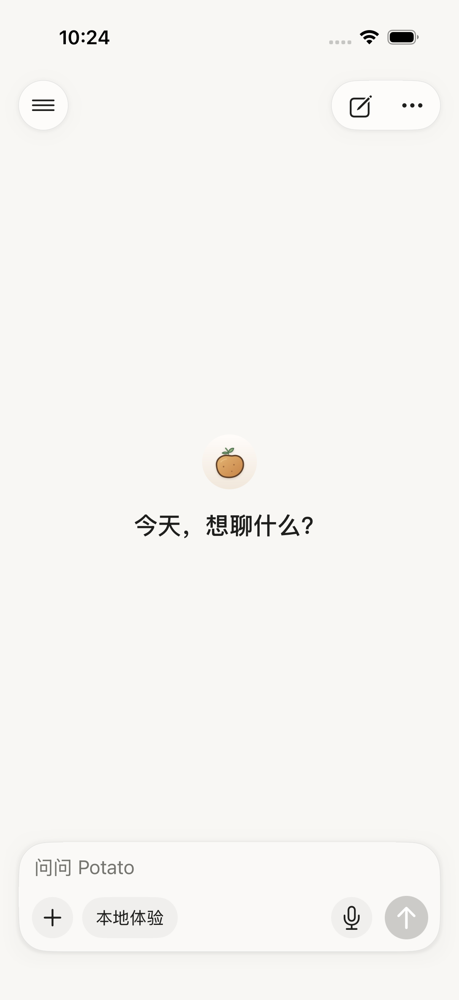
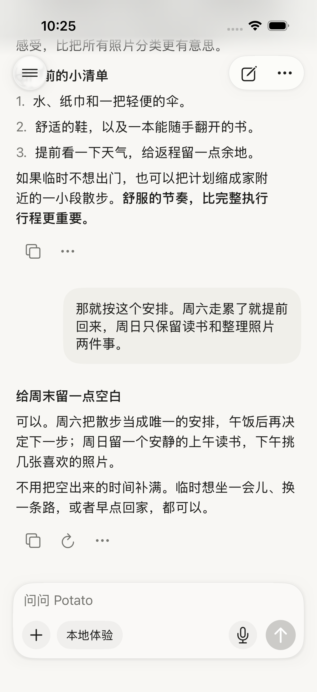
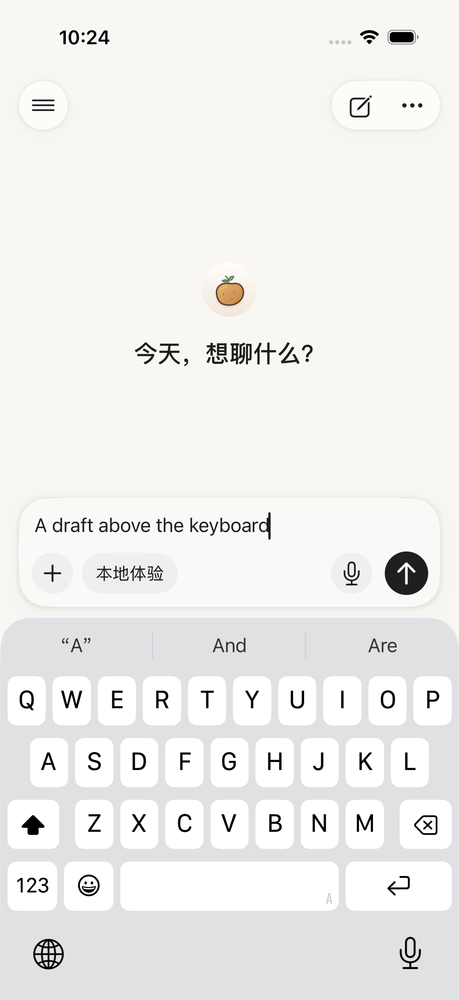
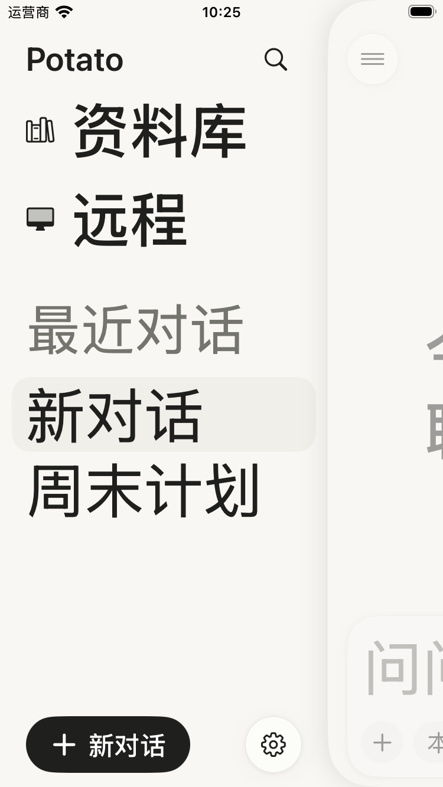

# iOS 浮动聊天界面与 Liquid Glass

2026-09-16。范围：原生 SwiftUI iOS 客户端的本机对话、共享侧栏、远程对话输入区。最终原生默认版本已随 **0.2.2（2026091601）** 发布 TestFlight，见 [发布记录](release-2026091601/README.md)。

**当前版本已按用户要求切换为原生默认 Liquid Glass 外观**：去掉第二轮添加的玻璃投影遮罩和细轮廓线。见 [原生默认版本与最新截图](native-default/README.md)。下方“第二轮材质打磨”和截图保留为历史对照。

## 行为与实现

- 消息滚动视图通过 `safeAreaBar` 承载上下浮层，正文延伸至导航、输入框和底部安全区域后方；底部滚动留白仍保证最后一条消息及操作可见。本机聊天关闭整条上下边缘的泛白效果，仅在状态栏保留渐隐的超薄材质。远程对话只关闭底部效果，保留原生导航区域的可读性处理。
- 顶部菜单、操作胶囊、输入卡片、追底按钮和侧栏设置使用系统 `glassEffect`。只对控制层使用玻璃，正文保持清晰；输入区内部使用轻量圆底，触控目标保留 44 pt。
- 侧栏前景页覆盖屏幕顶底，页面、淡色遮罩与关闭点击层一起进行连续圆角裁切，阴影在裁切之后。当前会话有选中背景和辅助功能 selected 状态。
- 前景页使用真实 ZStack 容器，并明确 contain 辅助功能分组，保证侧栏隐藏/恢复页面后，按钮的可访问性与点击区域一起恢复。
- 远程输入区共用相同材质和浮动布局；远程状态、发送回执与草稿行为保持原逻辑。
- iOS 26 以前使用 regularMaterial 和 safeAreaInset 回退；减少透明度时玻璃表面改为实色并保留细边界。DEBUG 可通过 `--ui-testing --reduce-transparency-preview` 检查此回退，不改变用户的系统设置。

## 第二轮材质打磨

上一版虽然调用了 Liquid Glass，但大范围滚动边缘泛白会先抹去玻璃后方的内容；默认投影在浅色背景上也显得过重。本轮按实际原生截图调整：

- 保留 `Glass.regular` 的自适应模糊、折射和触摸反馈。在玻璃形状之外衰减投影，使用带额外绘制空间的羽化遮罩，避免矩形阴影残角或沿玻璃边缘硬切。
- 增加 0.5 pt 的低对比轮廓，使浅色画布上的玻璃边缘更容易辨认。没有在控件内叠加白色实底，也没有给整块控件降低不透明度。
- 状态栏底层高度随安全区变化，只在有对话内容时显示；欢迎页保持统一底色。
- 本机输入区内边距从 10 pt 收到 8 pt，行间距从 8 pt 收到 6 pt，圆角从 28 pt 调整为 26 pt。按钮仍保留 44 pt 触控区域。
- 去掉顶部重复的“本地体验”提示，输入区模型入口继续标明当前模式。
- 阅读截图改用包含长段落、列表、粗体和用户气泡的隔离测试样例。样例仅在 DEBUG 且同时指定 `--ui-testing --glass-reading-preview` 时出现，不调用模型服务。

界面继续使用现有暖白画布（#F8F7F4）、正文墨色（约 #1F1F1D）、次要灰色（约 #757570）、浅色消息气泡（约 #F0EFEA）与系统字体。视觉目标是细轮廓、局部模糊、轻投影；布局和品牌不做重设计。

## 环境与版本

本机 Xcode 26.3，iOS 26.2 SDK，iOS 26.3 模拟器。项目最低部署目标仍为 iOS 17。最低部署版本表示可以安装的最低系统版本，不代表只能使用旧组件；新材质通过 `#available(iOS 26.0, *)` 启用。

Apple 已发布 [iOS 27 更新说明](https://support.apple.com/en-ae/149076)。Liquid Glass API 从 iOS 26 开始可用，见 [glassEffect 文档](https://developer.apple.com/documentation/swiftui/view/glasseffect(_:in:)) 与 [采用 Liquid Glass](https://developer.apple.com/documentation/TechnologyOverviews/adopting-liquid-glass)。本项目之前的聊天按钮和输入框由白色背景自定义绘制，不会自动获得这些系统效果。

本轮没有安装 iOS 27 SDK 或运行环境，不能视作 iOS 27 真机验收。旧系统回退已编译，但没有 iOS 17 运行时实测；完整 VoiceOver 人工验收也未进行。

## 验证截图

以下为真实原生模拟器测试截图，使用隔离的合成对话，不涉及真实服务调用。

### 阅读中的内容延伸

### 侧栏展开

### 小屏中的背景透出

同一代码在 SE 上的阅读截图，正文经过输入框后方时，可以看到原生玻璃的局部模糊和边缘变化。

### 欢迎页

### 回到最新消息

### 键盘与小屏大字号

[回归记录与验证边界](verification.md)。
