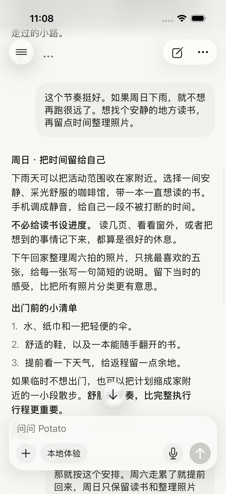
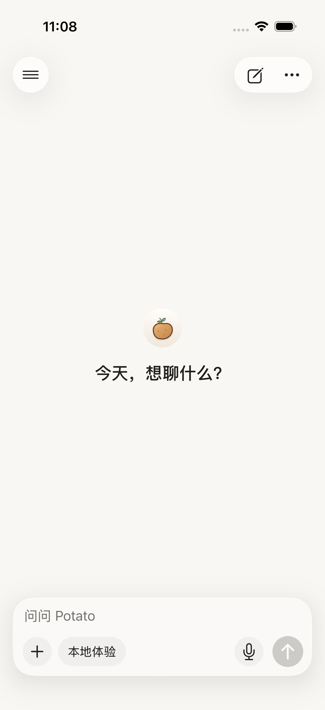
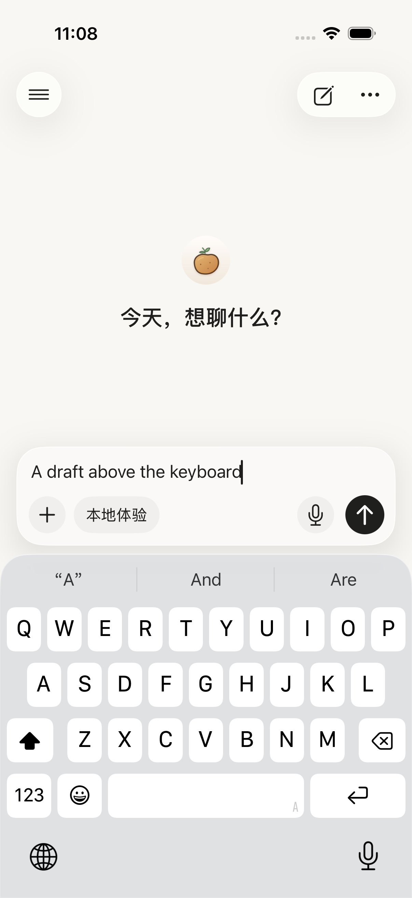
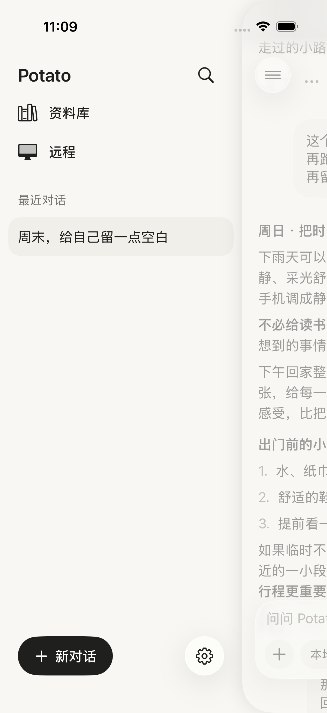

# 原生默认 Liquid Glass

2026-09-16，按用户要求改为系统默认玻璃外观。

iOS 26+ 的普通显示模式直接使用 `glassEffect(.regular.interactive(interactive), in: shape)`，不再叠加自定义轮廓线、投影衰减遮罩、透明度或染色。玻璃的折射、高光、模糊和阴影交给系统渲染；按钮仍使用系统的 interactive 反馈。

保留前几轮的侧栏圆角修复、内容延伸、输入框布局与触控区域。状态栏渐隐底层属于页面布局，继续保留；本次“原生默认”指玻璃材质外观，并不表示整页改成系统标准导航布局。减少透明度与 iOS 26 以前的兼容分支保持原实现。

## 实际截图

以下均为 iPhone 17 / iOS 26.3 模拟器的真实截图，使用隔离测试数据。

### 对话阅读

### 欢迎页

### 键盘与侧栏

[前一版的自定义修饰效果](../screenshots/glass-01-reading-under-controls.png)保留供比较。两次截图使用相同阅读样例，滚动停留位置可能略有差异。

## 验证

GlassChromeTests 5 / 5 通过，覆盖阅读与追底、侧栏关闭后输入、键盘、大字号和减少透明度回退。原始结果：`/tmp/potato-glass-native-default.xcresult`，日志：`/tmp/potato-glass-native-default.log`。

Release 模拟器构建成功，日志：`/tmp/potato-glass-native-default-release.log`。已目视检查阅读页与欢迎页的默认高光、阴影和正文延伸。

已随 **0.2.2（2026091601）** 发布至 TestFlight 既有个人内测组，状态 Testing，见 [发布记录](../release-2026091601/README.md)。未进行 iOS 27 真机验证。
