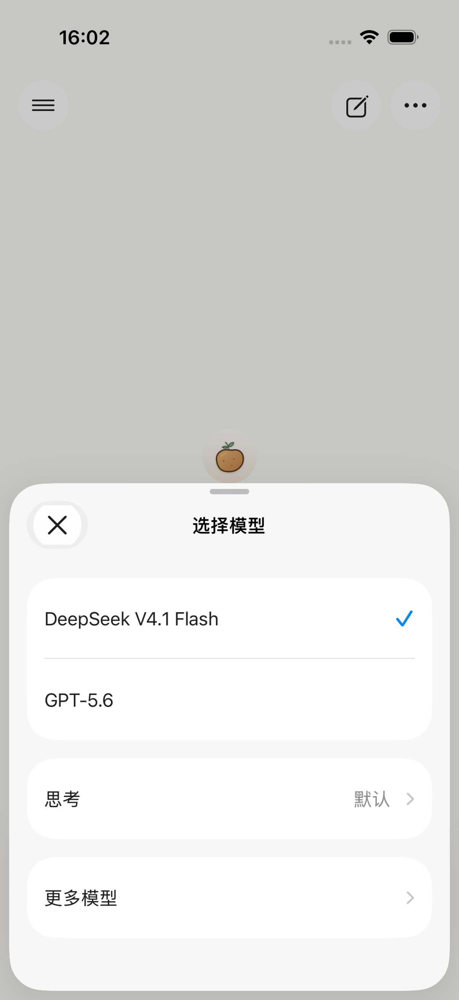
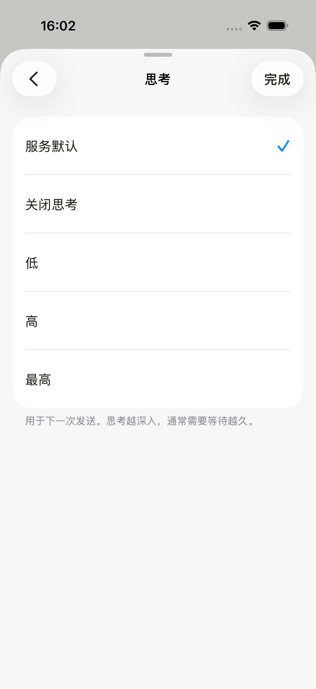
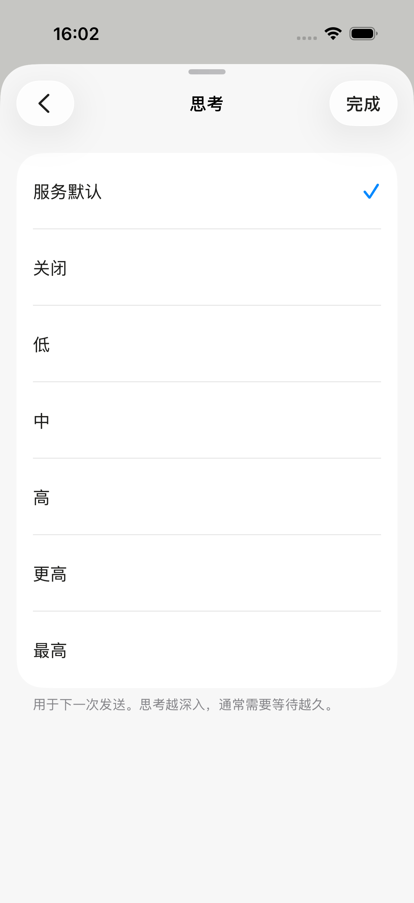

# iPhone 精简模型与思考档位验证

2026-09-13：云端聊天目录收为两项，默认 DeepSeek V4.1 Flash。iOS 只显示友好名称；云端模式不再允许手填已移除的模型。回复操作继续使用「复制、重试、…」，更多面板可换模型重新回答。

## 当前目录

| 显示名称 | 上游 API ID | 可选思考配置 | 服务默认 |
| --- | --- | --- | --- |
| DeepSeek V4.1 Flash | `deepseek-flash` | 关闭、`low`、`high`、`max` | 开启，`high` |
| GPT-5.6 | `gpt-5.6` | `none`、`low`、`medium`、`high`、`xhigh`、`max` | `medium` |

客户端另保留「服务默认」，此时不发送显式思考配置。DeepSeek 关闭使用 `thinking.type=disabled`，三个档位使用 `thinking.type=enabled` 与 `reasoning_effort`；GPT 使用 `reasoning_effort`，其中 `none` 显示为「关闭思考」。

DeepSeek 9 月 10 日发布 V4.1 Flash 后，正式 API 名称为 `deepseek-flash`。直接把旧日期后缀删除得到的 `deepseek-v4.1-flash` 实测 HTTP 400，不是可用 ID。依据：[发布记录](https://api-docs.deepseek.com/updates/)、[思考模式](https://api-docs.deepseek.com/guides/thinking_mode/)。

OpenAI 的 `gpt-5.6` 指向 Sol，因此目录只保留一个入口，未重复列出 Sol，也未增加 Terra/Luna。上述六档以官方模型页和当前 sub2api 实测为依据：[GPT-5.6 Sol](https://developers.openai.com/api/docs/models/gpt-5.6-sol)、[Terra](https://developers.openai.com/api/docs/models/gpt-5.6-terra)、[Luna](https://developers.openai.com/api/docs/models/gpt-5.6-luna)。

## 实际请求结果

调用只使用合成问题 `17 × 19`，未发送用户历史或附件。复用现有原生供应商连接，凭据在内存解密，不写入报告。

- 上游目录：[directory.json](directory.json)。DeepSeek 包含 `deepseek-flash`；sub2api 包含 GPT-5.6 系列。
- 直接聊天：[chat-probes.json](chat-probes.json)。共 31 次：DeepSeek 正式 ID 的关闭及三档全部成功；GPT-5.6、Sol、Terra、Luna 各六档全部成功，共 28 次正确返回 `323`。另有 3 次预期 HTTP 400：无效 DeepSeek 别名及两个供应商各一次非法 effort 对照。
- 本地 Worker 处理器连接真实上游 SSE：[stream-probes.json](stream-probes.json)。目录中两模型的 10 种显式配置全部 HTTP 200、正确答案且收到 `[DONE]`。这是本地处理器到上游验证，不等于已登录手机经过线上 Worker 的完整验收。
- 请求成功说明当前连接接受相应参数、能完成调用；简单算术不足以证明不同档位内部计算量或质量存在差异。部分 GPT 请求没有公开思考文本，不能据此判断参数被忽略或模型没有思考。

## 图片生成尚未接通

官方已列出 [GPT Image 2.5 Sunburst](https://developers.openai.com/api/docs/models/gpt-image-2.5-sunburst) 和 [GPT Image 2.5 Flare](https://developers.openai.com/api/docs/models/gpt-image-2.5-flare)。具体 ID 为 `gpt-image-2.5-sunburst`、`gpt-image-2.5-flare`，不是笼统的 `gpt-image-2.5`。图片模型使用 Image API 或 Responses 图片工具；`quality` 的 `low/medium/high/xhigh/max/auto` 是画质配置，不是聊天的 `reasoning_effort`。

当前 sub2api 目录只列出 `gpt-image-1`、`gpt-image-1.5`、`gpt-image-2`，没有两个 2.5 ID。以上五个模型分别尝试一次低画质合成图片请求，全部被分组权限拒绝，HTTP 403：`Image generation is not enabled for this group`，没有生成图片。见 [image-probes.json](image-probes.json)。请求在权限层被拒绝，不能据此断言 2.5 模型不存在或已可用。

因此暂未把图片模型放进 Chat Completions 聊天目录，也未实现图片生成入口。后续需要用户指定已开通图片生成的现有连接/分组，再验证其实际模型与画质档位并接入原生图片结果展示。

## 实现与回归

- `native/potato-worker/scripts/cloud-model-policy.mjs` 是手机云端目录的明确策略；桌面模型设置不变。Worker 验证目录声明的思考配置，拒绝错误档位。
- 云端目录刷新/登录后，iOS 将已退役的会话模型迁移到同供应商当前模型；清理不支持的思考配置，保留草稿、附件和全部回复历史。旧回复的原模型信息保留，换模型重新回答时要求从现有目录选择。
- Worker：TypeScript 检查、43 项测试、Wrangler dry run 通过。
- iOS：105 项单元测试、7 项原有模型/回复 UI 回归通过；随后新增的精简云端目录及精确档位 UI 测试也通过，共 8 项不同 UI 测试。新增测试覆盖旧模型迁移、禁用手填、两种模型的档位、草稿保留和 GPT `none` 请求参数。
- 测试结果：`/tmp/potato-curated-models-20260913.xcresult`、`/tmp/potato-curated-cloud-ui-20260913.xcresult`。下列截图来自原生 UI 测试 fixture，用于验证排版与交互，不作为线上模型调用证据。GPT 截图滚动到了列表下半部。





## 发布状态与复查入口

Worker 已发布，版本 `b5a3fe31-3921-40d5-ac0d-11c9220019ce`。使用 `--models-only` 只更新 `CLOUD_PROVIDERS` 与代码，保留现有邮箱白名单、账号登录要求及其他 Secret。两个域名 `/health` 均为 200，未登录 `/v1/models` 均为 401。

云端新目录已生效；本次 iOS 迁移与面板代码已编译测试，0.2.2 (2026091303) 已于 16:28 上传 Apple，处理完成并加入「个人内测」组，状态 Testing，中文更新说明已保存；内测分发状态见 [分发记录](../../../../native/potato-ios/DISTRIBUTION.md)。旧版客户端获得新目录后仍可能保留旧会话选择，需要手动选择新模型；自动迁移随新版客户端发布。

在 `native/potato-worker` 执行：

```sh
node scripts/sync-cloud-models.mjs --probe
node scripts/sync-cloud-models.mjs --probe --apply --models-only
# 以下会实际调用供应商并可能计费，按需使用；报告写入 /tmp。
node scripts/probe-model-capabilities.mjs --chat
node scripts/probe-model-capabilities.mjs --images
```

目录同步不是生成测试。图片探测失败时仍需检查报告中的状态；不能以脚本退出成功代替模型可用性判断。
