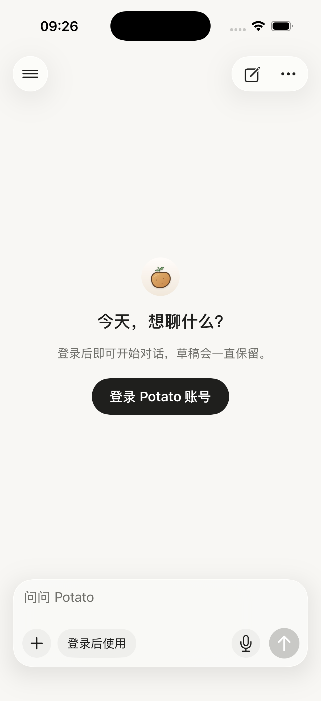
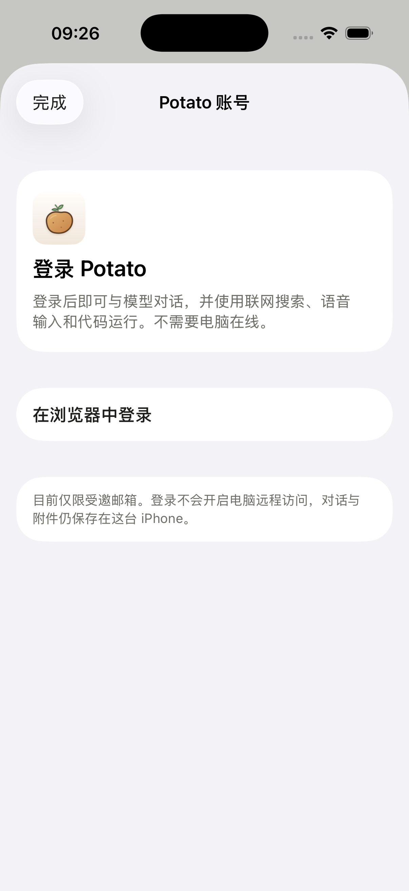
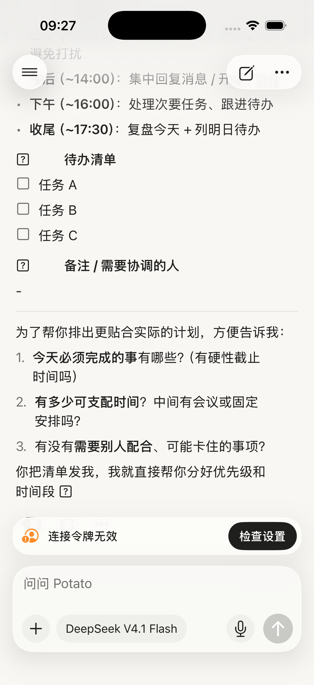
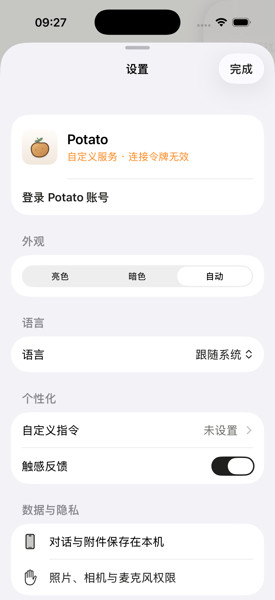
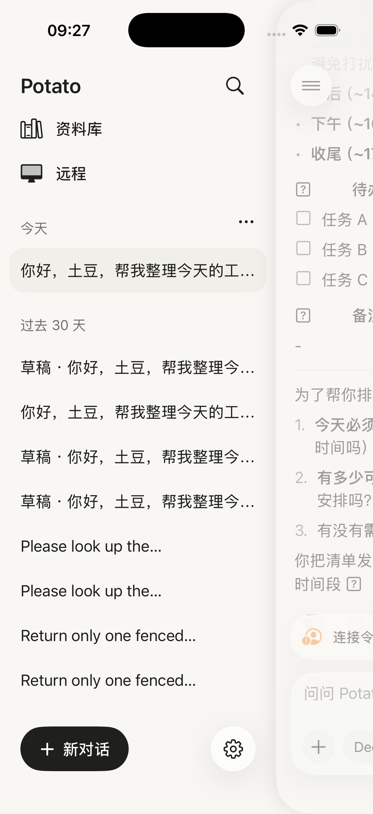
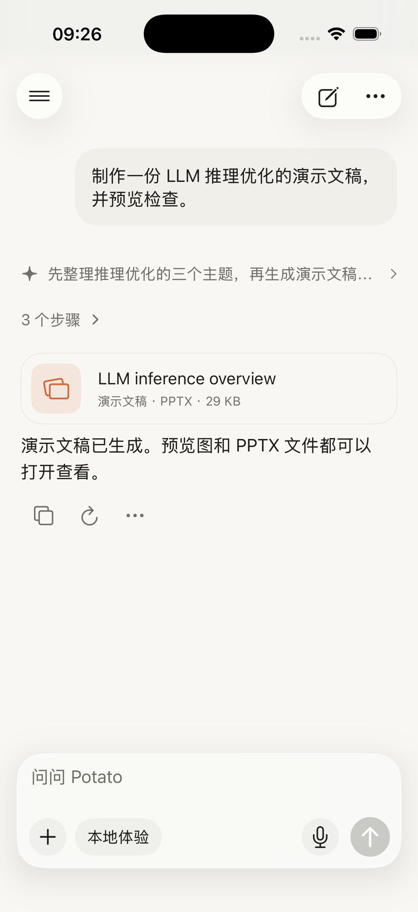
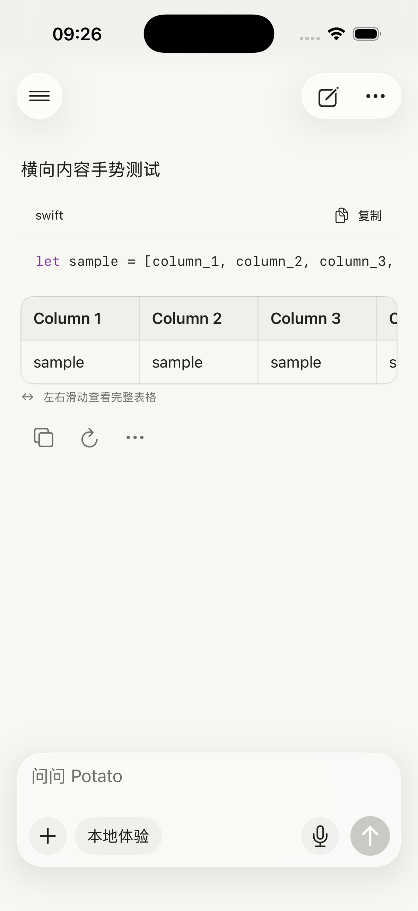

# iPhone 产品层打磨（2026-09-24）

依据 2026-09-24 的整机走查（首次打开、侧栏、对话、模型面板、设置、记忆与历史、远程、资料库、附件、工具过程），修复"像预览版"的产品层问题。只改 iOS 客户端；Worker、桌面 GPUI 与 potato-core 未改动。**尚未发布 TestFlight。**

后续复核修复了自动标题的思考参数冲突、失败回复缺少换模型入口、旧示例重试绕过登录三项回归。原始清单中尚未完成的部分见 [逐项复核与验证](followup-review.md)。

## 修复内容

### 首次体验与登录

- 全新安装不再进入预置的"周末计划"示例对话，而是空白首页，加上"登录 Potato 账号"入口；输入框模型标签显示"登录后使用"。
- 未登录时点发送或麦克风，弹出登录页，草稿保留；不再返回"本地体验"的固定示例回复。示例回复只在自动化测试中保留。
- 登录页去掉 Cloudflare 字样：标题"Potato 账号"，按钮"在浏览器中登录"/"使用此账号继续"/"退出登录"。

 

### 登录失效与发送失败

- 模型列表或回复返回 401/403 时，记录为"登录已过期"，在输入框上方显示横幅和"重新登录"按钮（自定义连接显示"连接令牌无效 · 检查设置"）。重新连接或模型列表读取成功后自动消失。
- 回复在产生任何内容前就失败时，不再显示成一条带"复制/分享"的助手回复，而是一行原因，加上"重新登录"（登录失效时）和"重试"。

### 隐藏工程细节

- 模型显示友好名：`deepseek-v4.1-flash-expires-on-0910` → "DeepSeek V4.1 Flash"，`gpt-5.6-luna` → "GPT-5.6 Luna"；服务端提供的名称优先。ID 中带 `expires-on-MMDD` 且已过期的模型，在模型面板里标注"已停用"。
- 设置改版：顶部是账号（已登录显示邮箱与状态；自定义连接显示服务主机）；外观、语言、触感即时生效，不再需要"保存/取消"；"回复偏好"改为"自定义指令"子页，只填写补充内容，Potato 的基础指令不再暴露。
- 接口地址、模型名称、令牌、测试连接和"本地体验模式"移入"开发者选项"（位于语言之后）：默认隐藏，连点底部版本号 7 次开启；已经在用自定义连接的人会自动保留该选项。开发者连接的修改仍需点"完成"提交，有未提交修改时才显示"取消"。
- 版本号改为读取安装包（如"Potato 0.2.2 (2026092101)"），去掉"原生预览版"。
- "记忆与历史"说明重写，去掉 E2B 等实现名称与大段免责说明。

### 对话列表

- 首轮发送后按首行生成标题：去掉 Markdown 标记，按宽度截断（中文约 22 字，英文约 44 字母），英文在词边界结束。首轮回复完成后再请求模型生成不超过 12 字的标题（`max_tokens` 24，关闭思考，服务端不挂工具），失败则保留本地标题。
- 旧版按 28 字硬截断的标题在启动时重新生成；没有内容的空对话在启动时清理；只有未发送草稿的对话显示为"草稿 · …"。
- 侧栏按"今天 / 昨天 / 过去 7 天 / 过去 30 天 / 更早"分组，长按菜单增加"重命名"。重命名后不再自动改标题。

### 信息架构与细节

- 右上角"…"改为本对话操作：重命名、置顶、分享、记忆与历史、移到最近删除。去掉重复的"设置"入口和"打开示例文稿"（后者仅测试模式保留）。模型面板的"连接设置"仅在开发者选项开启时出现。
- iOS 26 顶部改用系统柔和滚动边缘，正文滚到悬浮按钮下方时渐隐，不再与按钮文字叠在一起；底部保持无效果。
- 宽表格加圆角边框和可见滚动条；4 列以上显示"左右滑动查看完整表格"。
- 文件卡片与资料库按类型使用图标和颜色（演示文稿、PDF、表格、文档、代码、压缩包）；标题首字母大写，短的无元音词识别为缩写（`llm` → LLM）。
- 思考摘要图标改为 `sparkle`；过程概览里失败的步骤图标变红并标注"未成功"。
- 附件面板：只有选了附件才显示"已选 N 个"；"允许访问照片 / 前往设置"改为按钮样式。远程空状态改为居中插图，"登录账号"主按钮加"通过配对码添加"次按钮。

 

## 未做（需要决定或凭据）

- **任务完成推送**：需要 APNs 密钥和 Worker 侧推送，客户端单独无法可靠实现。
- **分享扩展**（从其他 App 分享到 Potato）：需要新 target、App Group 与签名配置。
- **本机对话跨设备同步**、**手机端产品重心**（随身工作稿还是远程接管电脑任务）：需要产品决定。
- 远程页底部栏与聊天输入框样式不一致，涉及远程页整体结构，本轮未动。

## 验证

环境：Xcode 26.3，iOS 26.3 模拟器（iPhone 17）。

- 单元测试 211 项全部通过，其中新增 `ProductPolishTests` 10 项：模型友好名、过期判断、标题生成与截断、草稿标题、日期分组、自定义指令拼接、全新安装无示例、启动清理与迁移、重命名、文件类型。
- 新增 UI 测试 `ProductPolishUITests`：首次打开要求登录且保留草稿；"…"菜单重命名。按新行为更新了 3 个 UI 测试：外观与语言改为即时生效（`PrototypeTests`、`LanguageUITests`），登录页标题改名（`CloudAccountUITests`）。
- 全量 UI 测试 122 项（28 项需真实服务，已跳过）：本轮引入的回归已全部修复（开发者选项的位置导致表单懒加载找不到行、说明文案与无障碍标签变化），相关组复跑通过：`PrototypeTests`、`LanguageUITests`、`CloudAccountUITests`、`LocalModelUITests`、`SidebarUITests`、`RecallUITests`、`ProductPolishUITests`。
- 仍失败的 6 项与本轮无关：其中 5 项用改动前的代码备份在同一模拟器复跑，同样失败——`AttachmentSheetUITests` 的 `testRecentTapAddsImmediatelyAndClosePreservesDraft` 与 `testDarkPanelAndCloseWhileImporting`（等不到最近照片）、`LocalModelUITests/testCuratedCloudModelsAndExactThinkingOptions`、`PrototypeTests/testAttachmentAndVoiceEntryPoints`、`RemoteUITests/testEmptyRemotePairingValidationAndLocalChatReturn`；另 1 项 `AttachmentSheetUITests/testContinuousSelectionLimitAndRemoveToFreeSlot` 因"模拟器相册至少需要 20 张照片"的前置条件不满足而失败。
- 使用模拟器现有数据（自定义连接、令牌已失效）实际检查了横幅、失败行、菜单、侧栏分组、设置与开发者选项。

新增的 `--first-run-preview` 启动参数（需同时带 `--ui-testing`）在隔离存储中模拟全新安装，仅用于测试与截图。
