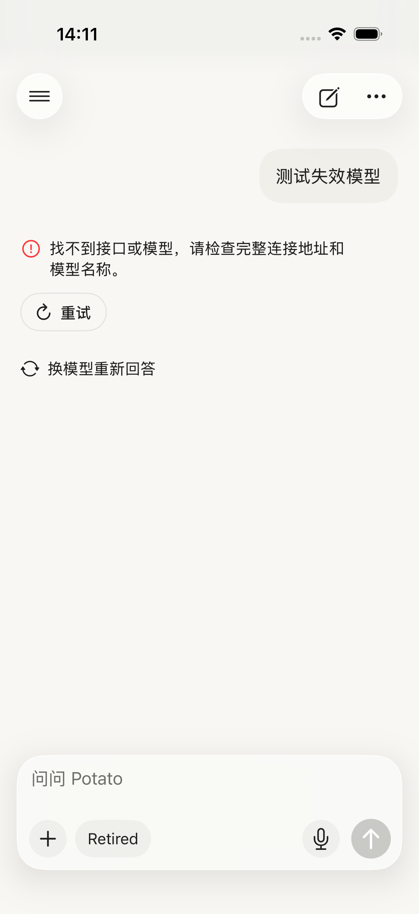
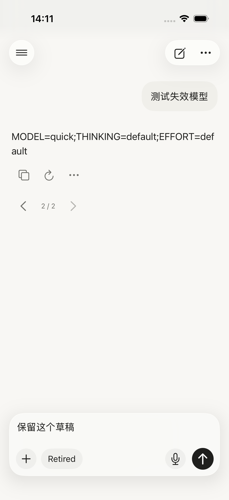
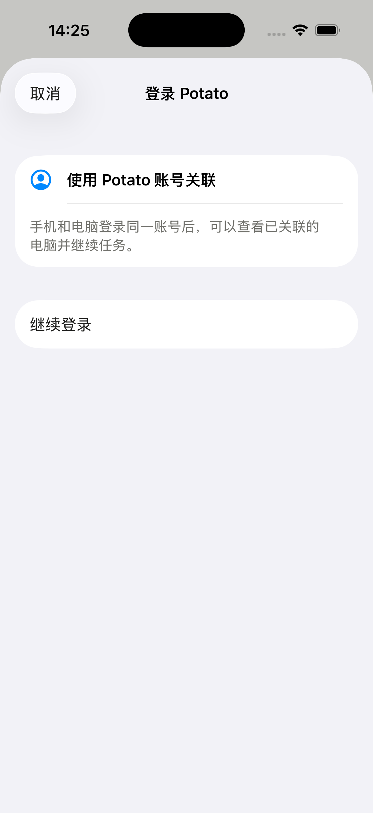
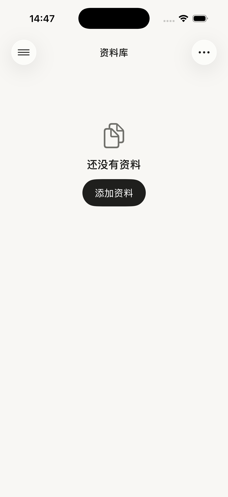
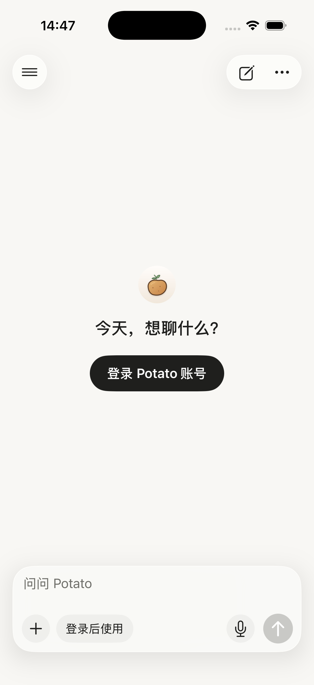
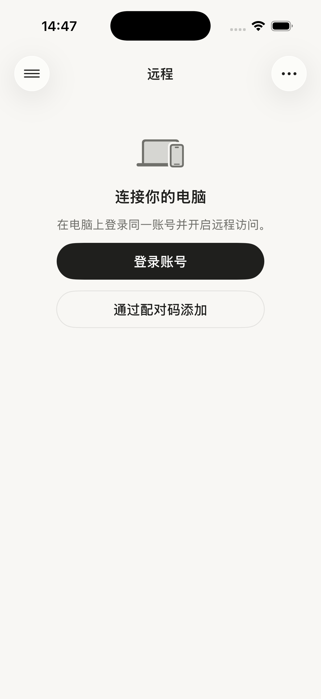

# iPhone 产品打磨复核与回归修复

2026-09-24。范围为当前 iOS 工作树；对照 Claude 修改前的 `potato-ios-before-polish.tgz` 和原始走查清单复核。此次修复没有发布到 TestFlight。

## 本次修复

1. **DeepSeek 自动标题请求返回 400**：原实现同时传 `thinking.type=disabled` 和 `reasoning_effort=low`，与 Worker 校验规则冲突。标题请求改为共用 `LocalModelChoice` 校验，关闭思考优先；仅在没有关闭思考模式时选择 `none` / `low`。单独抽出实际请求构造，自动化测试可以覆盖生产参数。
2. **空回复失败后不能换模型**：保留精简失败行，新增“换模型重新回答”。选择只用于本次重新回答，原失败版本和未发送草稿保留；输入框的模型选择不改变。
3. **旧示例的重新生成绕过登录**：`retry()` 在修改消息前检查登录状态。生产启动（包括测试中的生产启动）禁止示例回复；升级时保留旧内容，点击重新生成会引导登录，不增加空回复或版本。

## 原始清单逐项状态

| 项目 | 当前状态 | 已实现及剩余边界 |
| --- | --- | --- |
| 1. 首次打开假对话 | 已修主要路径 | 首次安装为空白首页并提供登录；发送、语音和此次补齐的重新生成都会引导登录。旧版示例记录仍保留。“本地体验模式”开关仍在隐藏开发者设置中，生产发送不再使用示例回复。 |
| 2. 工程细节暴露 | 部分完成 | 云端聊天登录、模型友好名、隐藏开发者设置、自定义指令、安装包版本号、记忆页文案已改。远程菜单、账号管理和登录页仍有 Cloudflare 名称及服务地址；网页来源页仍写“搜索记录 · Exa”，部分服务错误仍带 E2B。 |
| 2. 过期模型迁移 | 部分完成 | 模型面板标注“已停用”；刷新云端目录时，会替换已不在目录中的模型。没有针对过期日期的通用迁移，也没有向用户说明已替换；自定义连接不自动迁移。 |
| 3. 登录过期、发送失败 | 部分完成 | 已有登录失效横幅、登录入口、精简失败行及此次恢复的换模型入口。失败行仍属于助手消息，没有实现用户气泡旁的“未送达”。`ChatService` 直连响应只把 401 映射为登录失效，403 仍为普通权限错误；手动刷新模型失败没有统一更新全局失效标志。修改手动凭据后，也未在成功回复时清除旧横幅。 |
| 4. 对话列表 | 已修主要路径 | 本地标题、自动标题、日期分组、长按重命名、草稿标题已实现；此次修复 DeepSeek 标题参数。空会话目前是列表隐藏和启动清理，仍可能暂存于 workspace，并非从不保存。 |
| 5. 重复入口 | 部分完成 | 聊天“…”已改为本对话操作，示例入口只在 UI 测试显示；模型面板的连接设置仅开发者可见。顶部和侧栏的新对话入口仍都存在；历史管理、侧栏搜索、记忆检索尚未做进一步信息架构合并。 |
| 6. 设置即时生效 | 已修 | 外观、语言、触感、自定义指令即时保存；开发者连接仍明确通过“完成”提交。 |
| 7. 顶部渐隐 | 已实现，有版本边界 | iOS 26 使用系统 soft scroll edge；iOS 17–25 没有新增同等渐隐实现，本次也未做这些版本的实机验收。 |
| 8. 宽表格 | 已修 | 已有横向滚动、边框、滚动条以及四列起的滑动提示。 |
| 9. 空状态、权限、附件计数 | 部分完成 | 远程空状态、登录/配对按钮、照片权限按钮、零附件不显示计数已改；远程页底栏/输入区与本机聊天的整体样式仍未统一。 |
| 10. 文件卡片、思考、失败步骤 | 部分完成 | 文件分类图标及颜色、文件标题大小写、思考图标、失败步骤红色“未成功”已改。代码执行的错误详情可展开查看；搜索失败仍缺具体原因。PDF 缩略图沿用 Quick Look，本轮没有专门修复或验证此前报告的空白 PDF。 |

上述“已修”表示当前工作树存在对应实现；不等于已发布或所有设备均已验收。此次只对下述回归运行新的测试，其余状态来自代码及此前验收记录。

## 尚未实现的能力

- **任务完成推送**：iOS 没有 APNs 注册与推送 entitlement，也没有通知接收链路。需要 APNs 配置及 Worker/远程任务事件接入。
- **从其他 App 分享到 Potato**：项目没有 Share Extension target、App Group 或共享导入链路。
- **本机对话跨设备同步**：仍保存在本机。云端异步回复恢复、记忆检索上传、远程查看电脑任务均不等于完整的双向聊天同步。
- **产品主路径的决定**：代码仍同时提供本机聊天、手动存为工作文稿、远程电脑。尚未围绕一个核心任务重排首页，也未实现模型自动生成/更新独立工作文稿的完整流程。

## 验证

环境：Xcode 26.3，iPhone 17 / iOS 26.3.1 模拟器，模拟器 ad-hoc 签名。构建及 **29 项针对性测试全部通过**：`ProductPolishTests` 12 项、`LocalModelTests` 13 项、`ProductPolishUITests` 4 项。

- 新增标题请求参数回归，覆盖关闭思考、`none`、仅 `low` 和未知能力，并验证自定义指令不进入标题请求。
- 新增生产启动下旧示例重试回归，验证登录提示、原回复、磁盘记录和草稿不被覆盖。
- 新增两条 UI 回归：升级旧示例的重新生成引导登录；真实模拟 HTTP 404 后换模型恢复，检查草稿、旧失败版本及操作入口。
- 已查看 UI 测试截图，失败行入口可见、恢复后保留版本切换及草稿。测试通过隔离存储和 URLProtocol 使用合成数据，不访问真实模型。
- 结果包：`/private/tmp/potato-ios-review-test/Logs/Test/Test-PotatoMobile-2026.09.24_14-11-02-+0800.xcresult`。原有两处 `LocalModelUITests.reveal` 返回值未使用的编译警告仍存在。

本轮没有全量复跑其他 UI 测试、调用真实模型、归档真机或发布。原走查中的模拟器 emoji 字体现象本次未复验，仍需真机验收；未将其作为 Potato 代码缺陷处理。

## 第二轮收口（同日）

- **工程文案**：远程菜单、账号管理和登录页不再显示 Cloudflare（改为“Potato 账号”“继续登录”）；登录页的“服务地址”只在开发者选项开启时出现。网页来源页标题去掉 “Exa”；代码运行和云端历史的未配置错误不再提 E2B，改为“暂不可用，请稍后再试”。同时删除已不被代码引用的 Cloudflare/E2B 旧翻译。自定义连接说明仍提到 Cloudflare Worker，但只在开发者选项中可见，保持不变。
- **登录失效横幅**：直连流式回复成功或云端回复成功取回一页后清除横幅；手动刷新模型遇到 401/403 也会设置横幅，不再只靠后台刷新。直连自定义服务的 403 仍然是“没有访问权限”，因为那是手动连接的权限问题，不代表登录过期；云端链路已把 401/403 视为失效。新增 `ReasoningStoreTests.testAcceptedReplyClearsExpiredSignInBanner`。
- **PDF 空白缩略图**：用资料库自带的 PDF 在模拟器上，浅色和深色模式都复现不出来，首页内容正常渲染。对话里的文件卡片现在按类型显示图标，不再生成缩略图，原先报告的场景已经不存在。本项关闭，不改代码。
- 验证：`LanguageTests`、`ProductPolishTests`、`LocalModelTests`、`RecallTests`、`ReasoningStoreTests`、`CloudReplyTests`、`SandboxTests` 共 55 项通过；登录页截图见下。依赖真实账号的 `RemoteUITests.testNativeRemoteRoundTrip` 已同步改用新按钮名，但本轮未运行。

## 第三轮：去掉冗余小字（同日）

用户反馈界面“AI 味”重：怕人看不懂，加了很多冗余小字。按新写入 [iPhone 设计 README](../README.md) 的“界面文案规则”，删掉或缩短了约 40 处说明文字（中英文各删 43 个旧译文键）：

- **资料库**：空库时隐藏分类和底部搜索栏，只保留“还没有资料 + 添加资料”；删掉底部“资料保存在这台 iPhone”、文件详情里的同步说明、粘贴文本的 Markdown 说明。
- **首页 / 对话**：删掉未登录副标题、附件“x / 20 · 左右滑动查看”（改为达到上限才提示）、长输入“N 字”、换模型重答说明、文稿历史的两句说明。
- **登录 / 设置 / 记忆**：删掉登录页功能介绍和“登录不会开启远程…”，验证码指引缩成一句；删掉数据与隐私页脚；记忆开关说明缩成一句（保留“会同步到账号”这项隐私告知），其余三处页脚删掉。
- **远程**：空状态缩成一句，并隐藏底部搜索和新建按钮；删掉登录与配对说明段落；“操作编号”不再显示；未确认指令的几段长说明各缩成一句。
- **顺带修复**：配对失败的错误原先与远程目录共用 `store.error`，5 秒一次的后台刷新会把它清掉，现在配对面板用自己的错误状态。

验证：全部单元测试通过；`LibraryUITests`、`ProductPolishUITests`、`RemoteUITests` 中不依赖外部 fixture 的用例全部通过（7 个需要本地脚本或真实账号的用例按设计跳过）。`AttachmentSheetUITests` 的附件上限用例改为统计附件数量，因为它需要预置 20 张照片，本轮未运行。

