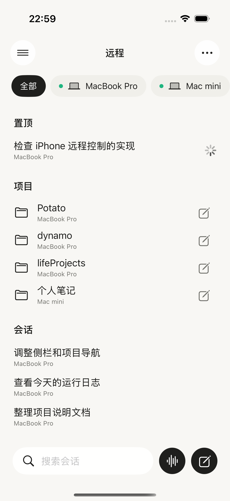
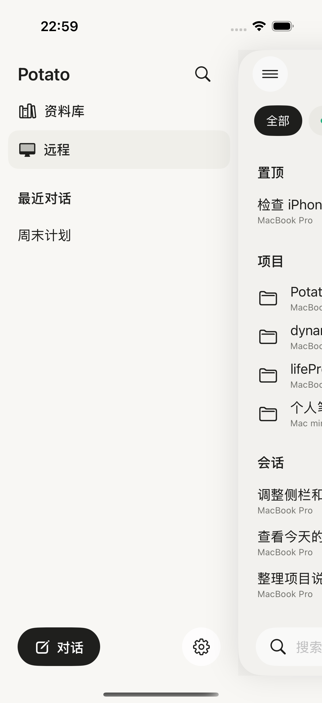
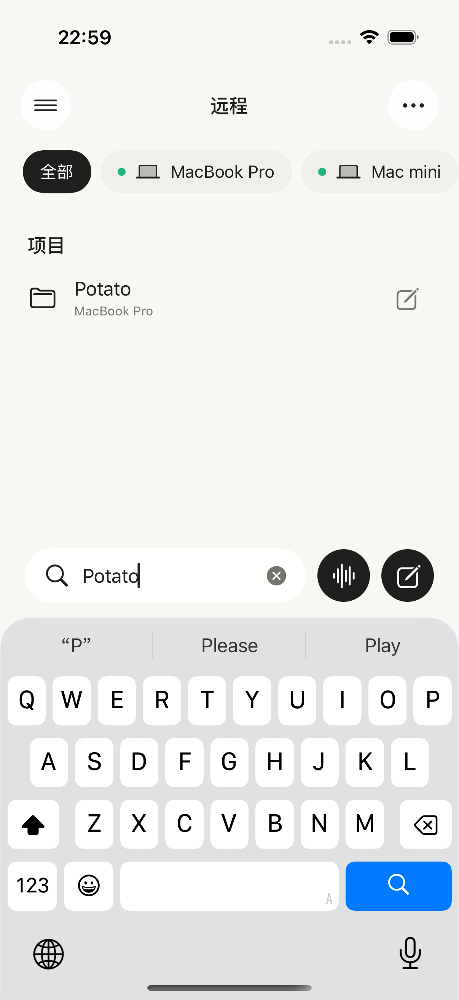

# Potato 与 ChatGPT Remote 对照审查

2026-09-12。结论：当前版本完成了远程连接和首页的大致结构，但尚未达到用户照片中的导航完整度与视觉细节。能安装、能登录和通信测试通过，都不能证明体验已经对齐。

## 证据与范围

对照源是用户提供的三张照片：Photo 1（Remote 首页）、Photo 2（侧栏最近会话）、Photo 3（侧栏功能与置顶）。没有 ChatGPT 的登录、项目详情、任务详情或语音操作照片；不据此推断这些页面的行为、协议、实时速度或功能。

Potato 截图来自本轮重新构建的 SwiftUI iPhone 17 模拟器，使用两台电脑的预览数据；不是用户当前手机的数据，也不是已在线更新 TestFlight 的证明。`RemoteUITests/testRemoteNavigationSearchAndDrawer` 通过，结果 `/tmp/potato-remote-comparison-20260912.xcresult`。精确导出的附件索引见 `manifest.json`。下面三张截图都已逐张打开检查。

1. **远程首页：部分对齐。** 设备横向筛选、置顶/项目/会话分组、项目行新建入口和底部搜索/语音/新建的结构存在；空间、分组操作和状态提示仍不足。
2. **打开侧栏：缺口明显。** 抽屉与主页面右移已经实现，但功能只列出资料库和远程，置顶仅支持本机聊天，远程在线标识缺失。
3. **搜索项目并清除搜索：基础流程正常。** 搜索 Potato 后只显示对应项目，清除后恢复 dynamo；此测试不证明搜索消息正文、所有设备状态、登录或真实远程任务可用。

## 照片能直接对照的差异

| 优先级 | 照片中的表现 | Potato 当前证据 | 建议与验收标准 |
| --- | --- | --- | --- |
| P1 | Photo 3 有 Images、Library、Projects、Plugins、Scheduled、Remote、Explore | 截图 02 只有资料库、远程；LibraryView.swift 的 WorkspaceSidebar 确实只提供这两个功能入口 | 建立完整导航规划。优先接通现有项目和定时能力；图片/插件/探索需有真实可用内容后再加入，不能补一排无效按钮来假装对齐 |
| P1 | Photo 3 的侧栏置顶包含项目和会话，图标区分类型 | 侧栏只取 WorkspaceStore 本机 Conversation；没有项目来源，置顶聊天行也没有类型图标 | 侧栏置顶支持明确的项目/会话类型与所属设备，点击进入正确对象；不能仅用预览数据填满 |
| P1 | Photo 1 的 Pinned 标题后带折叠箭头 | 截图 01 的“置顶”是静态标题；代码没有折叠状态 | 增加带展开状态语义的折叠按钮，折叠只隐藏列表而不移除置顶数据。照片表明有折叠提示，不能仅凭照片确认其具体手势 |
| P1 | Photo 1 的 Chats 标题右侧有新建入口 | “会话”标题只有文字，只有底部全局新建 | 会话标题右侧补新建；全部电脑时明确选择目标，选定电脑时直接进入该电脑 |
| P2 | Photo 1 的项目与会话基本使用单行标题 | 截图 01 在全部电脑模式下每一行额外显示电脑名 | 调整行信息层级以接近照片的紧凑列表，同时仍让同名项目/会话的设备归属可辨识。不要直接删除所有归属信息 |
| P2 | Photo 1 顶栏和设备条更靠上，列表较早开始 | 当前截图归一化到相同宽度后，设备条与首个分组位置更低 | 检查安全区、顶栏与 NavigationStack 叠加空间；同尺寸参考验收，不能比较两张图片的原始像素字号 |
| P2 | Photo 1 底部控件有浮层、渐隐的视觉处理 | 截图 01 是固定底栏与纯背景，列表在上方结束，缺少对应层次 | 调整底部材质与渐隐，长列表最后一行仍能完整滚动到可点击位置；键盘出现时保留搜索可用性 |
| P2 | 三张照片采用白底与中性浅灰 | 截图 01/02 偏暖；Palette.canvas 为 (0.973, 0.969, 0.957)，muted 同样偏暖 | 为 Remote/侧栏对齐中性色；审查全局 Palette 的影响，不顺手改变所有已有文稿页面 |
| P2 | Photo 3 的 Remote 图标有在线绿点；Photo 2/3 搜索按钮有圆形底 | 截图 02 是普通电脑图标与裸搜索图标 | 在线标识来自实际状态，并提供文字/无障碍状态；搜索按钮补照片中的容器样式 |

项目数量和聊天条数来自不同数据，不能作为功能缺失的证据；本次模拟器只有四个项目，不代表真实账号最多支持四个。中英文标签的长度差异也不能直接认定为字号问题。抽屉约 74% 宽、圆角和主页面右移已经存在，不能说当前没有侧栏效果。

## 额外检查出的功能问题

这些结论来自当前源代码，而不是声称从 ChatGPT 照片看到了其实现。

| 优先级 | 问题与影响 | 证据与修复验收 |
| --- | --- | --- |
| P0 | 同账号的两台电脑，新任务草稿及待确认发送记录可能共用保存位置。用户切换电脑后可能带入不属于该电脑的指令 | RemoteService.swift 的 RemoteDevice.account 在账号模式不含 device.id；RemoteTaskView 的 draftKey 拼接 account + chat/project/new，仍不含 device.id。应加入设备 ID 和目标类型，并验证 A/B 电脑草稿隔离、待确认请求只对原设备重试。当前未进行真实账号发送来复现 |
| P1 | 远程会话无法在列表里置顶/取消置顶，手机只能查看电脑已有置顶 | RemoteView.chatRow 没有菜单/操作；Rust remote_command 已支持 pin。应接通前端，并验证刷新和另一端显示一致 |
| P1 | 设备刷新成功后旧错误可能一直留在首页 | RemoteStore.refresh 的成功设备状态/overview 分支不清除旧 error。应区分单台失败与整轮恢复，验证断网→恢复后错误消失且其他电脑仍可用 |
| P1 | 项目详情接收进入时的一份 chats 数组，不直接观察 RemoteStore | RemoteProjectView 的 let chats 为值快照。父页面是否持续重建需要运行态验证；在项目页等待电脑新增会话，是下一轮必须补的验证，不据源码直接判为必现 |
| P2 | 搜索提示与搜索范围不一致 | RemoteView 显示“搜索会话”，实际上过滤项目名和会话标题，不检索消息正文。截图 03 搜索只出现项目。应明确为“搜索项目和会话”，或提供范围选择；ChatGPT 照片无法证明其搜索正文行为 |
| P2 | 多电脑聚合按设备顺序拼接，RemoteChat 没有更新时间字段 | 很难实现跨电脑统一的最近排序；需根据产品要求补字段及排序验收，不把它描述成已从 GPT 照片确认的排序规则 |

## 修改顺序

1. 先消除多电脑草稿/待确认请求串用风险，补刷新错误恢复；这决定远程操作是否指向正确的电脑。
2. 补项目/定时导航、项目与会话置顶、置顶折叠、会话区新建和设备归属，保证每个入口有真实行为。
3. 对齐白灰配色、顶部空间、单行列表、底部浮层和图标；用相同尺寸、相同数据密度重新截图对照。
4. 用真实手机检查选电脑→选项目→发送/继续→批准/停止→返回列表，并补断网、重新登录、切换设备与大字/VoiceOver。三张参考照片不能证明任务详情页已对齐，仍需该页面的参考或明确规格。

## 无障碍与限制

当前代码为主要按钮设置了标签，设备筛选有 selected 状态，抽屉隐藏背景的无障碍元素并适配 Reduce Motion，这些可以保留。在线状态主要用颜色表达，搜索占位文字较浅，长名称单行截断，属于需继续核查的风险。动态字号、完整 VoiceOver 焦点、对比度比值及硬件键盘没有在本轮测试，不能声称无障碍验收通过。

本轮完成比较与问题定位，未修改生产 UI，未发布新的安装包。手机刚安装的版本不会因本审查自动变化。

## 本轮截图

### 01 Remote 首页

### 02 功能侧栏

### 03 搜索

