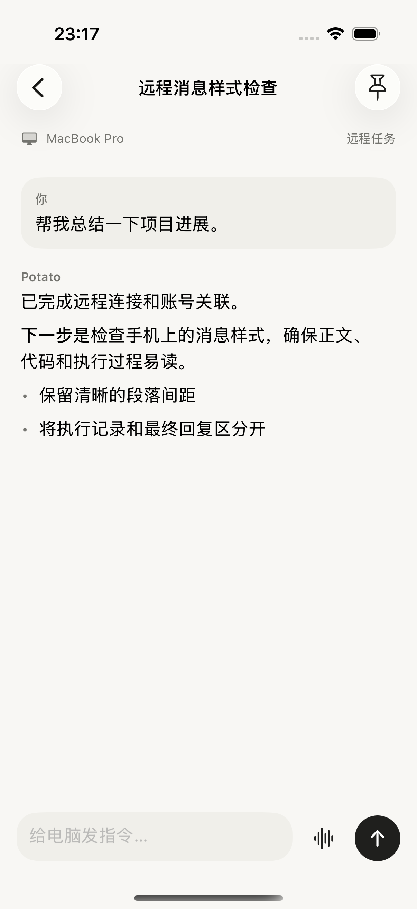
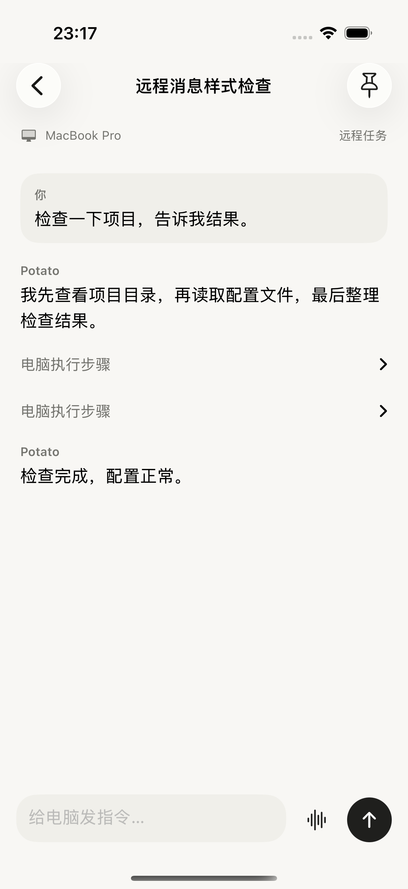
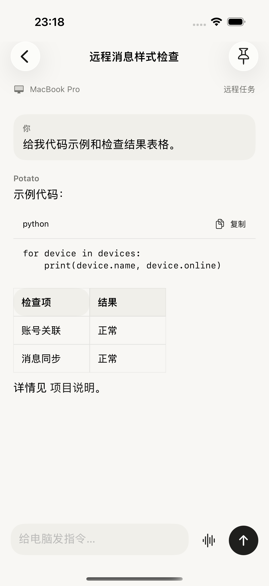
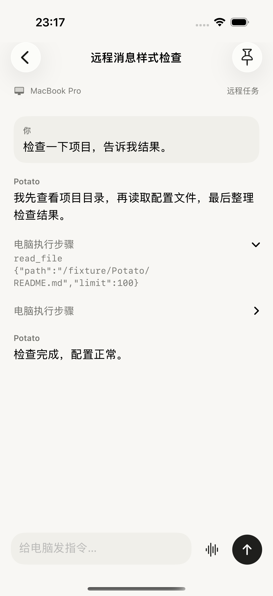

# Remote 对话消息样式检查

2026-09-12。本次按用户纠正，只检查 Remote 对话里的消息呈现。前一次侧栏/首页审查没有覆盖用户真正关心的回复样式，不能替代本轮结论。

## 本轮实际检查

在当前原生 SwiftUI 构建上，使用本机合成回复 fixture，检查普通回复、思考/工具调用/最终答复、Markdown 代码与表格，以及展开执行步骤四个状态。临时 XCTest 审查通过。最终证据 `/tmp/potato-remote-reply-style-stable-20260912.xcresult`，附件索引 `manifest.json`。全部截图已经打开检查，第一轮动画中间帧已弃用。没有修改真实会话，没有发送真实模型请求；本机 fixture 已停止，临时测试方法已撤销。

## 确认的问题

1. **普通对话：用户气泡布局不对。** 截图 01 中，用户消息占据接近整行宽度、左对齐，并额外标“你”；助手又标“Potato”。当前普通聊天页已经使用靠右的用户气泡与无重复角色标题的助手正文，Remote 单独实现了一套简化布局，导致同一个 App 的两种聊天呈现不一致。Remote 还将用户输入交给 MarkdownContent，用户输入里的 Markdown 标记会被渲染；普通聊天保留用户原文字面内容。
2. **执行中的对话：思考与最终回复没有区分。** 截图 02 中，上方“我先查看项目目录…”实际 kind 为 reasoning，但显示成普通“Potato”正文，最后“检查完成…”又显示一次“Potato”。RemoteView 只特殊处理 call/tool，其余全部用普通助手样式；Rust 仍保留 reasoning 类型，因此是手机渲染分支遗漏，不是必须丢失的信息。应为过程提供轻量可折叠样式，让最终答案保持正文层级。
3. **执行记录：多个同名折叠行缺少含义。** 截图 02/04 中调用与结果分别成为“电脑执行步骤”，没有“读取 README.md”这样的标题，也没有清楚的状态/结果摘要。展开后直接显示工具名称、路径和 JSON 参数，默认等宽灰字。应把执行步骤命名并关联调用和结果，将原始参数留在详情里。当前传输已将内容压成 text，完善步骤呈现还需保留结构化工具元数据。
4. **回复操作：缺少普通聊天已有的整条消息工具栏。** 截图 01/02 的完成回复下方没有复制全文、选择文字、分享等入口，RemoteView 也未接入 ReplyActions。正文已有系统文字选择，代码块已有复制按钮；不能把缺少消息级工具栏误写为“完全不能复制”。适合复用普通聊天的展示/操作组件，重试或编辑重发等会改变任务的操作需遵循远程协议单独设计。
5. **Markdown：基本能渲染，代码边界弱。** 截图 03 的代码、表格、粗体和列表均有原生渲染，并非没有 Markdown。代码背景和 Remote 页面同为 Palette.canvas，代码容器不突出；链接也不易从正文中辨认。应调整代码容器底色/边界，保持代码横向滚动和复制；保持表格横向滚动，另测宽表和长代码。

相关实现：`native/potato-ios/Sources/RemoteView.swift:260`（消息分支）、`WorkspaceView.swift:222`（普通聊天消息）、`ReplyActions.swift`（普通回复操作）、`DocumentView.swift:94`（Markdown）、`native/potato-core/src/remote.rs:22`（导出消息）。

## 需要进一步验证的动态问题

- Remote 每两秒取一次快照，不是普通聊天的 SSE 增量展示；可能造成回复分块更新和滚动跳变，但本轮静态合成回复不能证明用户实际延迟或必现跳动。
- 后端将每条文本截到 8000 字符，可能截断代码围栏或表格；本轮未用超长真实回复复现，需专项测试。
- 消息导出将块压为文本，没有完整保留图片/文件等富媒体结构。纯样式改动不能补齐所有消息类型。
- 审批卡片和提问表单不属于本轮截图状态；不把此前回归结果当成本轮样式验收。

## 应当采用的消息层级

用户消息靠右收窄气泡、保留原文；助手答案靠左全宽排版，减少重复名字标签。思考/执行过程使用轻量折叠区域，展开才展示日志和参数。最终回复下方提供整条复制、选择文字、分享；代码与表格采用统一富文本组件。

这先修 Remote 的消息呈现，不需要继续扩展侧栏来解决本问题。当前只完成检查，未修改生产样式或发布新的 TestFlight 构建。现有三张 ChatGPT 照片均未展示对话正文，因此这些是当前产品缺陷和内部一致性结论，不是假称已完成与 GPT 对话截图逐像素对照。

## 截图

### 01 普通消息：布局不一致，回复操作缺失

### 02 思考与最终答复：层级混淆

### 03 代码与表格：基本可用，代码容器不明显

### 04 执行记录展开：信息过于原始

从截图可见灰色步骤标签和代码详情辨识度较弱；没有测量完整对比度或运行 VoiceOver，不能声称无障碍合规。测试 fixture 与临时方法快照保留在此目录供复现，不属于生产运行链。
