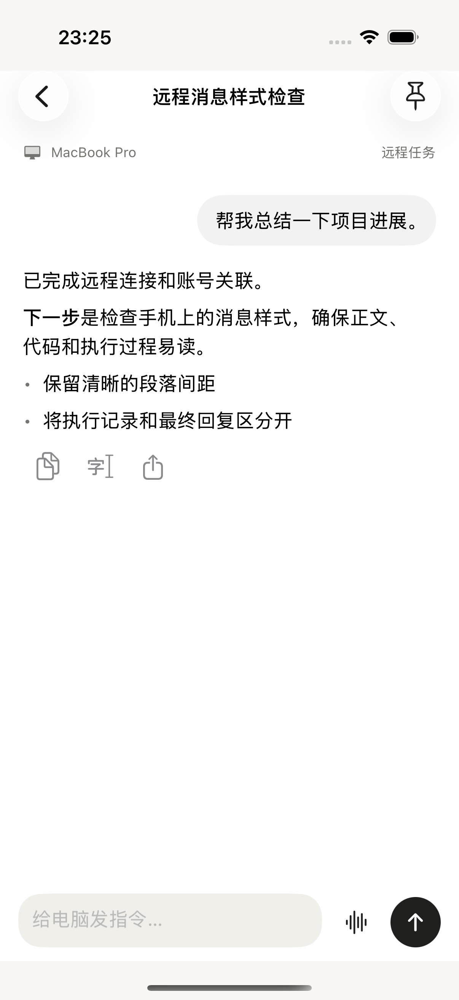
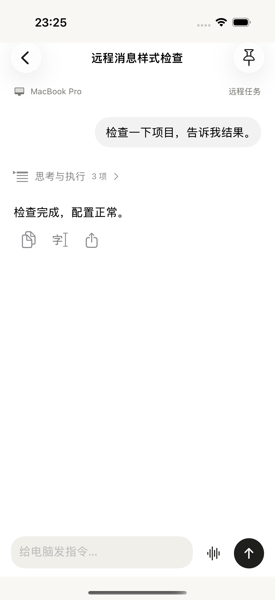
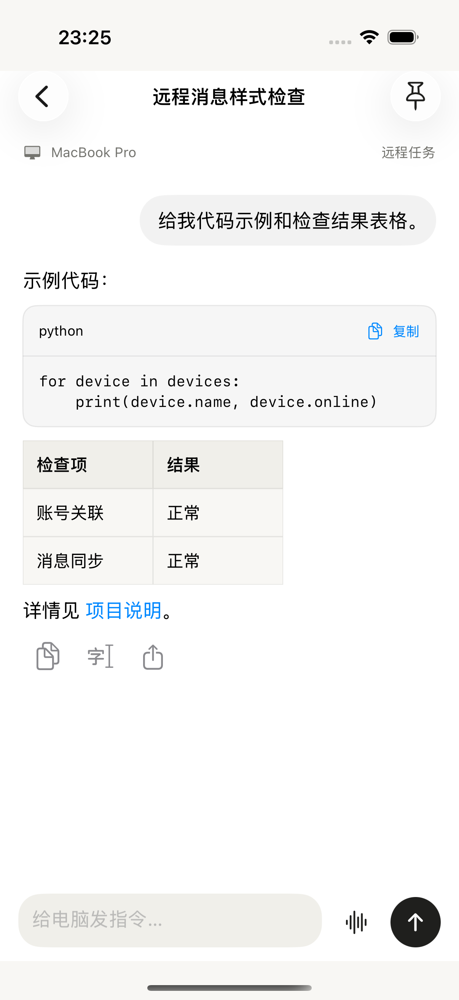
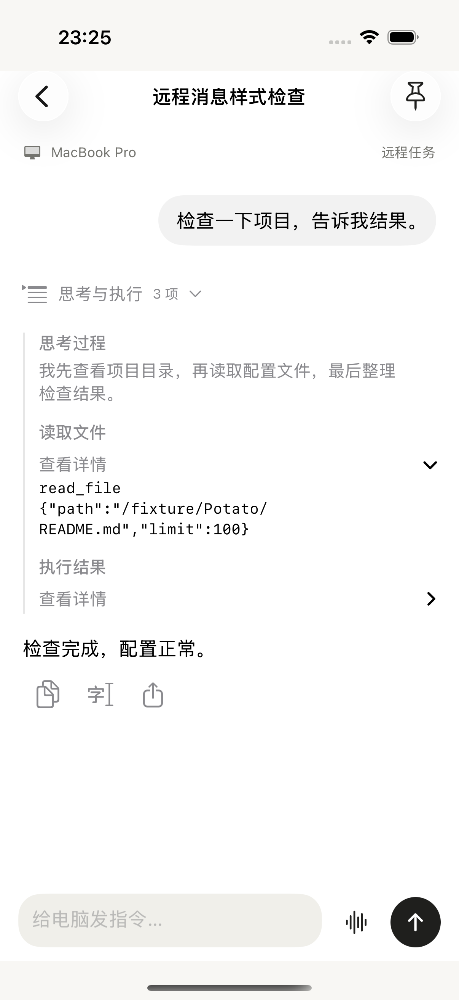
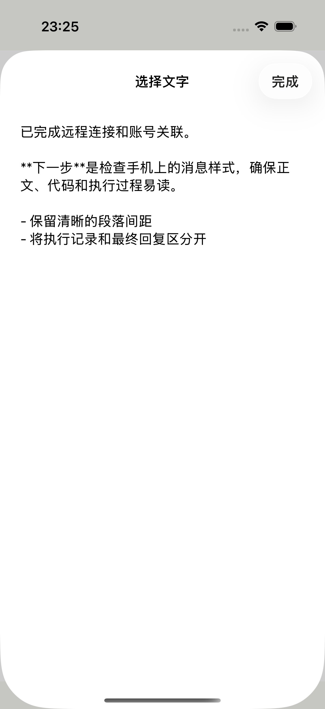
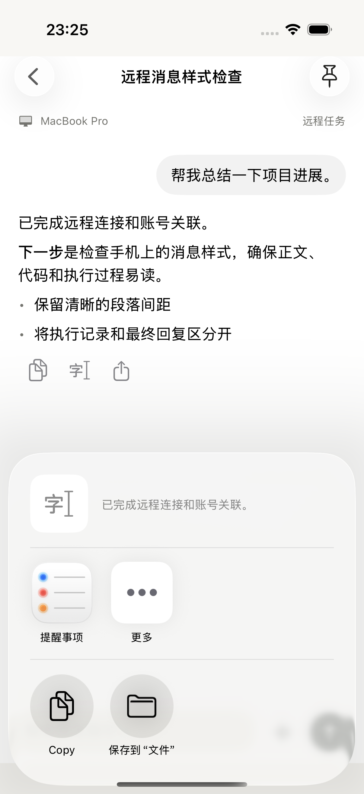

# Remote 对话消息样式修复

目标：修复 Remote 对话里的消息层级与回复操作。版本 0.2.1 (2026091203)。

- 用户原文使用靠右、随内容收窄的气泡，不再显示“你”标签或解析用户 Markdown。
- 连续思考与工具帧归为一个默认折叠的过程区域，展开后区分思考、调用、结果；具体参数仍在二级详情中。分组不会跨过用户消息、助手答案或系统提示，使用稳定消息 ID 保持刷新时的展开状态。
- 最终答案直接排版，不再混入“Potato”角色标题；系统提示单独呈现。
- 完成回复增加整条复制及反馈、选择文字、系统分享，复用现有文字选择页面；没有增加远程重新执行等副作用操作。
- Remote 代码块增加灰底、圆角边界；链接使用可辨认颜色。共用 Markdown 组件的默认样式保留，普通聊天与文稿不受主题参数影响。

## 验证

`/tmp/potato-remote-reply-fixed-v2-20260912.xcresult` 最终整体退出码 0，TEST SUCCEEDED。3 项消息分类/流式快照单元测试和 1 项原生 UI 测试通过。UI 测试覆盖气泡右对齐、无角色标签、思考默认折叠与开合、工具详情、复制反馈、选择文字内容及系统分享打开，另截图检查代码与表格。六张原始截图已逐张检查，附件索引见 manifest.json。

第一轮整体失败是断言查询整个 App 导致隐藏侧栏的 Potato 标题被匹配。已限定到 remote-conversation 后重跑；第一轮不计为通过。最终截图取自第二轮通过结果。

验证使用 iPhone 17 模拟器和只监听本机的合成回复服务，没有向真实电脑发送任务。测试服务已停止。没有修改现有 Mac 登录、远程访问或 Worker。现有协议仍可使用，无需更新 Mac。

当前服务的两秒快照更新、文本截断上限、附件结构仍是原有机制；本次未声称实现流式协议升级、富媒体完整同步或完整 VoiceOver/真机网络验收。

## 原生截图

## 分发记录

0.2.1 (2026091203) 于 2026-09-12 23:29:47（北京时间）上传成功，日志 `/tmp/potato-reply-upload-2026091203.log`。归档 `native/potato-ios/build/distribution/PotatoMobile-0.2.1-2026091203.xcarchive` 已核对版本、仅 iPhone 设备类型与隐私清单。Apple 已处理完成，构建已加入个人内测组，状态为 **Testing**、有效期 90 天；中文测试说明已保存。测试者页显示 iPhone 已安装 **0.2.1 (2026091203)**，这证明安装状态，不代表真机远程任务已验收。后续可直接通过 TestFlight 更新。
