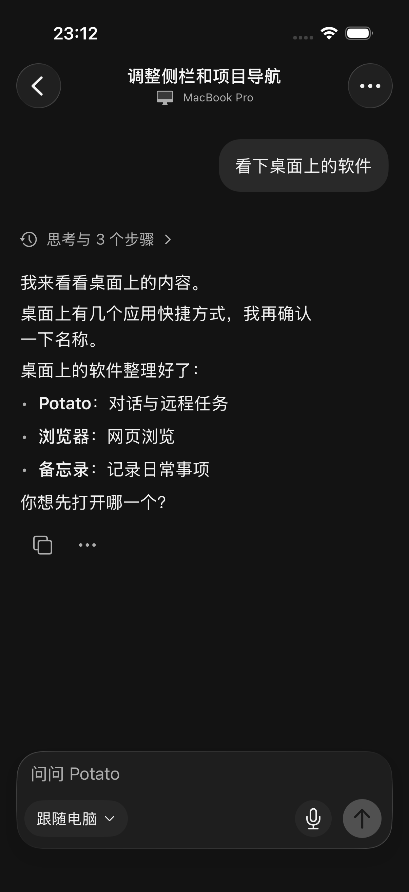
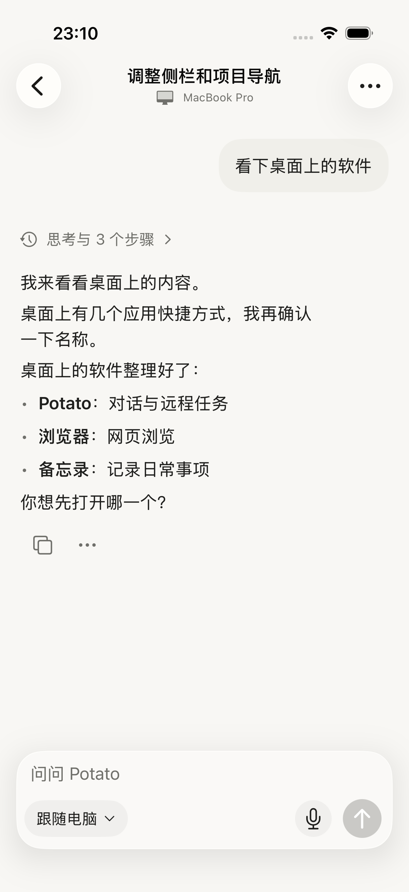

# 远程会话统一为对话阅读

用户提供的 iPhone 暗色截图中，思考英文摘要、工具步骤、正文和每段操作按钮交错出现，顶部电脑副栏与输入区也偏重。此轮明确针对原生 iOS 远程会话，沿用普通对话页，而非修改桌面 GPUI。

设计约束：复用 Palette 自适应配色（亮色底 #F8F7F4、正文 #1F1F1D、次要文字 #70706B、气泡 #F0EFEA；暗色底 #131313、正文 #F0F0F0），系统字体，正文 body、过程 subheadline、电脑 caption2。正文左对齐，用户气泡右对齐；横向留白 20pt、轮次间距 24pt、轮内间距 10pt。沿用系统 Liquid Glass，输入框内边距 8pt、圆角 26pt、操作触控区域 44pt。

阅读结构：标题和电脑合并为导航栏两行 → 用户气泡 → 每轮一个过程入口 → 连续回复正文 → 一组复制/更多操作 → 输入区。采用已有对话视觉体系，不新增装饰色、卡片或新的信息层级。

同一用户消息后的思考、工具与回复合并为一个展示组，保留所有正文与原始过程记录；系统通知、下一条用户消息仍分隔。过程入口不展示未经整理的英文片段，点击进入共用的过程概览和详情。复制、选择、分享覆盖整组正文。运行中的当前组不展示完成操作，历史组仍可复制。消息 ID 保持稳定，轮询不重建组身份。

顶部保留原生返回导航，置顶移入对话选项；移除独占一行的电脑副栏。模型、麦克风、发送/停止尺寸与普通对话输入区一致。输入复用普通对话页的 ComposerTextInput；点击正文空白或拖动收起键盘，草稿仍保留。断线提示使用独立实色底，避免大字号正文透到状态文字后方。

按用户本轮补充意见，完成和就绪不再显示额外回执；输入区恢复可发送状态。仅运行中、等待批准/回答、已停止、失败及连接异常保留状态提示。

## 验证

Xcode 26.3，iPhone 17 / iOS 26.3.1 模拟器。使用本机回环合成远程服务，不连接真实电脑或执行真实工具。

- 15 项远程消息分组、数据解码、草稿归属和任务状态单元测试通过。交错思考/工具/正文不丢内容，下一条用户消息和系统通知仍隔开；流式追加保持组 ID。
- 初轮亮色 18 项通过（15 单元 + 3 UI）：整轮回复/完整过程、导航往返与重启后的独立电脑草稿、思考→工具→回复→完成。见 `initial-light-tests.json`。
- 初轮暗色 3 条 UI 通过：整轮呈现、点击/拖动收键盘且保留草稿、大字号断线与恢复。见 `initial-dark-tests.json`。
- 去掉完成回执后的最终亮色 3 条 UI 通过：整轮呈现及操作、思考→工具→回复→静默完成、审批/回答/停止/失败。见 `final-light-tests.json`。
- 最终暗色 3 条 UI 通过，见 `final-dark-tests.json`：无完成回执的整轮呈现、键盘草稿、大字号断线状态区域。

截图人工检查修正了导航栏 Label 自动只显示图标、原 TextField 拖动收键盘不稳定、断线状态与透底正文叠字三处细节。键盘行为最终复用普通对话页原生编辑器通过验证。默认系统玻璃效果保持不变。

本轮只修改 iOS 原生远程页面及相关测试；未改桌面 GPUI、core 协议或中继服务。已发布至 TestFlight 0.2.2（2026091608），既有个人内测组 Testing；真机验收待用户安装。见 [发布记录](release-2026091608/README.md)。

## 最终截图

使用合成会话，主界面保留完整正文；过程概览可查看原始记录。

| 暗色 | 亮色 |
| --- | --- |
|  |  |

[过程概览](remote-conversation-process-dark.png) · [保留草稿](remote-conversation-draft-dark.png) · [大字号离线键盘](remote-large-offline-keyboard-dark.png)

