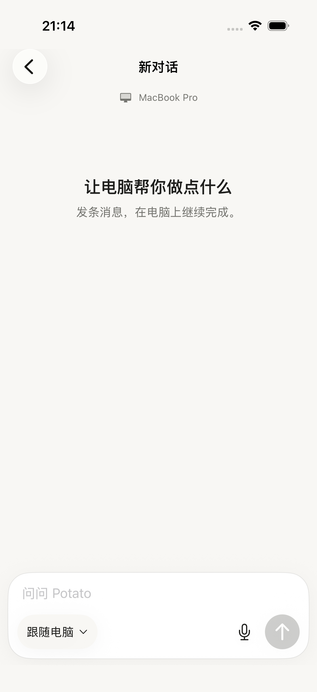
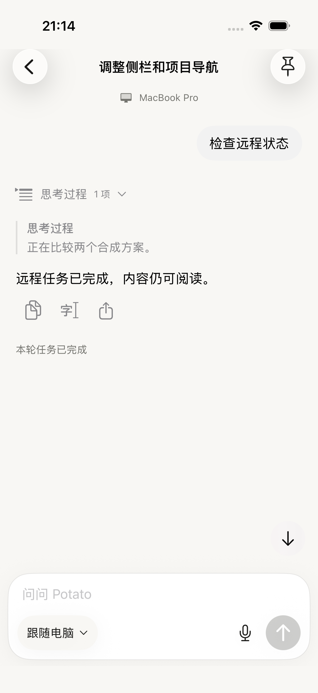

# iOS 远程对话简化

按用户提供的三张远程任务截图和普通对话截图统一 SwiftUI 远程页。改动仅覆盖 iOS，未修改桌面 GPUI、core 或中继协议，未发布 TestFlight。

## 变化

- 顶部只保留执行电脑的小字提示；新建页使用“新对话”和简短引导，有项目时仍显示项目名称。
- 输入区沿用普通聊天的白色 28pt 圆角、细边框、浅阴影和背景色。文字在上方，模型选择、麦克风和主操作在下方。
- 正常执行和完成状态随消息显示；失联或快照过期时，状态与刷新入口留在输入区上方。
- 支持停止的运行中任务：空草稿显示停止，有草稿显示发送并保留停止入口。停止仍绑定打开确认时的运行编号，追加指令仍锁定当前任务配置。
- 旧电脑的停止升级说明移入消息流；草稿恢复、发送回执未确认、审批和提问等异常或待办入口保持可用。

## 验证

使用 iOS 26.3 模拟器和本机合成远程服务，服务不调用模型或执行电脑命令。合计 14 次 UI 测试执行通过（11 条不同流程，0 失败、0 跳过）：首轮 8 条状态流程；模型/输入区补测 4 条；辅助信息字号上限修正后补测 2 条大字流程。模拟器构建及 `git diff --check` 通过。正常字号截图来自上限修正前，该修正只影响辅助大字号。真机、完整 VoiceOver 和最低 iOS 17 未在本次验收。

结果包：`/tmp/potato-remote-layout-process.xcresult`、`/tmp/potato-remote-layout-final.xcresult`、`/tmp/potato-remote-layout-large.xcresult`。构建日志：`/tmp/potato-remote-layout-build-final.log`。

## 已检查的截图

1. 新建对话：简短引导，模型选择和发送位于统一输入区。
2. 执行中追加：键盘上方保留草稿，停止和发送均可点击。
3. 完成：状态跟随回复显示，输入区回到可继续对话的状态。
4. 最大辅助字号离线：设备名保持辅助字号，正文和输入保留大字；刷新入口、输入框及操作按钮完整可见。

