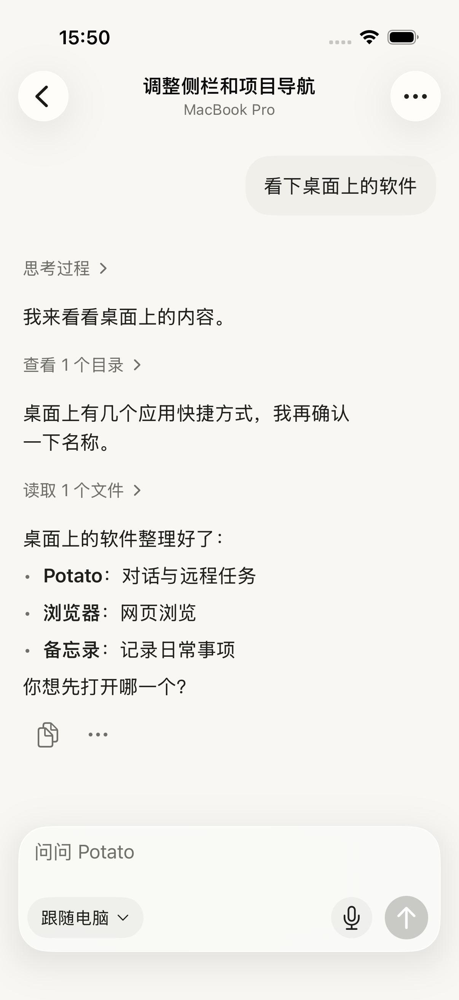
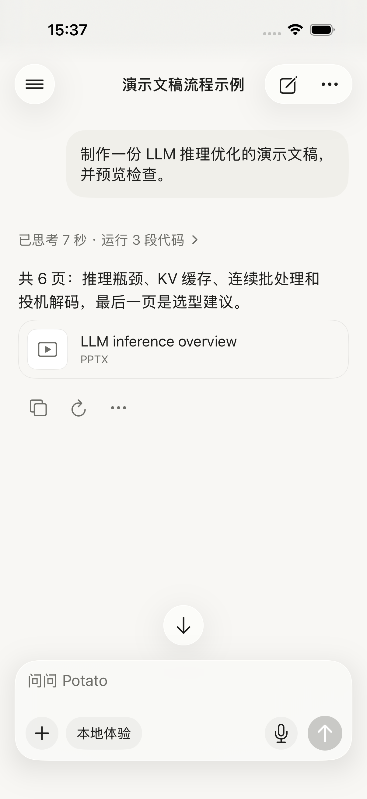
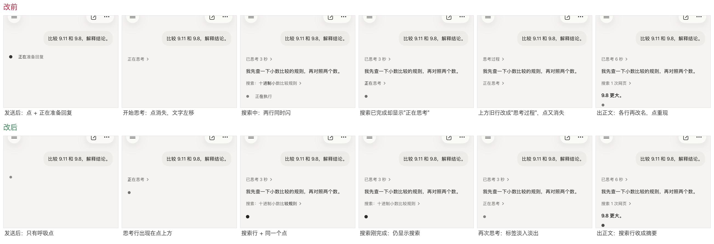
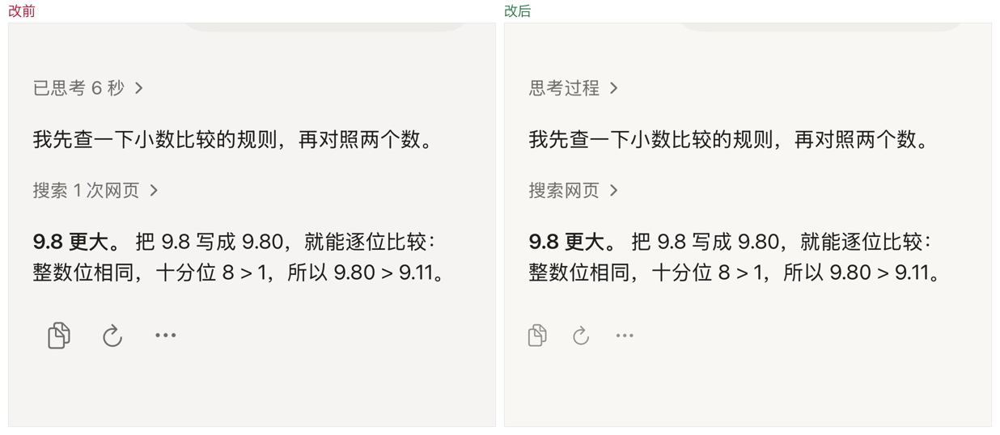

# 对话按时间线展示（2026-09-24）

对照成熟产品的会话页，把"一轮回复 = 顶部一个过程按钮 + 拼在一起的正文"改为按时间顺序交替显示：说明文字 → 这段文字引出的工具组 → 下一段文字 → …，最后一段才是答案。

## 改动

- **时间线**：远程按消息帧顺序切分（`RemoteConversationRow.segments`）；本机在 `recordActivity` 时记录当时正文的 UTF-16 位置（`activityAnchors`，可选字段，旧回复没有它就保持原来的单组布局），渲染时按位置切分正文，不在代码块内部切。
- **工具组摘要写动作**：`读取 2 个文件、执行 3 条命令`，文件按路径去重；有思考时长时前缀"已思考 N 秒"。命令步骤标题直接显示命令首行。补上 `execute_shell_command`、`grep_search` 等缺失的工具名（此前显示为"调用 execute_shell_command"）；没有 call_id 的旧版输出并入前一个调用。
- **一条状态行**：远程和本机都只在回复末尾显示一行"脉冲点 + 在做什么"（正在思考 / 正在执行 / 正在整理结果）；正文流式输出时只显示点。远程"状态待确认"卡片改为 20 秒无确认或请求失败才出现，停止、发送、审批仍按 8 秒新鲜度判断。
- **远程正文**改用 `StreamingMarkdown`，按 1.6 秒节奏铺开每 2 秒一次的轮询内容。
- **输入框**：运行中占位"排队到本轮之后…"/"补充当前任务…"；模型按钮显示电脑实际使用的模型和思考强度，不再显示"当前任务配置"。
- **顶栏**：远程副标题改为"项目 · 电脑"，去掉图标。本机对话曾加居中标题，之后按用户要求撤掉（保持只有浮动按钮）。

 

## 验证

iOS 26.3 模拟器（独立设备），单元测试 221 项通过（新增 `TurnTimelineTests` 5 项、`RemoteTaskObservationTests` 1 项）；ActivityPresentation、Reasoning、CodeExecution、Prototype 相关 UI 测试和 RemoteProcessUITests 12/13 通过，剩余 1 项（思考展开）的断言正由并行会话修改。尚未发布 TestFlight。

## 09-25 过程切换

"一条状态行"原实现里，进行中的提示在两种样式之间来回换：状态行（点 + 文字）和过程行（只有文字），思考时点会消失、文字左移；搜索/执行时两行同时闪；工具刚结束时最后一行被改成"正在思考"；模型再次思考时，上方已收起的"已思考 N 秒"变成"思考过程"。

- **底部呼吸点常驻**：从发送到最后一个字一直在回复末尾同一位置，只在结束时换成操作栏。点旁不再写"正在准备回复/正在执行/正在回复"（仍作为 VoiceOver 标签），只有云端提示这类过程行说不了的话才写在点旁。远程页相同。
- **过程行只说在做什么**：有步骤进行中才闪；两步之间保留上一步的名字，不在具体步骤和摘要之间来回切；本机再次思考时最后一组显示"正在思考"，上方已收起的思考行保持"已思考 N 秒"。
- **切换有过渡**：过程行标签淡入淡出，新出现的过程组和正文段淡入。
- **正文收尾不跳**：流结束时未显示完的字在 0.45 秒内补完，不再整段瞬间出现（远程最后一次轮询常把最后几句和"完成"一起带回）。

本机用 `--reasoning-case=timeline` 夹具（思考 → 说明 → 搜索 → 再思考 → 答案）录屏对比：

同日第二轮（去小字、按钮收小）：过程行去掉次数和秒数（"搜索 1 次网页"→"搜索网页"，"已思考 7 秒 · 运行 3 段代码"→"运行代码"，只有思考的组统一为"思考过程"，本机与远程一致）；"查看 N 个来源"→"来源"，"参考了 N 段历史"→"参考了历史对话"；过程行不再追加"· 已停止/· 已中断"，中断时也不再同时显示"已停止生成"；"正在检索历史与记忆"改为写在底部圆点旁。回复下方的复制/重试/更多改为 15pt 浅色图标并与正文左对齐。

## 未做

- 远程增量推送（替代 2 秒全量快照）、core 返回编辑行数（+/-）、输入框上方恢复入口收敛——需要后端或更大范围改动。
