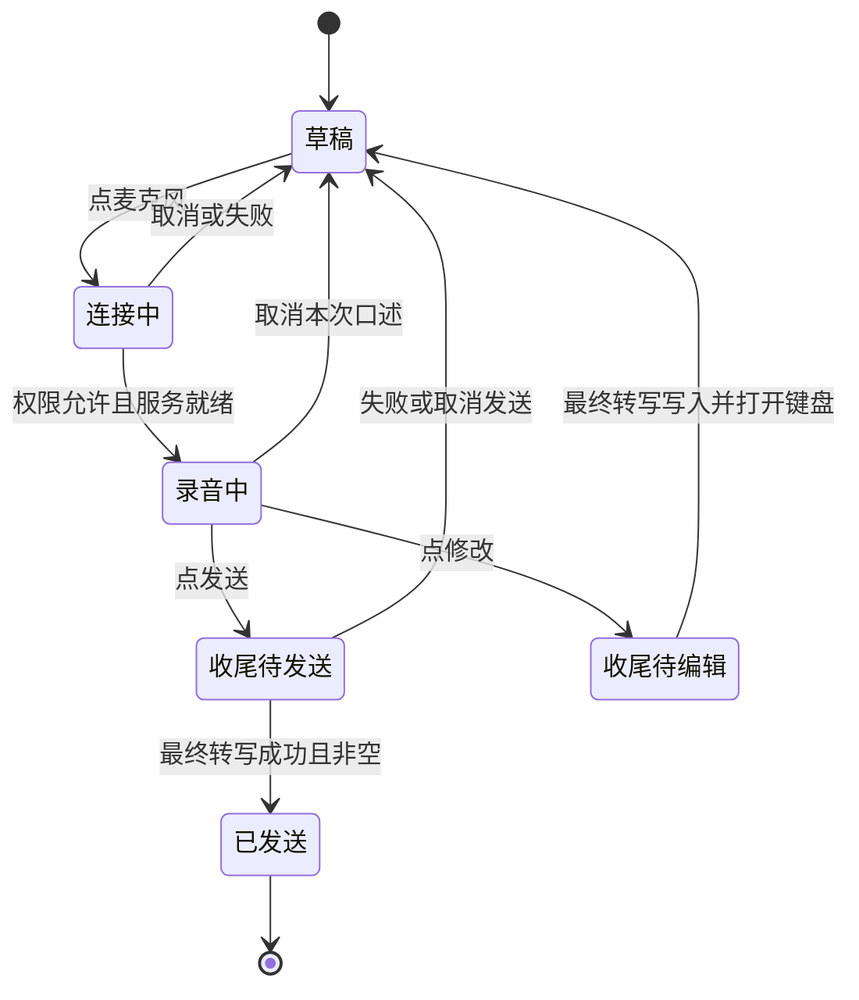

# iPhone语音输入：研究与设计

> 2026-09-12后续：用户选定Grok参考。当前面板以[紧凑输入规格](../compact-composer/README.md)为准，本文保留此前方向选择及验证历史。

2026-09-12。用户已选择方向1「就地说，直接发」，已实现到现有SwiftUI客户端并完成模拟器真实豆包联调；本页保留调研过程和三张概念图。范围是中文用户在Potato中口述一条消息，重点减少从说话到发送的操作，沿用原生iPhone、现有浅色风格、豆包流式ASR和桌面一致的模型。

## 结论

现有方案把语音做成独立转写页面，用户需要主动把结果搬回输入框。点击麦克风后还需再点开始，增加了启动成本。默认手动停止时，完整路径是麦克风、开始、停止、放入输入框、发送，共5次点击，不计首次系统权限。编辑机会应当保留，但不必通过强制搬运文本实现。建议语音直接在输入框中开始，边说边显示，点发送后收齐最终转写并发送，需要修改时才切换键盘。这是结合当前摩擦和竞品官方流程提出的设计判断，没有用户实验数据证明其完成率。更完整的实时语音对话需要额外设计轮次、打断和语音输出，不混入本次改造。

## 改造前界面审查

设计阶段通过Simulator实际打开Potato、点输入框麦克风、观察语音弹层，再取消返回；未打开麦克风采集声音。以下两张截图均在本轮捕获并检查。

1. [输入框](01-current-composer.png)：语音入口处于右手可达区域，但已有草稿与后续弹层分离。
2. [语音弹层](02-current-voice-sheet.png)：点击入口后仍是未开始状态，主操作“开始录音”；大面积空白占据原对话，“放入输入框”提前出现但不可用。
3. 停止、等待最终结果、放入输入框、发送的后半程依据 `native/potato-ios/Sources/VoiceInput.swift` 与用户本次标注确认；本轮未重新录音，不能称为重新实测。

| 问题 | 影响与严重度 | 证据与置信度 | 设计动作 |
| --- | --- | --- | --- |
| 进入语音后再次要求开始 | 高频入口多一次操作；高 | 当前弹层可见，置信度高；发生频率未量化 | 麦克风直接启动权限/连接流程 |
| 完成后需要手动搬运文本 | 重复确认、打断表达；高 | 用户明确反馈及源代码，置信度高 | 使用同一输入草稿，删除转移按钮 |
| 全屏弹层遮住对话上下文 | 难以边看问题边补充；中 | 当前截图，置信度高 | 底部原位录音，不离开对话 |
| 停止、最终转写、发送语义不同 | 若草率合并可能丢尾字或误发；高 | 已有ASR的partial/final协议与状态代码；具体误操作频率未知 | 显式发送意图，最终结果到达后只发送一次 |
| 灰色开始按钮与禁用按钮层次接近 | 可能误认为尚不可操作；中 | 截图推断，置信度中 | 黑色主要动作；状态同时用文字表达 |

现有取消入口明确、不会默认发送，值得保留。截图只能检查视觉层次，不能证明VoiceOver、对比度、真实触控尺寸或声音反馈合格。

## 官方参照

| 来源 | 可确认的行为 | 对Potato的启发 |
| --- | --- | --- |
| [ChatGPT Voice Dictation FAQ](https://help.openai.com/en/articles/12168547-voice-dictation-faq) | 麦克风录音后返回文本，发送前可编辑 | 编辑应可用；文档未完整说明当前iOS每个按钮和点击数，不能据此声称已复刻其界面 |
| [Claude Mobile dictation](https://support.claude.com/en/articles/10065434-use-dictation-on-claude-mobile) | 点击输入框麦克风、口述、点箭头发送；X取消 | 明确支持短路径，从口述直接表达发送意图 |
| [Apple iPhone Dictation](https://support.apple.com/en-au/guide/iphone/iph2c0651d2/ios) | 文本输入位置内听写，可同时使用键盘；有明确停止操作 | 语音是输入方式，保留插入位置和改字能力 |

本轮查阅官方帮助文档，未登录竞品App、未做竞品真机操作，也没有将社区个案当作发生频率。Apple的原位编辑是交互参照，Potato继续使用豆包，不替换识别服务。

## 三个可比较方向

编号严格按本对话中生成图的显示顺序，见 `concept-order.json`。

| 编号 | 核心交互 | 常规路径 | 主要取舍 |
| --- | --- | --- | --- |
| 1 | 就地说，直接发 | 点麦克风→说→点发送 | 推荐；两次点击，编辑为分支；不需要持续按住 |
| 2 | 边说边改 | 点麦克风→说→停止→改字或发送 | 适合长句、专名；多一次停止，但没有搬运文本 |
| 3 | 按住说，松开发 | 按住→说→松开 | 适合短句和单手；长时间按压疲劳，松手误发与无障碍成本更高 |

[方向1](concept-1-direct-send.png) · [方向2](concept-2-inline-edit.png) · [方向3](concept-3-hold-to-talk.png)

图片是单状态视觉概念，已检查主要文案和操作，没有交互验证。生成图中的上方助手气泡只是示意，后续实现保留现有消息样式。方向2的系统键盘语音图标应由iOS管理，不能把它画成豆包的开关。方向3在持续按住时无法单指同时点改文字；真实实现需要上滑后选择编辑的独立手势或锁定态，因此不推荐作为默认。最终交互逻辑以下述设计规范为准。

## 推荐方向的状态与规则

- 首次系统授权只在用户点麦克风后发生；后续不再弹应用自己的“开始”页。连接未就绪时显示“正在连接”，就绪后轻触感提示开始，不能假装已在采集。
- 录音时保留原会话位置，输入框扩高但有最大高度，长文本在输入区内滚动。波形依据真实音量；“正在听”和计时同时可见，减少动态效果时用静态状态。
- 普通说话路径只有开始和发送两次点击。点发送立刻停止采集、排空音频尾部、等final，期间原按钮显示进度。重复点击不重复发消息，不能把partial冒充最终结果。
- 实现中点击发送立即显示“整理中”和收尾状态，不延迟700ms，以明确回应点击；Worker沿用8秒收尾超时，客户端另有10秒保护。超时保留草稿并提示未发送，不自动发送不完整文本。
- “修改”结束本次口述并原位打开键盘，没有中间确认页面。用户一旦开始编辑，晚到的识别事件不能覆盖手工修改。普通点击文本也可进入这条路径。
- 原有文字、附件和本次口述分别管理。听写插入进入时的光标位置；ASR每次返回的累积全文只替换本次临时片段，不反复追加。取消只撤销本次口述，保留原草稿与附件。
- 用户停顿不会自动发送。达到60秒、来电、进入后台、锁屏或切换会话时停止采集并保存可用草稿，清除待发送意图；返回后由用户继续。会话ID与录音ID绑定，旧回调不得写入新会话。
- 没有识别到文字时不发送空消息。网络失败保留已识别内容，允许改字、手动发送或重新录音，不强制重说全部。
- 开始、发送、取消、修改的触控目标至少44pt；VoiceOver分别读“开始语音输入”“结束录音并发送”“取消本次语音”“结束录音并修改”。不要把每一段流式文字都抢占播报。
- “取消发送”只在提交聊天请求前有效；一旦已发送，呈现正常的停止回复操作，不能用“撤回”文案暗示服务端未收到。

## 实施顺序与验收

第一步在选定方案后调整SwiftUI输入区，复用现有豆包连接和音频转换；Worker接口不需要为减少点击新增服务。第二步补齐原草稿/插入位置、final竞态、取消和恢复的状态测试。第三步在真实iPhone检验短句、长句、专有名词、连接慢、60秒、来电、后台与VoiceOver。

核心验收：常规语音从5次点击降为2次；取消不损失原草稿；发送无尾字丢失、无重复；失败不误发；修改不被晚到结果覆盖；切会话不串消息。上述状态已实现并通过自动测试；正常直接发送与修改已通过模拟器→Worker→豆包真实服务联调。真机麦克风质量、完整60秒录音、实际来电与VoiceOver仍待设备验收。持续双向语音与自动轮次检测属于后续独立研究，不作为此次方案已支持的能力。

## 方向1实施记录

实现位于 `native/potato-ios/Sources/VoiceComposer.swift`、`VoiceInput.swift`、`ComposerTextInput.swift`、`WorkspaceView.swift`。录音识别与发送意图分开管理；每轮绑定会话与录音ID，最终事件至多发送一次，手工编辑后旧事件无效。UIKit输入框提供UTF-16选区，取消不改原草稿和附件。正文按系统字号缩放，控制区字号上限为xxxLarge，保证大字模式下三项操作可达。沿用现有消息样式、SF Symbols与浅色配色，不增加页面或联网开关；Worker本轮无需部署。

[原生交互截图](../../../../native/potato-ios/qa/voice-inline/40-inline-recording.png) · [修改](../../../../native/potato-ios/qa/voice-inline/42-inline-edit.png) · [真实豆包发送](../../../../native/potato-ios/qa/voice-inline/47-live-inline-sent.png) · [完整QA](../../../../native/potato-ios/design-qa.md)
