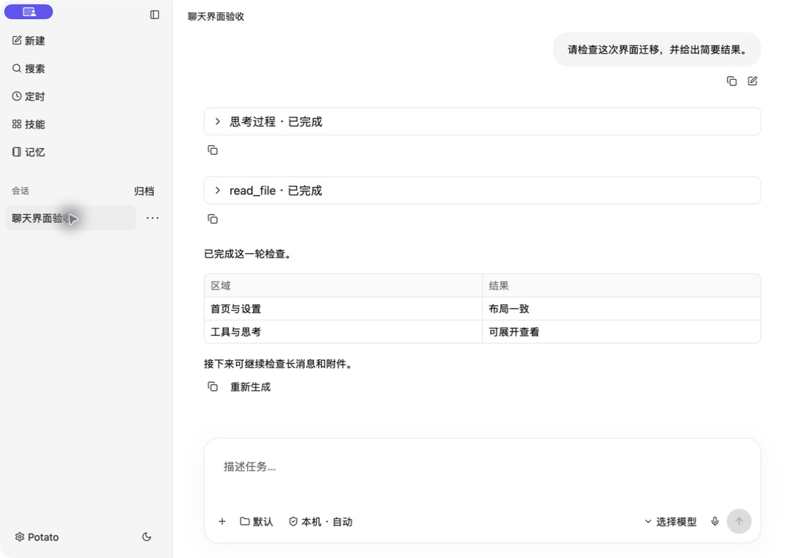
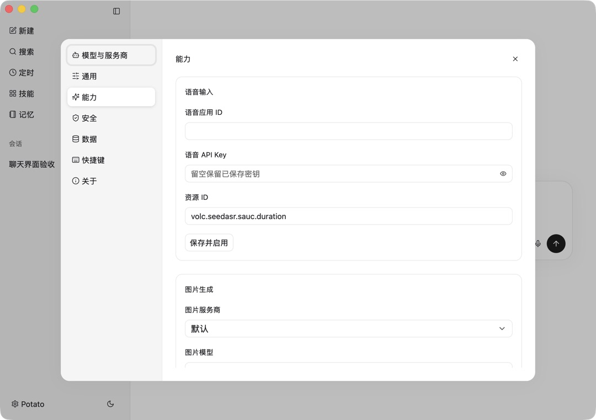
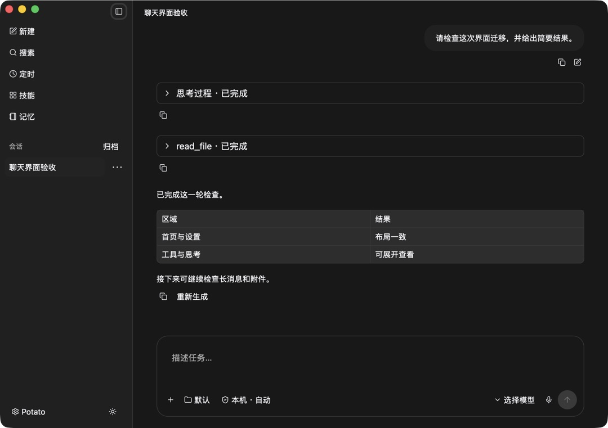

# GPUI 体验与缺陷检查 · 2026-09-06

本轮对象是当前 Rust 迁移主线 `native/potato-gpui`。参考原版 `app/src/styles/tokens.css`、聊天 Composer/QuestionCard/MessageList 和 `app/src/lib/crons.ts`，保留中性配色、原 Lucide 图标及简洁导航。没有要求逐项复制原版，也没有将仍在迁移的功能宣称为完整可用。

## 已修复的问题

| 区域 | 原问题 / 触发条件 | 本轮处理 |
| --- | --- | --- |
| 新会话草稿 | 输入后打开历史会话，再点新建，无法回到原草稿 | 统一保留新会话草稿入口，恢复文字和附件 |
| 编辑 / 重新生成 | 重发占用输入区，发送后丢掉此前未发送草稿 | 发送编辑内容后恢复备份；取消和切会话也恢复原草稿 |
| 会话读取 | 历史尚未返回即可发送；读取失败仍像空白首页 | 增加读取中、失败、重试状态；未确认历史前禁用发送 |
| 会话归属 | 新会话完成后侧栏没有对应选中项 | 刷新列表时按 session 绑定已创建的会话 |
| 搜索 | 会话和工作区共享同一个搜索输入；隐藏侧栏时快捷键聚焦不可见输入 | 拆分两份查询；搜索快捷键展开侧栏，模态打开时不穿透；提示明确为按名称搜索 |
| 提问 / 审批 | 会话切换后旧提问残留；旧轮询可能重新显示已处理卡片；可以重复提交 | 按 session/status 过滤，切换清空显示，提交锁及完成集合去重，完成后释放回答草稿 |
| 提问操作 | 缺少跳过入口，空答案按钮无反馈，多卡片可能挤掉输入区 | 增加跳过、提交禁用态和滚动高度上限 |
| 文档读取 | 关掉 A 打开 B，A 的迟到回包可覆盖 B | 独立编辑器代次隔离；加载完成前不给出可保存空表单 |
| 文档保存 / 删除 | 请求期间继续修改或切换编辑器，回包会关闭当前内容 | 请求期间显示处理状态并锁定编辑器；失败恢复原草稿，成功后刷新列表 |
| 任务编辑 | 替换整个 request，丢失原目标会话及隐藏配置 | 只替换 input，保留 session/user/channel/request_context/custom/stream；修正日程 dirty 基线 |
| 设置读取 | 数据到达前创建空字段，之后不更新；重新打开可残留旧值 | 所需数据加载完成才显示字段，失败可重试，重新打开清理已关闭页面的字段 |
| 设置保存 | 搜索保存后缓存不更新，切页回来恢复旧值；连接修改可被模型详情导航丢弃 | 写回搜索返回值；有修改时阻止进入模型详情；处理中保护输入与导航 |
| 设置滚动 | 从下半页切换分组后，新页面顶部字段被藏住 | 分组及详情切换时滚动回顶 |
| 深色主题 | Markdown 表头低对比，底层组件仍使用默认主题副本 | 明确设置表头前景/背景，并同步 GPUI Base 主题；按已保存主题创建首窗，避免深色启动先白屏 |
| 输入区布局 | 长项目/模型名以及窄窗口可能挤压发送入口 | 限制名称宽度，完整名称保留 tooltip；项目/权限与模型/语音/发送分组换行 |
| 按钮与导航 | 发送按钮缺少辅助功能名称；非聊天页收起侧栏后没有鼠标展开入口 | 增加发送/停止名称、表单名称，工作区页补展开侧栏按钮 |
| 任务模板 | 模板直接显示 Cron 表达式，阅读门槛高 | 显示“每周五 17:00”等时间描述，编辑器保留高级表达式 |

## 实际操作与截图

1. **聊天排版：正常。** 合成历史的用户消息、思考折叠、工具卡片、表格、编辑和复制入口可见。浅色布局保持现有间距和中性层次。

   

2. **草稿与编辑：回归通过。** 实际输入“尚未发送的新会话草稿”，打开历史，再点新建，AX 输入值恢复；新增真实 GPUI Entity 测试覆盖文字、附件、取消编辑、编辑发送及切会话。捕捉工具曾返回与最新 AX 不同步的旧帧，所以未将该旧图作为草稿恢复截图证据。

3. **设置：已验证主要表单与保存切页。** 能力页标签、输入宽度和分组一致，内容超长可滚动。独立目录中将搜索模型保存为 `audit-model-local-only`，切到能力再回通用仍显示该值。截图来自加载完成后的能力页。

   

4. **深色聊天：表头问题已复核修复。** 修复前表头过暗；release 复查后标题和表格文字清晰。下图是修复后的实际窗口。

   

5. **任务与记忆：基础操作可用。** 实际查看任务空状态、8 个模板入口、记忆分类和新建编辑器；在独立目录保存 `audit-note.md` 并重新打开，名称和正文一致。新建任务的高级日程表单与调度目标选择仍有迁移差距。

6. **小窗口：首屏检查通过，完整交互待进一步核验。** 独立 fixture 设置 800×580，首屏项目、权限、模型、语音和发送入口均在窗口内。CUA 拖动缩放多次返回 `noWindowsAvailable`，后续聊天截图亦出现旧帧，不能据此声称全部窄窗口交互完成验收。

## 验证方式

- `cargo +1.96.1 test --manifest-path native/potato-gpui/Cargo.toml`：19 项通过，其中 5 项直接构造真实 GPUI Potato Entity，2 项覆盖任务请求字段保留。
- `cargo +1.96.1 clippy --manifest-path native/potato-gpui/Cargo.toml --all-targets -- -D warnings`：通过。
- macOS ARM64 release 构建与本地 ad-hoc 签名验证通过；未发布、未覆盖 `/Applications/Potato.app`。
- 运行数据：`/private/tmp/gpui-chat-review-audit-0906`；小窗口数据：`/private/tmp/gpui-chat-review-audit-compact-0906`。未导入个人配置、未调用付费模型/语音、未修改正式会话。
- 小窗口可复跑：`cargo +1.96.1 run --manifest-path native/potato-gpui/Cargo.toml --example review_fixture -- /private/tmp/gpui-chat-review-example --compact`，再以该目录设置 `POTATO_NATIVE_DATA_DIR` 启动。
- CUA 期间遇到 `noWindowsAvailable`、ScreenCaptureKit -3811/-3812 和部分 AX 操作延迟；有效截图经过单独查看，未把工具错误当作产品功能失败。
- 原版安装窗口截图也受到捕捉错误影响，原版对比以本地源码、组件及设计 token 为依据。未声称已比较 ChatGPT/Claude 实机截图。

## 功能清单与后续优先级

| 功能组 | 当前结论 | 待补 / 未验收 |
| --- | --- | --- |
| 聊天 | 流式、停止、编辑重发、工具折叠、附件、审批和提问已有接入 | 真账号端到端、停止后重连、长流手动滚动、编辑器 IME 完整流程 |
| 会话管理 | 重命名、置顶、归档恢复、删除确认已有入口；本轮补状态隔离 | 跨重启草稿、全文搜索结果面板、日期/项目分组、长列表虚拟化 |
| 消息内容 | Markdown 基础块和工具结果；深色表格本轮修复 | 产物/改动侧栏、数学、多媒体和完整执行轨迹 |
| 模型与设置 | 七组设置页面；本轮解决加载/保存/导航状态 | 设备选择、语言、更多模型参数与上下文用量；系统外观和平台行为持续实测 |
| 任务 | 模板、创建/编辑、启停、执行历史 | 可视化单次时间选择、完整调度目标选择、运行时真实调度验收 |
| 技能 / 插件 | 技能编辑及启停，图片插件入口 | 技能 ZIP 导入、完整插件目录和卸载流程 |
| 记忆 / 工作区 | 文档编辑、冲突保护、基础筛选 | 文档勾选/排序；录音及附件异步完成时的所有跨页组合 |
| 桌面交付 | macOS ARM64 可构建，可本地打开 | Windows/Linux 实机、完整无障碍、托盘、更新、发布签名/公证 |

优先继续完成 IME、真实长流及停止/重连的端到端验收，再补常用的全文搜索与草稿持久化。功能扩展继续使用现有简洁界面层级，不把所有能力一次铺到首页。
