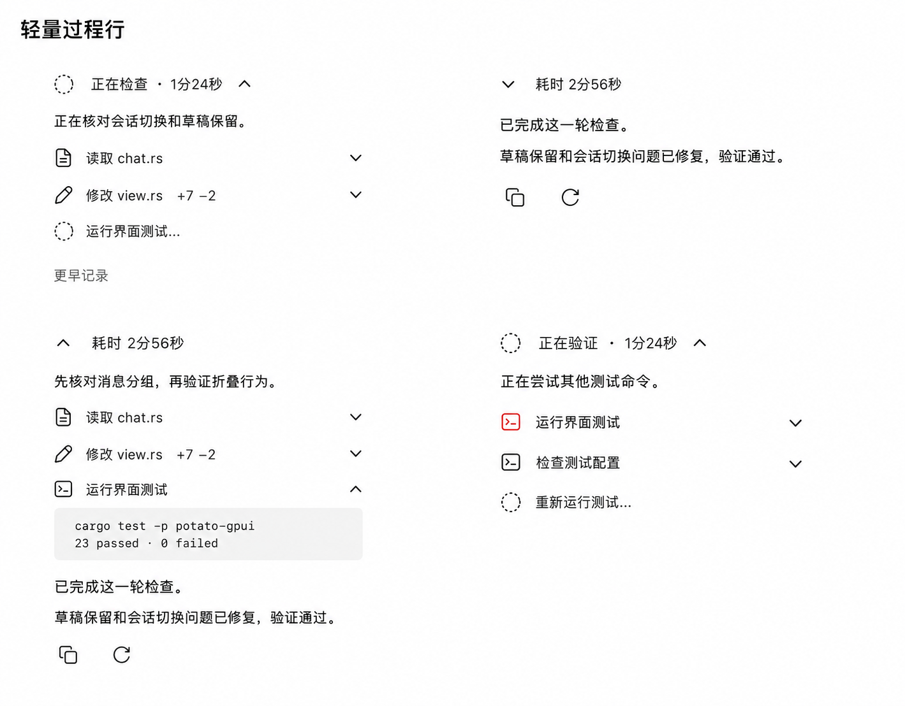

# 聊天执行过程：轻量过程行

状态：首版已实现；浅色原生窗口与 800px 窄窗口已核对，完整验收范围见下文。
日期：2026-09-06。

用户选择第一种无边框过程行；保留 Potato 的简洁风格。最终答案是阅读主体，过程可随时展开追溯。本轮已按用户批准的精简方向更新 GPUI 聊天呈现，并生成独立安装包。

图中四个区域是状态对照，不是应用中的四栏布局。文字、耗时、测试结果均为示例。实际排列和行为以下文为准。第二版依据用户批注减少摘要文字、弱化单次操作失败，并删除重复的展开/收起文字入口。

## 一轮回复的结构

同一轮内依次排列：用户消息 → 执行过程 → 最终答案 → 答案操作。没有中间过程的普通回答直接显示答案，不生成空摘要行。

执行过程包含对用户可见的中间说明、已有的推理摘要、工具调用及其结果；不新增或推断模型内部思考。折叠仅改变呈现，不删除或改写原始记录。调用与结果显示为一次操作。

## 状态与默认行为

| 状态 | 摘要与可见内容 | 折叠和操作 |
| --- | --- | --- |
| 进行中 | `正在执行 · 1分24秒`；有可靠操作描述时可显示 `正在检查` 等具体标题；最新一条进展、最近 3 项操作 | 较早记录进入 `更早记录`；用户可以展开全部，也可收起过程 |
| 正在输出最终答案 | 最终答案在过程下方独立流式显示；尚未完成时不标记成功 | 保持现有阅读状态；答案操作暂不出现 |
| 成功完成 | 只显示 `耗时 2分56秒` 和箭头，不显示“已完成”和操作计数；答案紧接摘要下方 | 默认自动收起过程；显示答案复制及符合条件的重新生成 |
| 手动展开 | 同一条耗时摘要，箭头朝上；中间说明与操作按原始顺序排列 | 工具输出默认收起，逐项展开；只用顶部摘要切换，不另设底部收起链接或“展开过程”标题 |
| 单项操作失败，Agent 继续执行 | 保持当前运行摘要；只将失败操作的图标标红，操作文字保持普通颜色 | 不展示整轮失败标题、失败数量或大段说明，不强制展开错误；点击该行可查看详情 |
| 整轮确实无法继续 | 摘要简短显示 `已中断`，仅错误图标标红；不伪造成功状态或最终答案 | 具体原因在详情中查看；确需用户处理的交互保持可见，不增加醒目的告警块 |
| 用户停止 | `已停止`，保留中间记录和已有的部分文本 | 不标记完成，不丢弃部分输出，不把部分文本当作完整最终答案 |
| 等待确认或输入 | `等待确认` 或 `等待你的回复` | 需要用户处理的交互在折叠区域外持续可见，不被历史折叠隐藏 |

单次工具失败是执行记录中的一个事件，Agent 可能换命令继续处理，不能据此将整轮标为失败。保留该操作的红色图标和实际错误详情即可，不额外展示“失败”“已恢复”等标签，也不在摘要累计失败次数。后续操作照常显示；整轮成功后照常自动收起，失败历史不强制保持展开。只有真实的整轮终止或等待用户处理事件才改变整轮状态。

## 自动收起与滚动

- 自动展示和用户手动展开必须区分。用户主动展开的过程或工具详情，不因完成事件被收走；手动收起也不因新操作到来自动展开。
- 用户在底部跟随新内容时，完成后收起默认过程，让最终答案接上来，避免留下隐藏内容的占位空白。
- 用户已向上滚动查看当前过程时，延迟自动收起，保留当前可见内容和阅读位置；不能仅有“没有点击展开”就视为可以立即收起。
- 新事件不强制滚到底部。折叠、展开及列表变化应维持可见内容锚点，不能只保持一个失效的像素偏移量。
- 折叠偏好按会话和稳定的回复轮次保存于当前应用会话，不因完成状态改变而丢失；切到另一会话不得串用。
- 重新打开历史记录时，已完成轮次默认收起，未解决的交互仍保持可见。

## 展开层级

一级是整轮过程；二级是单项操作详情。首版不增加阶段时间线或第三层自动分组。

两级统一使用向下箭头表示可展开、向上箭头表示可收起。整条摘要或操作行可点击，不要求精确点击小箭头。删除常驻的“展开过程”“收起过程”文字、重复状态小标题和按钮使用说明；必要提示仅在悬停、键盘聚焦或辅助功能名称中提供。

实施后的用户调整：耗时文字直接与正文左边缘对齐，摘要箭头移至耗时右侧并保持可见；工具行最右侧箭头改为悬浮或键盘聚焦时显示。用户气泡下的编辑按钮同样只在悬浮或聚焦时显示。详见 [输入框与悬浮操作](composer-compact.md)。

操作行用小图标、简短动作和对象表达，例如 `读取 chat.rs`、`修改 view.rs +7 −2`、`运行界面测试`。只有真实提供的数据才显示文件数量、修改行数或描述；缺少时用工具名作为回退，不杜撰自然语言解释。

中间说明穿插在其实际发生位置，避免先收集所有文字、再排列所有工具而破坏时间顺序。最近 3 项只是默认预览上限，查看全部时恢复完整顺序。长说明默认预览最多 2 行，完整内容仍可展开。

工具详情采用浅灰平面内容区，展示命令、状态和输出，不为每个操作加卡片。长输出可设约 240px 预览高度，并提供明确的“展开完整输出”；折叠预览不能静默丢弃内容。普通正文自然换行，代码保留格式并允许横向滚动。

## 答案操作

- 完整最终答案下方显示复制，复制仅包含该答案，不夹带过程、按钮文字或状态摘要。成功后图标短暂变为勾选并提示“已复制”，不改变布局。
- 重新生成使用现有图标库的 RefreshCw 环形箭头。只在可重新生成的最新一轮最终答案下方提供，遵守生成中、加载中等现有限制；不清空用户尚未发送的草稿及附件。
- 图标约 16px，点击区域 32×32px，圆形；默认透明、无边框。悬停或键盘聚焦时出现浅灰圆底，键盘焦点另有清晰轮廓。提示分别为“复制回复”“重新生成”。
- 中间说明、推理摘要和工具行不出现回复级复制或重新生成按钮。此轮设计不新增工具详情复制按钮。
- 此规格仅约束助手回复操作，不借此改动用户消息的编辑入口或输入区布局。

## 尺寸与主题

- 使用现有聊天宽度上限 760px；所有状态共享正文左边缘，窄窗口自然缩小。
- 正文沿用现有 16px 左右字号；过程文字约 14px，次级但需可读；图标约 16px。
- 摘要点击行高至少 32px，整行可点击；操作行视觉高度约 28–32px。
- 摘要和最终答案间距约 20px，答案与操作间约 12px。展开详情只对详情本身作轻微缩进。
- 优先用留白区分内容，不常驻外框、阴影或阶段连线；不强制每个摘要下画分割线。
- 浅色沿用白底、深色正文、灰色辅助文字；深色使用现有主题 token，不能硬编码浅色图稿色值。
- 窄窗口保留简短状态/耗时和箭头；摘要默认已无计数，无需额外添加说明。长对象名省略并可查看完整名称。
- 展开按钮支持键盘操作及展开状态说明；失败图标通过悬停提示、辅助功能名称和可展开的实际输出补充状态，不添加常驻失败文字；减少动态效果模式下停用装饰性旋转。

## 数据边界与实施前检查

- 优先使用真实的轮次、消息角色、消息阶段及运行状态。不能把“当前最后一段 assistant 文本”直接当作最终答案：工具执行前的中间说明也可能暂时处于末尾。
- 现有草稿实现主要按用户消息边界和尾部文本判断分组，实施时须核对运行中追问、补充指令和历史兼容，不得仅因插入一条用户消息就误判上一轮完成。
- 若协议没有可靠的最终阶段标记，必须结合真实终态保守回退；无法确认时保留运行状态，不按单次工具成功或失败推断整轮终态。
- 已使用会话及消息稳定标识作为折叠键，明确保存用户展开偏好，不再把完成状态放入键。
- 耗时来自可靠的起止信息；当前运行可用真实开始时间。历史信息缺失时完成摘要回退为 `已完成` 和箭头，不能以读取历史记录的时间补造耗时。
- 摘要和“更早记录”入口不显示操作数量。调用与返回仍须合并，后台任务启动、后续输出及完成通知按其真实关联归属，避免重复操作行。

## 后续验收场景

1. 纯文本回答无多余摘要；长工具轮次完成后只保留一行过程摘要及最终答案。
2. 最终答案流式输出时无完成图标和操作按钮；成功终态后只在最终答案出现复制。
3. 手动展开后再收到完成事件，详情及阅读位置保持；正在向上查看时不突然跳到答案。
4. 单次失败只标红对应图标，不改变整轮状态、强制展开或阻止正常自动收起；真实中断、停止、等待确认仍准确呈现，必需交互始终可操作。
5. 切换会话、运行中补充指令、重开历史后，过程内容和折叠偏好不串轮次或会话。
6. 工具结果正确归属，重复通知不新增操作行，长输出可完整查看。
7. 重新生成保留未发送草稿；按钮有悬停反馈、工具提示和键盘焦点；复制内容仅含最终答案。
8. 浅色、深色及窄窗口下无截断控件、低对比状态或折叠占位空白。

9. 完成摘要只有耗时及箭头；没有重复的展开/收起文字入口；向下展开、向上收起，两级一致。

当前视觉稿由内置 Image Gen 修订，提示词保存于 `chat-process-prompt-v2.txt`；上一版图稿及提示词保留供对照。生成图用于方向与层级参考；精确行为、图标及尺寸以本文为准，完成实现后仍须在原生窗口验收。

## 2026-09-06 实施结果与边界

已实现：轻量摘要、完成自动收起、两级箭头切换、最近三项预览、完整记录与长输出入口、仅失败图标标红、仅最终答案复制、环形重新生成按钮，以及未发送草稿保护。稳定轮次键、运行中补充指令、调用结果关联和终态判断均已补充回归覆盖。

GPUI 的 32 项测试通过，含实际渲染摘要控件后的鼠标展开/收起测试；Clippy `--all-targets -- -D warnings` 通过。Release 已构建，独立 macOS ARM64 安装包位于 `../dist/chat-process/`。

实际截图和逐项结论见 [设计验收记录](../design-qa.md)。截图使用隔离数据与显式 debug fixture；示例命令与测试输出未真实执行。生产 release 不编译该 fixture 入口。

本轮尚未覆盖或有条件支持的设计项：

- 只有协议显式给出 final 阶段时，最终答案才在完成前独立流式展示；无阶段标记的提供方结合整轮终态识别最终答案。
- 耗时保存在当前应用会话中；重启后缺少可靠历史时长时显示“已完成”。
- 上滚时冻结当前预览并取消强制追尾；任意长 Markdown 在异步重排后的精确内容锚点仍需进一步验证。
- 深色主题采用现有颜色 token，本轮未获得可确认的深色截图；系统减少动态效果、屏幕阅读器和系统剪贴板端到端操作尚未完成人工验收。
- 原生窗口自动化间歇返回 `noWindowsAvailable`，故展开详情的截图采用预设展开状态；摘要真实点击由 GPUI 渲染测试覆盖，不能将截图回放视为完整鼠标流程验收。
