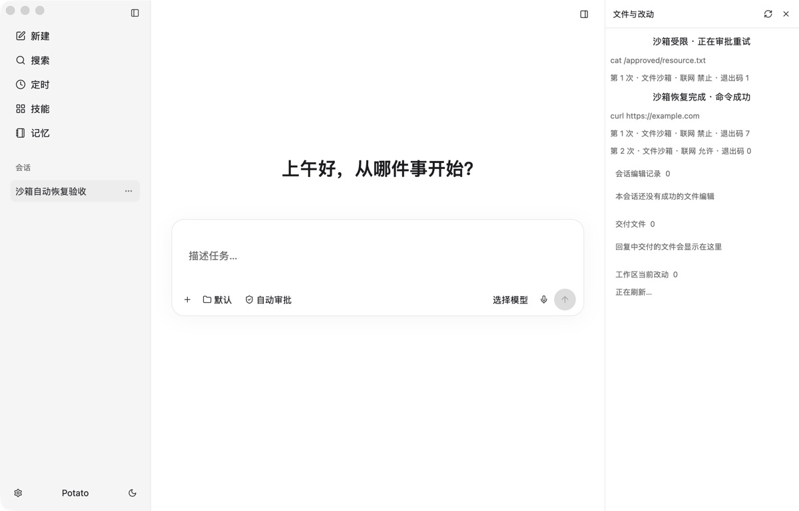
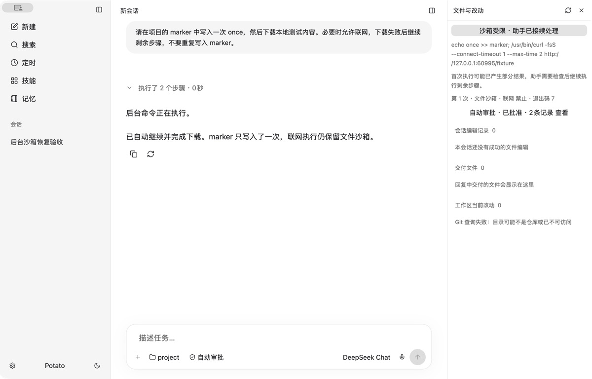

# Shell 沙箱恢复界面验收

2026-09-10：使用隔离数据目录和 debug-only `POTATO_GPUI_REVIEW_FIXTURE` 加载 [fixture.json](fixture.json)，在实际 GPUI 窗口核对审批中与恢复成功记录，以及每次文件/网络权限和退出码。



这是固定数据的原生渲染验收，不是模型或进程执行截图；底层真实 Seatbelt、前后台自动审批与重试由核心测试覆盖。Computer Use 的折叠点击返回 `noWindowsAvailable`，因此本轮不声称折叠交互完成了实机验收。

```sh
cargo +1.96.1 build --locked --manifest-path native/potato-gpui/Cargo.toml
POTATO_NATIVE_DATA_DIR=/private/tmp/potato-sandbox-review-data \
POTATO_GPUI_REVIEW_FIXTURE="$PWD/native/potato-gpui/design/sandbox/fixture.json" \
native/potato-gpui/target/debug/potato-gpui
```

始终使用独立数据目录，不要同时打开相同的日常数据目录。恢复记录来自正式视图，固定数据只在 debug 验收入口注入。

## 后台自动续跑闭环

2026-09-10 补充实测：真实 GPUI 和 Seatbelt 进程、固定本地模型服务。首次命令 `echo once >> marker; curl ...` 禁网失败；当前回合结束后，调度器自动唤醒助手，仅继续下载，经过再次自动审批并保留文件隔离后成功。原始用户消息仍只有一条，系统恢复通知没有成为新的授权，marker 内容始终只有一行。详细校验见 [continuation-result.json](continuation-result.json)。恢复卡片展开交互本轮通过无障碍按钮点击验证。



复现时，每轮用新的临时目录启动 [mock_recovery.py](mock_recovery.py)，记录打印的 URL：

```sh
python3 native/potato-gpui/design/sandbox/mock_recovery.py /private/tmp/potato-auto-approval-sandbox-demo
cargo +1.96.1 build --locked --manifest-path native/potato-gpui/Cargo.toml --bin potato-gpui --example approval_review
native/potato-gpui/target/debug/examples/approval_review /private/tmp/potato-auto-approval-sandbox-demo/data http://127.0.0.1:服务打印的端口
POTATO_NATIVE_DATA_DIR=/private/tmp/potato-auto-approval-sandbox-demo/data \
POTATO_GPUI_REVIEW_FIXTURE="$PWD/native/potato-gpui/design/sandbox/live-fixture.json" \
native/potato-gpui/target/debug/potato-gpui
```

服务终端需单独保持运行。[live-fixture.json](live-fixture.json) 的 `start_request` 只在 debug 验收入口使用，会在隔离数据目录发起一次真实原生对话。服务日志只记录调用类别，不保存模型密钥或完整对话。工作区未初始化 Git，所以截图中的 Git 查询提示与沙箱恢复结果无关。
