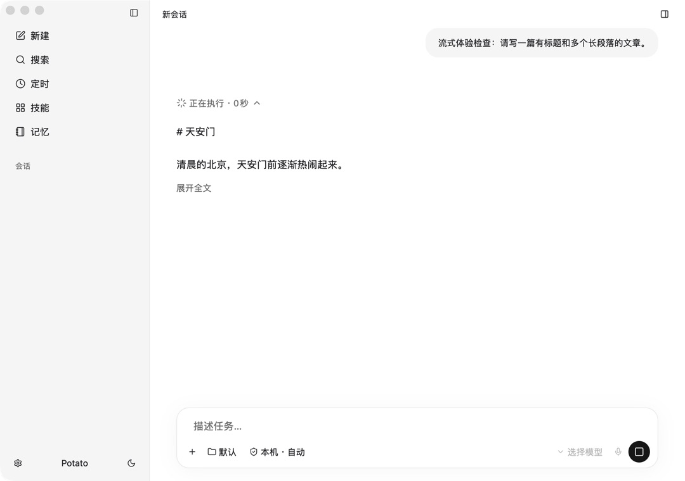
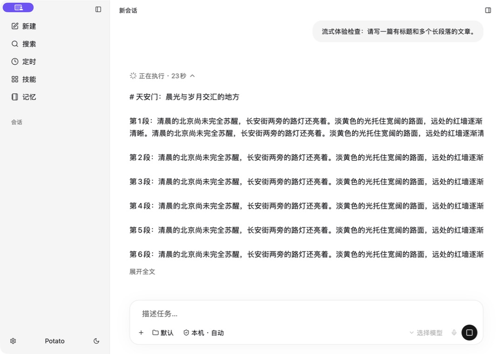
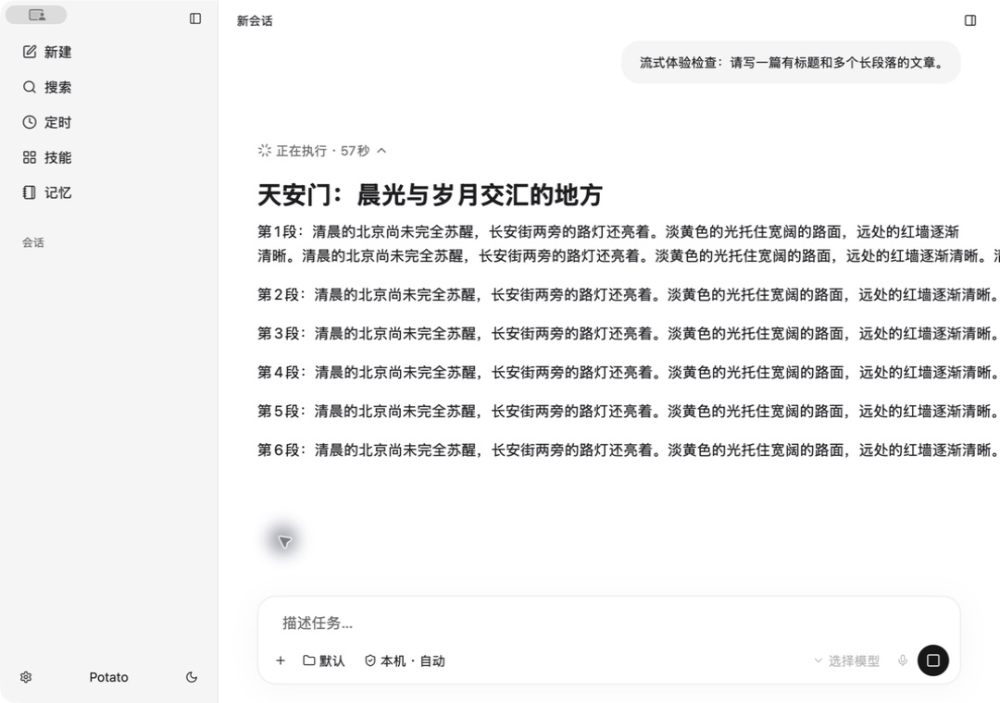
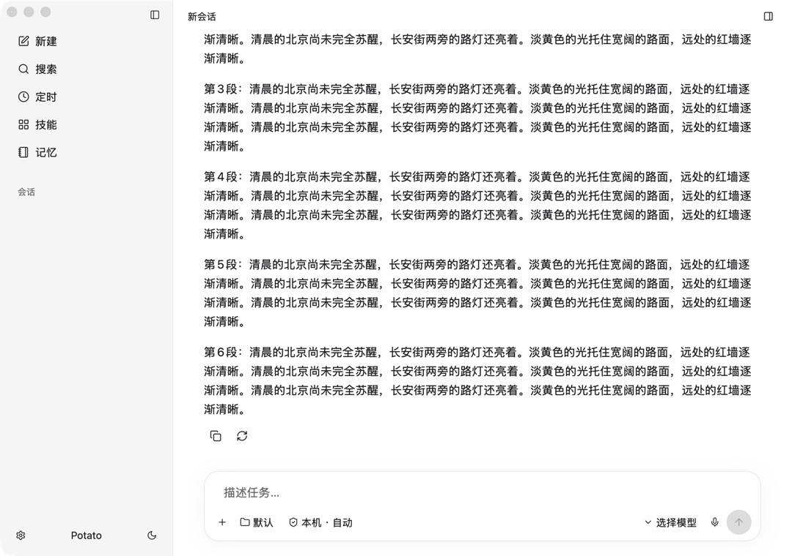

# Potato 流式输出体验检查

结论：存在影响正常阅读的布局与状态问题。仅隐藏空“思考”和改“更早记录”文案不足以解决。

## 验证范围

使用本地已有 GPUI debug 可执行文件、隔离数据目录、固定协议消息回放；未调用模型，未操作用户的真实会话。当前源码同时做只读核查。最新源码构建受到并行修改的 side_panel.rs 缺少 ButtonVariants 导入影响，因此截图代表已有本地可执行文件，不宣称是最新源码的构建验收。来源与哈希见 provenance.json。

## 步骤与截图

1. 短正文（不佳）：只有标题和一句话，因含空行而进入纯文本预览，标题显示原始 #，并出现“展开全文”。

2. 长正文生成中（严重问题）：长段落在右边界截断，阅读内容不完整；“执行过程”承载了整篇答案。

3. 点击展开全文（仍不佳）：标题变成 Markdown 大标题，但段落仍越过右边界；内容高度和间距改变。源码还将 scroll_paused 设为 true，展开操作同时停用了自动跟随。

4. 同一内容完成态（换行恢复）：独立完成态回放中段落正常换行，能纵向滚动。说明问题与执行过程展示路径相关，不是源文本丢失。此项是独立完成态回放，不是连续录制的终止瞬间。

## 发现与优先级

- P1 已复现：执行过程内的正文宽度/换行异常。展开全文也未消除，完成态正常。需要给正文及嵌套父容器提供稳定的可用宽度，避免横向裁切；不能只移除 line_clamp。
- P1 已复现且源码确认：同一正文使用不同渲染器。chat.rs:538 条件为超过 64 个字符或超过 2 行（含空行），切到 plain text + line_clamp(2)。标题、列表、代码等格式因此在增长或展开时改变。应让正文从第一个字符到结束都使用同一 Markdown 渲染路径，正文不要使用执行摘要截断。
- P1 源码确认：缺少 phase=final 的流式 assistant 文本都进入 Process；完成后 candidate 被移出，变成独立 Message。组件位置、父容器和高度随结束切换，存在明显阅读位置改变风险。保留稳定正文身份和父容器，仅更新完成状态；仅工具、推理和明确 commentary 可折叠。
- P2 源码确认：点击展开全文直接设置 scroll_paused=true，将内容展开与停止跟随耦合。跟随应由实际滚动位置和用户向上阅读决定，展开本身不应隐式切换。
- P2 源码确认、未压测：listen_turn 每个事件触发 notify；view 每次渲染遍历/克隆整段历史，并在未暂停时请求滚到底部。高频输出、长历史的帧率与输入延迟需量测，不能仅凭代码宣称已经卡顿。可按显示帧合并更新，只重算变更消息，保留用户阅读锚点。
- P2 源码确认、未运行重连压力测试：Backend::stream 使用容量 256 的队列；Replay::attach 同步将历史事件 try_send 到队列，返回 receiver 前无法消费。长回复重连可能因队列已满失败，仍需补长回放用例。上一轮会话切换修复不代表长流重连已充分验证。
- 可访问性风险：本次原生 AX 树暴露了按钮和输入框，未出现正文文本节点；尚未用 VoiceOver 完成阅读验证。纯文本预览也绕开了 selectable(true) 的正文组件，应测试生成时文字选择、复制、键盘阅读。

## 建议验收

- 同一消息逐字增长：标题、中文长段落、列表、代码块、表格；跨越 64 字和三行时布局不切换。
- 800/1080/宽窗口下正文不越界，长代码仅在自身区域横向滚动。
- 底部自动跟随；向上阅读保持位置；展开详情不改变跟随意图；完成不搬移正文。
- 长回复 A→B→A 能恢复，包含超过 256 个协议事件、运行刚结束的竞态与停止状态。
- 长历史高频事件量测掉帧、输入延迟，补充正文可访问性检查。

本轮为体验检查，未修改产品逻辑，也未替换正在运行的正式应用。
