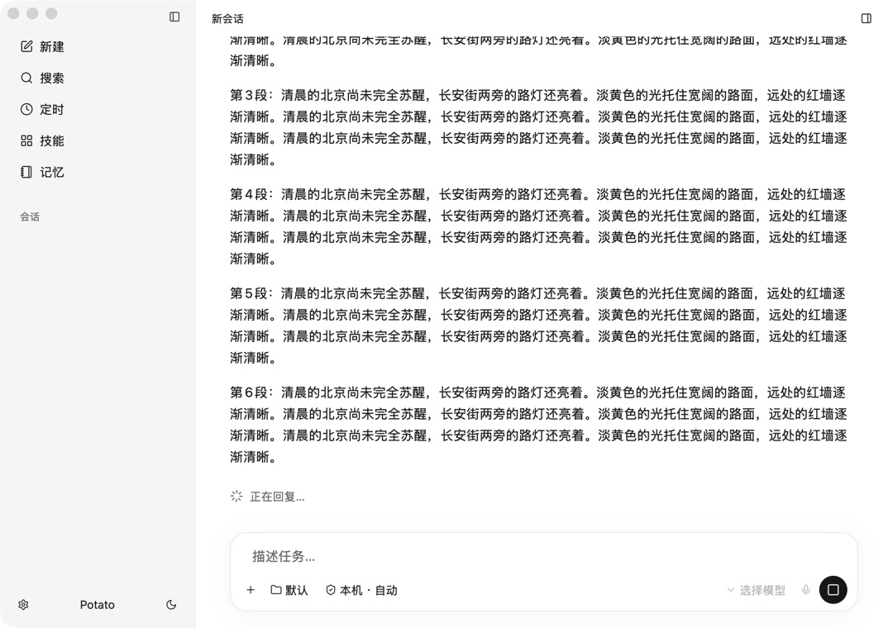

# 流式 Markdown 接入验证

已复用 GPUI Kit 0.6.0，无新增渲染依赖。

- media.rs：按会话、消息 ID、内容块缓存 TextViewState；前缀追加走 push_str，修正快照走 set_text；清理离开会话的缓存；跳过不使用该渲染器的工具/推理消息。
- chat.rs：普通正文在整个回复生命周期使用独立正文容器，只有明确 commentary、推理、工具进入过程区；过程文本也使用 Markdown，移除纯文本两行截断。补足宽度约束。
- view.rs：只有内容签名变化时才请求自动跟随，保留向上阅读暂停及回到最新按钮；无过程区时显示回复中/停止/中断提示。
- 迟到引用定义在结束时执行一次完整解析校正，保留 Entity；普通正文完成不重建状态、不清除选择。引用语义发生修正的特殊情况可能重置选择。

## 验证

`cargo +1.96.1 test --locked --manifest-path native/potato-gpui/Cargo.toml --bin potato-gpui -- --test-threads=1`

57 passed, 0 failed。新增/更新覆盖：正文不随工具出现重新分类；中文长段落增量换行；代码围栏/表格跨块追加；完成前后正文 bounds 与 Entity ID 相同；选择保留；全文修正；迟到引用链接；按消息 ID 而非位置复用；跨会话缓存清理。

隔离 debug 回放使用上一轮相同长段落，生成中已能正常换行，截图见 01-running.png。该截图不是实际模型请求。原生 CUA 的滚动动作返回 noWindowsAvailable，未据此宣称人工滚动操作验收通过；滚动行为改动仍需实际设备回归。

没有替换或重启用户正在运行的正式应用。最终 debug 二进制位于 target/debug/potato-gpui；本轮不包含发布打包或模型吞吐性能测量。
