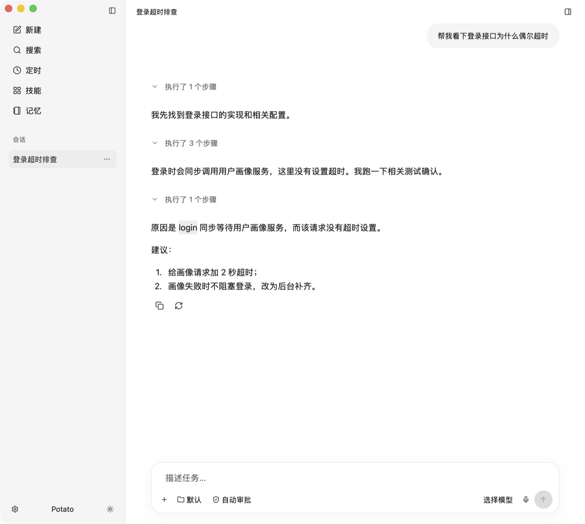
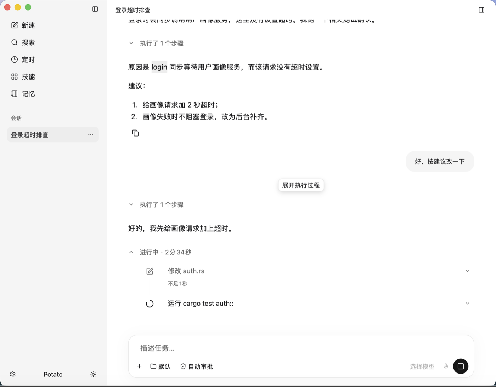

# 回复按时间线展示（2026-09-24）

与 iPhone 端 `docs/design/iphone/turn-timeline-20260924/` 对齐：一轮回复不再是"一个过程块 + 拼在一起的正文"，而是按时间顺序交替显示说明文字和它引出的工具组，最后一段才是答案。

## 规则

- `chat_blocks` 按行顺序切分：助手正文（含 `commentary`）各自成段，思考、工具调用、补充指令归入相邻的过程组。
- core 实时流先发空的正文占位再发思考，历史记录则是思考在前；紧跟在正文后的思考挪到该正文之前，保证实时与历史顺序一致。
- 只有进行中回复的最后一个过程组保持展开和运行态；一旦后面出现正文，该组即视为完成并自动收起（用户手动展开的选择仍然保留）。
- 旧的"已执行 N 个步骤 · 正在回答"状态随之去掉：答案正文开始时，前面的组已经收起。
- 过程组时长：只有一个组时沿用整轮耗时，多个组时各自按活动时间戳计算。

 

## 验证

`cargo test` 68 项通过（新增按时间交替、实时占位顺序用例）；`cargo clippy --all-targets` 无告警。用下列固定数据在 debug 窗口核对了已完成和进行中两种状态：

```sh
POTATO_NATIVE_DATA_DIR=/private/tmp/potato-turn-timeline \
POTATO_GPUI_REVIEW_FIXTURE="$PWD/native/potato-gpui/design/turn-timeline-20260924/live.json" \
native/potato-gpui/target/debug/potato-gpui
```

## 未做

- 过程组标题仍是"执行了 N 个步骤"，未改成 iPhone 的动作摘要。
- 进行中组的计时仍从整轮开始算。
